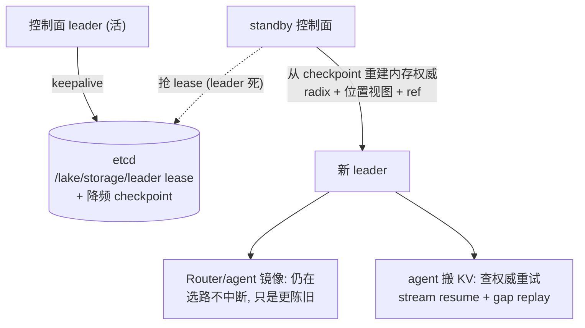

# 10 — 控制面与通信选型（对应 #3 #4）

> **状态：P2 草案 / 讨论中**。本文借 [Dynamo](../research/dynamo/overview.md) 源码对照，给 [#3](https://github.com/chengda-wu/lake/issues/3)（架构图 + 通信边）与 [#4](https://github.com/chengda-wu/lake/issues/4)（Router 持镜像方式）的待讨论项提供输入，定稿后并入 `overview.md`。已定边界见 #3，本文不重复，只讲 dynamo 对照与 lake 取舍。一致性原理（位置视图权威为什么放控制面内存、为什么分三档一致性）在 [`consistency.md`](consistency.md) §8，本文引用不展开。

## 定位差异：集中权威 vs P2P 涌现

| | lake（已定方向） | Dynamo |
|---|---|---|
| 位置视图权威 | Rust 存储控制面**独立进程**（内存强一致）+ etcd 降频 checkpoint | **无独立控制面进程**；etcd 只做注册表，KV 事件走 NATS/ZMQ，最终一致 |
| 存储状态归属 | HBM 归池，`BlockManager<L0..L3>` 全四层 | G1（HBM）engine 外部拥有，无 `BlockManager<G1>`；G2/G3 在 `InstanceLeader` |
| 协调模型 | 集中权威 + etcd（Raft 在 etcd 内） | per-instance `InstanceLeader` **P2P**（velo RPC + onboard session），非单 leader、非 Raft 副本 |

**结论**：dynamo 是"多发布者 + 事件总线 + P2P 涌现"的去中心模型；lake 是"单权威 + 强一致 + 集中控制面"的更彻底模型。dynamo 的 P2P leader 满足不了 lake"位置视图强一致"要求——lake 应**明确拒绝** per-instance P2P，选集中控制面 + etcd。这不是缺陷：dynamo 不需要强一致（KV 归 engine，错了回退预测式），lake 需要（HBM 归池，位置错 = 拉错节点）。

## 位置视图权威的归属（对应 #3，#4 的前提）

lake 原定"位置视图进 etcd 强一致"。但位置变更含**满块注册**（每次 prefill 新块都触发），是高频写；etcd 承高频写会被 Raft 复制 + watch fan-out 拖垮。dynamo 专门为避开 etcd 高频写，把 KV 事件放 NATS/ZMQ（`distributed.rs` 注释 "expected in approximate mode"，丢了即跳过 = best-effort）。

**结论（已定）：强一致权威在存储控制面进程内存（单写者线性一致），etcd 降频只存低频 checkpoint**（节点 / 模型 / 配额 / revision + 位置快照），供控制面崩溃重建、Router 冷启动建镜像、stream 断时回退。高频位置变更在控制面内存聚合 → 推 Router / agent。dynamo 的实证是反证——它的强一致位置在每实例内存（`InstanceLeader` 持 G2/G3 manager），根本不进外部存储；lake 不能完全照搬（KV 归池要全局权威，不能每实例自治），但"强一致权威放内存、etcd 只做持久后盾"这点一致。

> **radix tree 是位置视图权威的一部分**：前缀树（前缀 → block → 位置）就在控制面进程内存里，是位置视图权威本身，不是单独一层。Router / agent 持只读镜像（stream 推送的副本）。选路查镜像（最终一致、零 RPC）、搬 KV 同步查权威树（线性一致），两类查询分途见 [`kv-cache-pool.md`](kv-cache-pool.md)「前缀树索引」。lake 无 APC（实例私有自维护索引被砍，前缀复用能力保留放大）。


为什么这合理（强一致 ≠ 必须进 etcd、不丢 ≠ 强一致、三档一致性分级）的理论依据见 [`consistency.md`](consistency.md) §8。本节只给结论，它是下文 Router 镜像方案选择的前提。

## Router 持位置视图镜像（对应 #4）

Dynamo router 维护**本地 radix 树副本**（每 router 实例一份），更新路径（`lib/kv-router/src/services/indexer/listener.rs`）：

- **事件订阅为主**：ZMQ SUB 收 worker 发的 `KvEventBatch` → `apply_live_batch`（`listener.rs:320`）→ 更新本地 radix 树。事件源 = worker（engine 持有 KV，worker 自己知道）。
- **路由决策预测回填为辅**：`apply_routing_decision_with_prune_tracking`（`kv_indexer.rs:41`）——选路后乐观预测选中 worker 会缓存这些 block，后续 prune 校正。
- **一致性机制**：`EventEnvelope{publisher_id, sequence, ...}`（`event_plane/traits.rs:13`）+ `DeduplicatingStream` LRU 去重（按 `(publisher_id, sequence)`，`mod.rs:218`）+ **gap 检测 + replay**（`listener.rs:291 handle_gap → replay_gap`，DEALER socket 请求重放缺失序号）。最终一致。

### 方案选择（已定）

上文"权威在控制面进程内存、etcd 只存降频 checkpoint"改变了对 #4 三方案的比较基础：

- 方案1（Router 嵌 Rust agent，FFI）/ 方案2（Router 直连 etcd watch）：watch etcd 读到的是**降频 checkpoint**，落后于控制面内存的 live 视图。
- 方案3（gRPC stream）：控制面直推，读到 **live 权威**。

故方案1/2 否决——要读 live 权威只能直连控制面 stream，等于方案3 多一层 cgo（方案1）或打破 etcd key space 隔离（方案2）。方案1 的"机制统一"卖点也不成立：view mirror 是 agent 的**只读子集**（不搬 KV / 不组装 block table / 不 RDMA），共享的只是"订阅 stream + apply 增量 + 去重 + gap replay"协议逻辑，那套 proto + apply Go 一样能共享；为这点可移植逻辑付 cgo 交叉编译 + panic 跨边界，不划算。

| 方案 | 镜像来源 | 读到的是 | 结论 |
|---|---|---|---|
| 方案1 FFI | etcd watch | 降频 checkpoint | **否决** |
| 方案2 直连 etcd | etcd watch | 降频 checkpoint | **否决** |
| 方案3 gRPC stream | 控制面推送 | **live 权威** | **主方案**：唯一不限部署拓扑读 live 权威 |

### 同机共享内存优化（已采纳）

控制面与 Router **同机**时，控制面把 view 写进一块 mmap 共享内存（带 seqlock 防撕裂读），Router 映射读——纯内存 load，无序列化、无 proto decode、无 syscall。

```
控制面进程内存（权威） ──写入──> 共享内存段（seqlock） <──映射── Router 进程
                          纯内存读写，零拷贝零序列化
跨机 Router 副本 ──gRPC stream──> 控制面（落回主方案）
```

- **与权威归属协同最强**：权威本就在控制面进程内存，共享内存只是把那块内存的**只读视图**暴露给同机 Router，连"推"都省了。
- **前提**：控制面与 Router 同机（lake 控制节点上常成立）。**跨机 Router 副本用不了**，落回主方案。所以它不是独立方案，是"同机替 stream、跨机仍 stream"的**分层混合**。
- **代价**：共享内存 schema 要内存布局稳定（改字段走版本号）。同机是优化前提，使 #3 待讨论 #1（控制面与 Router 是否同机）对 #4 变关键。

其余机制已考虑并否决：周期全量快照拉取（协议极简但新鲜度受固定间隔限制 + 全量带宽浪费，留作镜像小 / 要求极简的早期备选）；pub/sub（NATS/Redis，dynamo 的做法，lake 单权威引入 broker 只多依赖与一致性问题，多发布者场景才需要）；long-poll / pull-delta（stream 的 pull 变体，非独立方案）。

### 粒度与协议（答 #4 待定）

1. **粒度 = 增量事件 + 单流序号 + gap replay（非快照）**。控制面是**单权威、单发布者**，`publisher_id` 恒为控制面，退化为单流 sequence（比 dynamo 多发布者简单）。借鉴 `DeduplicatingStream`（`mod.rs:218`）的 `(publisher_id, sequence)` 去重。冷启动：snapshot-on-connect（带序号建镜像）→ 之后增量。断线：Router 报 "resume from seq N"，控制面重放。
2. **gap replay 通道 = 单 bidi stream（带 resume），非单独 RPC**。单权威 → 单连接 → 单序号上下文。dynamo 用单独 DEALER socket 是多发布者 pub/sub 拓扑的需要，lake 不必照搬。
3. **agent 与 Router 同协议**。dynamo router 和 worker 引擎连同一事件流、不同订阅者。→ 边4（Router）与边5（agent）**同一套推送协议**，不同订阅者（对应 #3 待讨论 #6 = 是）。
4. **etcd checkpoint 三重角色**（非浪费）：控制面重启重建内存权威 / Router 冷启动 snapshot 源 / stream 断时 Router 回退（更陈旧但非空）直到重连。这让主方案"依赖控制面在线"有了兜底。
5. **陈旧只损性能**。gap/replay 保证最终一致，期间 router 误判 → 回退确认 → miss 回填，多一跳。正合 [`consistency.md`](consistency.md) §1"陈旧只损性能不损正确性"。

### 剩余风险（归 #3，非 #4）

主方案依赖控制面在线 → **控制面单点**。归 #3 待讨论 #4（单 leader + etcd，多副本留 P7）。#4 声明"假设控制面 HA 由 #3 解决"。

## 控制面 HA（对应 #3 待讨论 #4，已定）

主方案 gRPC stream 依赖控制面在线，控制面是单点。HA 机制照搬 Mooncake（单 leader + 元数据在 leader 内存 + 选主 + 快照重建 + 客户端重连），lake 在重建对象与重建源上不同。



**选主**：etcd lease + keepalive（仿 Mooncake `EtcdLeaderCoordinator`，`ha/leadership/leader_coordinator.h`）。控制面进程启动抢 `/lake/storage/leader` lease（TTL），抢到为 leader，余 standby；leader 周期 keepalive，lease 过期 → standby 抢。**Raft 在 etcd 内，控制面不自研 Raft**。

**重建**：新 leader 从 **etcd checkpoint**（节点/模型/配额/revision + 位置快照，见上「位置视图权威的归属」）重建内存权威（radix + 位置视图 + ref）。重建后陈旧（落后于崩溃前最后几次满块注册），但**陈旧只损性能不损正确性**——误判位置 → agent 回查/miss 回填。真正未 checkpoint 的高频位置变更，其 block 的 **L2 durable 副本还在**（满块写回落 L2），故**数据不丢，位置视图靠 agent 上报重新收敛**。

**降级**（故障期秒级切换）：
- **选路不中断**：Router 镜像还在（只读副本不受控制面切换影响），只是不再更新、更陈旧，miss 回填兜底。
- **搬 KV 重试**：agent 同步查权威失败 → 退避重试，等新 leader 重建完。搬 KV 本就 ms 级，容忍秒级抖动一次（故障罕见）。
- **stream 断**：Router/agent 用 #4 定的 "resume from seq N" + gap replay 重连新 leader。

**多副本留 P7**：active-active 需复制控制面内存权威，复杂度高；规模到了再做。P7 前单 leader + etcd 选主/重建足够。

**与 Mooncake 的区别**（机制照搬，内容与源不同）：

| | Mooncake store | lake 控制面 |
|---|---|---|
| 元数据内容 | 对象 KV（`key → replicas`），无前缀 | radix 前缀树 + 位置视图 + ref + 配额 + GC + 放置 |
| 寻址 | segment ID / 对象 key | 内容寻址（前缀链式 hash）+ radix 匹配 |
| 副本语义 | 对象多副本 | block 多层多副本（L0/L1 缓存 + L2 durable + L3 SSOT）|
| 重建源 | 本地/S3 快照（自造 `MasterSnapshotManager`）| etcd checkpoint（已有，不自造快照组件）|
| 数据节点 | master 管 segment，client 持 KV | KV Node agent（DRAM donor + NVMe serve）+ 计算节点持 HBM 载体 |

三点本质差：① lake 多一整层前缀复用（radix），重建对象比 flat `key→replicas` 复杂；② lake 重建源就是 etcd checkpoint，省掉 Mooncake 的 `MasterSnapshotManager`（代价：checkpoint 频率决定重建陈旧度，即"降频"权衡）；③ lake 数据节点含计算节点（要协调放置/模式选择/D-direct），控制面决策比 Mooncake 重，但 HA 机制不变。

## 通信边对照（对应 #3 通信表）

Dynamo 把通信拆**三层正交**（`lib/runtime/src/`），正好印证 lake 通信表的多后端分工：

| 通信需求 | Dynamo | lake 对应边 |
|---|---|---|
| 注册/发现（低频强一致） | etcd `Discovery` trait（`discovery/mod.rs:781`），`v1/<类别>/<ns>/<component>/...` 前缀 | 边4/5/6 控制面元数据；lake 一套 etcd + key space 隔离同此模式 |
| 高频事件流（best-effort） | `EventTransportTx/Rx`（NATS/ZMQ，`transports/event_plane/transport.rs:28`） | 边4/5 位置视图推送；lake 改 gRPC stream（单权威直推，见上） |
| 请求面 RPC | TCP（`transports/tcp.rs`） | 边2 HTTP(OpenAI 兼容,Bifrost↔Router)/ 边3/5/10 gRPC(内部) |
| 大块数据 | NIXL RDMA（`kvbm-physical` TransferManager） | 边7/8 RDMA 旁路 |
| 对象存储 | S3/Azure（`object/mod.rs` `ObjectBlockOps`） | 边9 S3 API |
| 同进程 | in-process trait 调用 | 边6 FFI（PyO3） |

**关键印证**：

- **etcd key space 隔离**：`v1/instances/{ns}/{component}/{endpoint}/{id}`（`discovery/kv_store.rs:21-23,55`）正是 lake `/lake/storage/*` `/lake/scheduling/*` 隔离的范式。bucket = key path prefix，按前缀分层 watch。
- **worker 存活自动收敛**：etcd lease 绑定实例生命周期（`transports/etcd/lease.rs:17`）——lease TTL 到 → etcd 自动删 key → watch 推 Removed。lake worker 崩溃后位置视图权威收敛**无需额外心跳服务**，直接复用此机制。
- **权威 vs 事件流分离**：dynamo 明确 etcd 管低频注册、NATS/ZMQ 管高频事件（`distributed.rs:635` ZMQ 是所有 discovery 后端默认事件面，NATS opt-in；`distributed.rs:483` NATS 不可用即跳过 = best-effort）。lake 同此思路：强一致权威在控制面内存，etcd 降频，高频位置变更走 gRPC stream 推送。

## 进程边界（对应 #3 待讨论 #1 #2）

Dynamo 部署拓扑（`components/src/dynamo/router/CLAUDE.md` "Frontend/Router Boundary"）：

1. **集成 Rust frontend**：`frontend → in-process Rust KvRouter → worker`，**frontend + router 同进程，无 router RPC hop**（默认）。
2. **Python processor 内嵌**：仍内嵌 Rust router。
3. **standalone router service**：`frontend → router RPC → worker`，router 独立进程（可选，横向扩展时）。
4. **请求级选路（Dynamo 叫 scheduler）**：`LocalScheduler` / `SchedulerQueue` / `DefaultWorkerSelector` 在 kv-router crate 内，做"请求送去哪个 worker"（overlap 量化 + logit 打分 + 排队），**无独立进程**——是 router 内逻辑。注意：这是**请求级选路**，不是 vLLM 那种 engine 内 batch 调度（见下术语澄清）。

> **术语澄清（lake 约定，与 reviewer 对齐）**：lake 两个"调度"同名不同层，必须分清——
> - **Router**（集群级，大写）：决定请求**去哪**（模式 + 节点），`f(请求, 集群状态) → (模式, 节点)`，集群级少数实例。集群级的调度逻辑（池间 / 弹性那一档）归 Router，**lake 集群级调度就叫 Router**。
> - **scheduler**（计算节点级，小写）：每个计算节点 / 每 engine 一个，控制计算流程：continuous batching、KV block 分配、抢占、queue 顺序。**lake 计算节点的调度就叫 scheduler**（对应 vLLM `vllm/v1/core/sched/scheduler.py::Scheduler`）。
>
> 两者非二选一，都必然存在。Dynamo 的 `LocalScheduler` 是**请求级**（对应 lake Router），**不**对应 lake 的节点级 scheduler——别被"scheduler"同名误导。vLLM 的 `Scheduler` 是 engine 内（对应 lake 节点级 scheduler）。

**对 lake 的输入**：

- **集群级调度逻辑归 Router，不拆独立进程**：Dynamo 的请求级选路（`LocalScheduler`）内嵌 router 进程，lake 可同——集群级调度（池间 / 弹性）作 Router 内逻辑，同进程同机直接调用，省 gRPC。拆独立进程只在调度变重 / 要独立扩缩时才有必要（先不拆）。注：这里"调度"= 集群级 = Router，**不含**节点级 scheduler（那个在计算节点上，per-engine，跟 Router 无关）。
- **Gateway 不自研，用 Bifrost（外部 AI gateway）**：dynamo 默认 frontend + router 同进程省一跳，但 lake 把入口网关交给外部 Bifrost（鉴权/限流/过载 shedding/可观测归外部控制面，CLAUDE.md 第3条）。**Router 只实现 OpenAI 兼容**——Anthropic 客户端由 Bifrost 转 OpenAI 再进 Router，lake 不自研入口 adapter、不定义私有入口 gRPC。对外 OpenAI 兼容（边1/边2 HTTP），对内（Router↔worker↔pool）gRPC。对接约束见下「Gateway（Bifrost）对接约定」。
- **存储控制面是独立进程**：dynamo 没有这个（lake 独有），因为 lake 把存储权威从 worker 剥离了。这是 lake 比 dynamo 多出来的一个进程。

## Gateway（Bifrost）对接约定（对应 #3 ③，PR #13）

> Bifrost（[maximhq/bifrost](https://github.com/maximhq/bifrost)，外部 AI gateway）担鉴权 / 限流 / 过载 shedding / 可观测——外部控制面职责（CLAUDE.md 第3条）。lake 不自研入口、不定义私有入口 gRPC。下列是 Bifrost **配置面**约束，非 lake 代码。

1. **协议面（选 A）**：Router **只实现 OpenAI 兼容**。Anthropic 客户端 → Bifrost 转 OpenAI → Router；Router 不双协议。对外 OpenAI 兼容（边1 客户端↔Bifrost、边2 Bifrost↔Router，均 HTTP），对内 gRPC（边3 及以下）。Bifrost 可替换（任何 OpenAI 兼容 gateway 即可），非硬绑定。
2. **不二次选路**：Bifrost **单一 upstream = lake Router**；关跨 provider failover、关 semantic cache。过载只决定「进 / 不进」，**「去哪」仍归 Router**——Router 持位置视图镜像做模式 + 节点选路（见上文「Router 持位置视图镜像」）。
3. **过载信号**：P2 先 Bifrost **本地限流**（按配置阈值进/不进）；lake 容量信号（队列长度 / in-flight / 剩余容量，见 [`../features/nonfunctional.md`](../features/nonfunctional.md)）对接 Bifrost 自适应留 **P7**——届时把 Worker/Router 上报的容量喂 Bifrost。请求级 shedding 始终归 Bifrost，lake 不自 shedding（CLAUDE.md 第3条）。
4. **透传**：lake 私有字段（`agent_hints` / `kv_hints` 等自定义 header、streaming SSE）须端到端透传，**Bifrost 不剥**；SSE 增量原样回传客户端。

## 待讨论项的 dynamo 输入汇总

| # | #3 待讨论项 | dynamo 输入 | lake 倾向 |
|---|---|---|---|
| 1 | Gateway/Router/Scheduler 拆几个进程 | frontend+router 默认同进程；请求级选路（`LocalScheduler`）内嵌 router | Gateway 外部(Bifrost,不自研)；**集群级调度归 Router、同进程**（节点级 scheduler 不在此列，每计算节点一个） |
| 2 | Scheduler 独立进程？ | `LocalScheduler`（请求级）在 kv-router 内，无独立进程 | 集群级调度不拆（归 Router 内逻辑）；**节点级 scheduler（每计算节点一个，vLLM 式）另论，跟 Router 无关** |
| 3 | KV Node 有 agent？ | dynamo 无 KV Node 概念（远端 = 对象存储 + NIXL）；`TransferManager` + `export/import_metadata` 是 RDMA 注册参考 | KV Node 跑 agent（复用计算节点 agent 代码），做 RDMA 注册 / 读写服务 |
| 4 | 存储控制面单 leader / 多副本？ | per-instance `InstanceLeader` P2P，非单 leader / 非 Raft | **已定**：拒绝 P2P（不满足强一致）；单 leader + etcd lease 选主 + checkpoint 重建（仿 Mooncake），多副本留 P7。见上文「控制面 HA」 |
| 5 | Gateway 自研 / 外部？ | dynamo frontend 自研（OpenAI HTTP）或 k8s Gateway API + EPP | **已定：不自研，用 Bifrost**（外部 AI gateway）；Router 只 OpenAI 兼容（Anthropic 由 Bifrost 转），无私有入口 gRPC（见下「Gateway 对接约定」） |
| 6 | 边4 = 边5？ | router 与 worker 同事件流不同订阅者 | 同协议、不同订阅者（是） |

> #4 的结论（Router 镜像走 gRPC stream 主方案 + 同机共享内存优化、1/2 否决、粒度与协议）见上文 "Router 持位置视图镜像" 节；#4 剩余两项（控制面与 Router 是否同机、控制面 HA）归 #3 待讨论 #1 / #4。**控制面 HA 已定**（见上文「控制面 HA」），控制面与 Router 是否同机留 `topology.md` P7。

## 参考

- [Dynamo 总览](../research/dynamo/overview.md)
- [`consistency.md`](consistency.md) §1（陈旧只损性能不损正确性）、§3（writeback ref + 请求结束屏障）、§8（位置一致性理论定位：目录一致性 / 释放一致 / flat memory）
- [`scheduling.md`](scheduling.md) §1（Router 本地命中视图镜像，B3 闭环）
- [`topology.md`](topology.md)（双网络 / RDMA 退化）
- [#3](https://github.com/chengda-wu/lake/issues/3) / [#4](https://github.com/chengda-wu/lake/issues/4)
