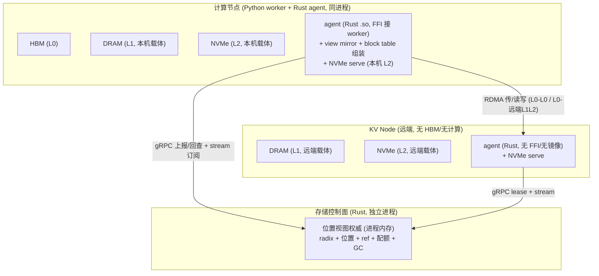

# 05 — KV Cache 池

KV Cache Pool 把 KV cache 从"附属于产生它的 GPU"提升为全局可寻址、可复用、可迁移的分布式资源。在彻底存算分离下,连 HBM/DRAM/NVMe 都不归计算节点私有,而是存储池统一管理的物理载体(L0–L3:GPU/NPU HBM / DRAM(池化) / NVMe(池化) / 对象存储,层=介质非位置,分层定义见 [`storage-layer.md`](storage-layer.md))。所有 KV 位置(含"哪段 KV 在哪个节点 HBM/DRAM/NVMe")均为存储池权威元数据。

## 设计目标

1. **前缀复用**:多请求共享公共前缀(system prompt、few-shot、共享上下文)的 KV,避免重复计算。
2. **跨节点迁移**:节点缩容/故障时,KV 迁移到他处续推。
3. **解耦计算与存储**:Prefill 不关心 Decode 在哪,只把 KV 写入 Pool;Decode 从 Pool 拉。HBM 放置亦由存储池管理,本地命中是放置决策的结果(支撑 D-direct)。
4. **可控成本**:热 KV 在 RAM,冷 KV 落 NVMe / 对象存储。
5. **模型无关、长期存续**:池生命周期与模型解耦,同一池同时承载多个 `(model_id, revision)` 的 KV。

## 数据结构

### Block 寻址

身份与位置数据结构已定稿,见 [`../../proto/schema.proto`](../../proto/schema.proto)(#2)。要点:

```proto
message KVBlockID { string model_id; bytes block_hash;
                    PoolKind pool_kind; string scope; }   // pool_kind=TARGET|DRAFT, scope 多租户预留(默认 public)
message Location  { Tier tier; string node_id; uint64 segment_id; uint64 offset; }  // 仅 L0/L1/L2(tier∈{L0,L1,L2} 硬约束)
message BlockMeta { KVBlockID id; BlockKind block_kind; repeated Location locations;
                    bool l3_present; uint32 ref_count; }
```
> 完整 schema 见 [`../../proto/schema.proto`](../../proto/schema.proto),RPC 边界见 [`../../proto/lake.proto`](../../proto/lake.proto)。
- **block = page(128 token × 全部层)**,身份按 token 段而非按层:`KVBlockID = (model_id, block_hash, pool_kind, scope)`,**不含 `layer_idx`**。`block_hash` 本就 layer-agnostic(链式哈希只吃 token),layer_idx 只在 `LayerSlice`(子块传输切片)里出现。对齐 SGLang radix(每页一 hash 当 L3 key)、vLLM prefix caching(token-based hash 跨层共享),也与下文 page-first「整块所有层连续、传引擎单条 `(ptr,len)`」一致。
- `block_hash` = 前缀链式哈希 `hash(parent_block_hash || 本块 token ids)`,序列起点块 parent = ⊥(空)。相同前缀 → 相同链式 hash → 命中同一 KV。**算法可插拔**(BLAKE3-128 / SHA-256-128 / SHA-256-256),由模型注册元数据声明,proto 只规定 ≥128-bit + 链式;不同 `model_id` 可用不同算法。
- `locations` 只含 L0/L1/L2 段式位置(`node_id + segment_id + offset`,仿 Mooncake SegmentID),`tier∈{L0,L1,L2}` 为硬约束(L3 永不进 Location);**L3 不进 Location**,用 `l3_present` bool,object key = `s3://lake/kv/{model_id}/{block_hash}` 现场拼(仿 SGLang L3 用链式 hash 当 key、不记位置实时查后端)。`l3_present=false` 且 `locations` 全空 → block 不存在;`l3_present=true` → 即使缓存副本全空仍存在(从 L3 回填)。层间不变量:L0/L1 缓存副本可各一份;L2/L3 稳态二选一(XOR,允许迁移窗口短暂双有);L2 同层不冗余(见 [`storage-layer.md`](storage-layer.md)「层间副本 vs 移动」)。
- `rkey/lkey` 不进 schema——MR 注册时 per-NIC 动态产生,传输时 agent 查本地 MR 表得 lkey、查 peer BufferDesc 得 rkey(仿 Mooncake)。

内容寻址使前缀复用天然成立:相同**前缀** → 相同 block hash → 命中同一 KV。

**block_hash 必须前缀链式**(含 parent_block_hash),而非仅本块 token 内容哈希。原因:KV 是**前缀相关**的——同样的 token 序列在不同绝对位置,KV 不同(RoPE/ALiBi 位置编码、Mamba recurrent state 都是全前缀的函数)。纯内容哈希会让两条不同前缀、相同尾部内容撞到同一 block → 错误复用。链式哈希把父块哈希编进本块哈希,使 block 身份天然绑定其前缀路径:两条前缀不同 → 父哈希不同 → block_hash 不同,即使尾部 token 相同也不会误复用。这与 radix 前缀树"节点=block_hash、路径=token 序列"一致(下"前缀树索引"),参考 vLLM `ExternalBlockHash` 的父哈希链式实现。

**block 粒度 = 128 token**:缓存命中 / 复用 / 传输 / 写回的最小单位。128 为初版默认,待 P7 校准(与 SGLang `--page-size`、vLLM `block_size` 同量级)。L1–L3 统一按 128-token block、page-first 组织(两类复用条件一致、不区分类型,见 [`storage-layer.md`](storage-layer.md) "KV 类型"节)。HBM(L0)的 t-type block 同取 128,便于 L0↔L1 整块零拷贝;r-type 在 L0 不按 block 而按紧凑状态槽,落 L1+ 时再按 block 切(trailing pages 或 state checkpoint)。

**模型无关**:`model_id` 是寻址命名空间,Pool 不解释张量布局(层数、头维、dtype),按不透明字节块存取。接入新模型只需注册 `model_id`,无需新建池。

**drafter / r-type 不物理分池**:`pool_kind`(TARGET|DRAFT)与 `block_kind`(T_TYPE|R_TYPE_STATE|R_TYPE_TRAILING)是 `BlockMeta` 元数据字段,区分命名空间与 block 内布局,不改物理池结构——L1–L3 统一按 block 不透明存(参考 SGLang `PoolName.DRAFT` 命名区分但 lake 不分物理池、vLLM `kv_cache_spec_kind`)。block 内装逐 token KV 还是紧凑 state 快照由 `block_kind` 声明,Pool 不解释。

**多租户预留(不实现)**:`KVBlockID.scope` 字段已在 schema,**当前不入寻址**——默认 `"public"`,寻址/分片仍按 `hash(model_id, block_hash, pool_kind)`(**忽略 scope**),同一 `model_id` 内 KV 全局共享复用,不做租户间私有隔离(多租户归外部控制面,见 [`../features/features.md`](../features/features.md) F8)。未来 F8 启用时把 `scope` 纳入 hash + 寻址过滤,**不改 KVBlockID 结构**(字段已在),只改寻址语义——向后兼容。

### t-type / r-type:复用条件一致,区别在 HBM 存储形态

两类的**复用条件相同**:都需**命中全部前缀**才能复用(从序列起点的连续前缀 KV/state 必须在场)。区别**仅在 HBM(L0)存储形态**——r-type 用紧凑表示(滑动窗口最近 W token / Mamba 定长 state)替代逐 token 完整 KV,降低 HBM 占用。HBM 之上的区分**不带入下层**:

- **L1–L3 统一按 block(128 token)组织**:两类复用条件本就一致(全前缀命中),下层不区分类型。r-type 落下层时在 block 边界 checkpoint 紧凑状态:
  - sliding window:存 trailing pages(最近 W token,参考 SGLang `PoolHitPolicy.TRAILING_PAGES`)。
  - Mamba/state-space/卷积:每 128 token 存一份 recurrent state 快照。
- **复用**:radix 沿前缀匹配到最长边界,取该边界处的完整 KV(t-type)或 state 快照(r-type),从该点续算。内容寻址 + radix 前缀匹配对两类同等成立——block hash 为前缀链式(`hash(parent || 本块 token ids))`,与 block 内装 KV 还是 state 快照无关;t-type 与 r-type 都因前缀相关而需链式(Mamba state 同是全前缀的函数)。

> 池按不透明字节块存,r-type 与 t-type 在存储层共享同一套 block/分层/传输机制;区别仅是 block 内布局(逐 token KV vs 紧凑 state 快照),由元数据声明。相对 SGLang multi-pool 物理分池,我们把类型差异收敛到 **L0 存储形态 + block 内布局**,而非物理分池。

### drafter 的 KV 与 seed 状态

投机解码的暂存物分**两类**,管理不同(此前误记"draft 一律 L0-only 不进池",已纠正):

**1. drafter 自己的 KV(draft head/model 的 KV)——与 target KV 同款进池**
- 按 token/block 组织、进存储池统一管理(放置/迁移/生命周期),**跨请求前缀命中即可复用**、随请求迁移;复用条件与 target KV 一致(全前缀命中)。t-type/r-type 同存储层机制对 drafter KV 一样适用。
- 参考 SGLang `hicache_storage.py::PoolName.DRAFT`——drafter KV 作与 `PoolName.KV` 并列的一等 pool(跨请求存取/预取)。命中后残差区间由 draft-extend 前向补齐。

**2. seed 状态(自回归的 seed hidden / diffusion 的窗口·block 状态)——请求内滚动窗口,是否跨请求缓存待定**
- 自回归类:target **最后 `num_mtp_layers` 个 token 的 hidden states**;diffusion 类:draft 侧窗口/block 状态(DFLASH 滑窗、DSPARK gamma 块 + Markov 状态),均由 drafter `post_forward` 从 target 输出准备。
- **是否进池跨请求复用 = 待定,先按 SGLang 重算式推演**:不进 radix、走请求内 `spec_info`,命中/迁移后由 draft-extend(`post_forward`)重建 seed。备选:按 token 存 hidden 进池换跨请求复用(省重算、费存储)。**记为遗留问题**(见 [`compute-layer.md`](compute-layer.md) "开放问题")。
- 详见 [`compute-layer.md`](compute-layer.md) "投机解码"节(drafter `post_forward`/`pre_forward` 二阶段、"drafter cache 与 seed hidden states")。

### 前缀树索引

radix tree 归存储池,按 `model_id` 分命名空间。节点 = block hash,路径 = token 序列;给定 prompt 沿树匹配最长公共前缀,确定可复用 KV block 范围。

**权威与镜像**：radix tree 的**权威**在存储控制面进程内存（位置视图权威的一部分,见 [`control-plane.md`](control-plane.md)「位置视图权威的归属」）。Router 与各 agent 各持一份**只读镜像**（控制面 gRPC stream 推送的副本,见 [`control-plane.md`](control-plane.md)「Router 持位置视图镜像」）——它们只读、不写、不拥有;满块注册写权威（控制面内存,release 一致,不进 etcd）,不写任何本地索引。

**两类查询走不同的树**（别混）：

| 查询 | 谁查 | 查哪棵树 | 一致性 | 错了怎么办 |
|------|------|----------|--------|-----------|
| **选路**（这前缀在哪个节点 HBM?）| Router | Router 本地**镜像** | 最终一致 | 误判 → agent 回查权威 → miss 回填 |
| **搬 KV**（block X 准确在哪?）| agent | 控制面**权威树**（同步 RPC）| 线性一致 | 不会错（那一刻要准）|

选路读镜像零 RPC（守 5ms 模式选择预算）;搬 KV 本就 ms 级,同步查权威的延迟可接受。

**无 APC**：lake 不存在"计算层私有、易失、引擎自维护的前缀索引"（即 vLLM/SGLang 那种实例内 APC/RadixCache）。前缀复用能力**保留且放大**——从单实例工作集扩到集群工作集;砍掉的是"实例私有 + 引擎自维护"这两个性质,由池全局权威 radix 取代（见 [`storage-layer.md`](storage-layer.md)「分层缓存」、[`../features/features.md`](../features/features.md)）。引擎不拥有 HBM、不持任何前缀索引、零地址（满块注册由池写,见下「写回与生命周期」）。

**为何池必须自长 radix（Mooncake 界限）**：Mooncake store 是 dumb blob 池——KV 按 `tenant+key` 存不透明字节块，**无内容寻址、无 radix、无前缀匹配**（`master_service.h`，`unordered_map<string, ObjectMetadata>` 线性表；详见 [`../research/mooncake/kv-store.md`](../research/mooncake/kv-store.md)）。前缀复用由引擎侧（SGLang RadixAttention）或外部 Conductor 负责，store 只搬字节。lake 把 HBM 归池、引擎零地址——引擎不能持前缀索引，故**池必须自己长出 radix + 位置视图**。lake 的三个核心能力——**前缀复用 / DualPath / D-direct**——全都建立在"池懂前缀（radix）+ 懂位置（位置视图）"之上；Mooncake 两个都没有，三个都做不了（只能做最底层的零拷贝搬字节）。故 lake **借 Mooncake transfer-engine（数据面搬字节）**，**不借 store**（不懂前缀，控制面自长）。DualPath 限制见 [`../research/dualpath.md`](../research/dualpath.md)「关键差异」。

```
root
├─ [sys_prompt_hash] → KV blocks [0..k]
   ├─ [fewshot_hash] → KV blocks [k..m]
   │   └─ [user_query_A_hash] → ...
   └─ [user_query_B_hash] → ...
```

## 物理布局

KV Pool 的远端物理载体(L1 DRAM 池 + L2 NVMe 池的远端部分)由 N 个 KV Node 组成,每个贡献 DRAM + NVMe,block 按 hash 分片:
```
node_id = hash(KVBlockID) % N
```
- 写:产出节点的 agent 通过传输引擎 RDMA write 推到目标 KV Node。
- 读:消费节点的 agent 通过传输引擎 RDMA read 拉取(跨实例传输机制见上节)。

### KV Node 上的 agent

**KV Node = 存储池的远端物理载体节点**:贡献 DRAM(L1)+ NVMe(L2),无 HBM、无计算、无 worker。计算节点本机的 HBM/DRAM/NVMe 也是池的载体,但**远端**那部分就是 KV Node。每个有介质的节点上都跑一个 agent（池伸到该机的本地手）。



两类 agent 共用一个 Rust crate `lake-storage-agent`，**共用传输 core**（传输引擎 + lease/段挂摘），再**按角色 feature 出两套能力**：计算侧独有 FFI / mirror / block table / fence / slot；KV Node 侧独有 NVMe serve（bounce）。**不是**"谁是谁的真子集"——两者共用 core，各自叠加对方没有的能力。

| 职责 | 计算节点 agent | KV Node agent |
|------|---------------|---------------|
| 传输引擎（注册 MR / segment / RDMA submit）| ✅ 共用 | ✅ 共用 |
| lease 续命 / 段挂摘 | ✅ 共用 | ✅ 共用 |
| NVMe serve（bounce buffer 读写）| ✅ | ✅ |
| view mirror（订阅控制面只读镜像）| ✅ | ❌ |
| block table 组装 / fence / slot 分配 | ✅ | ❌ |
| FFI（PyO3,接 worker）| ✅ | ❌ |

> **计算节点本机 NVMe 也由本机 agent serve**：池放置可能把 block 放计算节点本机 NVMe（L2 = F4 恢复点不挑节点，本机/远端 NVMe 均可作载体，见下「L2 = F4 恢复点」）。若规定"可被远端读的 L2 只放 KV Node"，等于剥夺计算节点本机 NVMe 作 L2 载体的资格，与"四层物理载体分布计算节点 + KV Node"矛盾。故 NVMe serve 两边都有，计算节点 agent 只是再叠加 FFI/mirror/block table。本机读本机 NVMe = 本地 serve（零网络）；远端读则经 SNIC。

**两个介质,访问方式不同**:
- **DRAM(L1)——被动 donor**:节点启动时把 DRAM 注册成 RDMA segment,远端 agent 直接 RDMA read/write,**不经该节点 CPU**（仿 Mooncake `TransferEngine::registerLocalMemory` / `openSegment`,存储侧只注册 + 暴露,见 [`../research/mooncake/transfer-engine.md`](../research/mooncake/transfer-engine.md)）。
- **NVMe(L2)——要主动 serve**:NVMe 不能裸 RDMA 直达,需 agent 主动服务——读 = NVMe → DRAM bounce → RDMA send;写反之。每个请求走一遍服务循环,逃不掉。默认走 **bounce buffer**(agent 内 DRAM 中转);NVMe-oF 直达留 [`topology.md`](topology.md) P7(拓扑/硬件相关,接口不变,传输引擎内部吸收)。

**存活走 etcd lease**:节点 mount segment → lease → 控制面 watch(仿 Mooncake `MountSegment` + `client_live_ttl_sec`,见 [`../research/mooncake/kv-store.md`](../research/mooncake/kv-store.md))。计算节点与 KV Node **同机制**（都靠 lease 续命，控制面 watch 收敛存活，无需额外心跳）。节点死 → lease 过期 → 控制面标其段失效 → 读回退：L1 其它位置（若有）/ L2 其它放置点（若池曾双写，默认无同层 L2 副本，见 [`storage-layer.md`](storage-layer.md)「层间副本 vs 移动」——L2/L3 间按移动非副本）/ 否则 L3 SSOT。

> **关键差异(相对参考实现)**:Mooncake 的存储数据节点是**被动 MR donor**(RDMA 直达,master 单独管元数据)——lake 的 DRAM 访问同此;但 Mooncake 无 NVMe serve / 无内容寻址 radix,lake 的 KV Node agent 多 NVMe serve 这层,且元数据权威归 lake 控制面(非 Mooncake master)。Dynamo KVBM 是 engine 持有 + offload 卸载(KV 归 engine),lake 不照搬(HBM/KV 全归池)。

## 传输协议

- **控制平面（权威）**：block 元数据（位置、引用计数、热度）权威在**存储控制面进程内存**（单写者线性一致）；etcd 只存降频 checkpoint + lease，非强一致位置表。详见 [`control-plane.md`](control-plane.md)「位置视图权威的归属」。
- **数据平面**：block 字节 → RDMA，最终一致，best-effort。

**无引擎驱动的 intra-step 重叠;池驱动异步重叠保留**:本系统不照搬 SGLang HiCache "引擎在 `get_key_buffer` 每层 `wait_event`、算 layer N 传 layer N+1" 的**引擎驱动**逐层重叠——那套绑死引擎、破坏 CUDA graph(SGLang 把补拉与 graph 冲突留作 TODO)。我们拒绝的是这种**引擎驱动**的 intra-step 重叠。**池驱动的异步重叠保留**:引擎只调**异步传输接口 + fence**,传输由池的 agent 在独立 stream 上做;两类重叠都是异步自然结果,引擎无感、graph 安全:
- **消费侧 step 间重叠**:传 step N+1 的 block 时引擎在算 step N(B decode)。
- **生产侧层级重叠**:A prefill 逐层产出 → A 的 agent 逐层 publish page 切片 → 传输引擎搬到 B(时序二正向"与 A 计算重叠",支撑 PD 分离 TTFT)。

生产侧层级重叠要解决一个张力:page-first 要求整块(所有层)连续才能零拷贝传,但 prefill 逐层产出,整块没满没法传 → 重叠断了。解法是 `page_first_direct` 子块传输(同 page 内同层连续)→ 层算完即传该层的 page 切片,既保 page-first 整块零拷贝(L1 DRAM 池用),又能层级重叠(L0→L0 用)。此即下文"分块流水线"。

## 跨实例 KV 传输

核心:**跨实例的 KV 字节流不经过任何一个 worker 进程**,走存储池的分布式传输引擎(RDMA),零拷贝直送。Q1 定的 in-process agent 只管本地 L0;跨实例是池数据面的活,完全另一层。

### 内存注册与寻址

每个 worker 的 L0 arena(或其中被引用的页)启动时向传输引擎**注册**成可寻址区域 `(segment_id, offset, len)`,拿到全局句柄。之后跨实例传输即"源地址 → 目地址"的 RDMA 写,不经过 Python、基本不占 CPU。block 的 **page-first 连续布局**(见 [`storage-layer.md`](storage-layer.md))是零拷贝前提:一个 block = 一段连续内存,传引擎拿到的是单条 `(ptr, len)`,无 gather。

### 一次跨实例传输(以 PD 分离:A prefill 产出,B decode 消费)

1. **池定源**:B 的 agent 查位置视图——目标 block 在哪。两种源,由路由/时序决定:
   - **直传(A→B)**:A 还在线且 L0 仍持热副本 → 源 = A 的 L0 注册段。低延迟,要求 A、B 时序重叠。
   - **经池中转**:A 已 `publish` 到池 → 源 = 池中段(L1 DRAM 副本,或 L2 NVMe)。A 可先死、B 稍后拉,时序解耦。
2. **B 异步 pull**:B 的 agent 调 `pull(block_ids)`,传输引擎在**独立的传输 stream** 上把字节从源 RDMA 写进 B 的 L0 空闲 slot(slot 由池分配、in-flight 冻结),返回 handle。
3. **B wait ready → 算**:B 在本步 replay 前 `wait(handle)`。传 step N+1 的 block 时 B 在算 step N——异步 + fence,重叠自然。
4. **A publish**:A 产出 KV 进 L0 slot 后调 `publish(block_ids)`,池记进**位置视图**(block → A 的 L0 段)+ 决定是否写回 L2(NVMe,F4 恢复点)。注意:publish 只更新位置视图,**不注册 radix**——radix 注册要等满块(哈希需完整 block,见"写回与生命周期"满块路)。

引擎的全部分层职责仍是 Q1 的 **消费 ready → 算 → 发 done**;pull/publish 只是这一契约在跨实例场景的接口形态。

> **搬 KV 查权威分层（避免控制面成搬字节热路径 QPS 墙）**：「搬 KV 一律同步查权威树」过重——按源类型分层：
>
> | 场景 | 查哪 | 为什么 |
> |------|------|--------|
> | 源在本机 L0（agent 自己分的 slot） | 本地 free-list / 本地状态，**不查权威** | agent 知道自己刚分配的 slot，无需 RPC |
> | 源来自镜像且 pull 前 confirm | 批量 `Locate(block_ids[])`，或乐观镜像 + miss 回填 | 镜像最终一致，可批量降 RPC 数 |
> | Drain / HA 刚切主 / 镜像 gap | **必须查权威**（线性一致） | 这几种镜像不可信，要准 |
>
> 常态（PD 直传、本机 L0→L0、镜像已确认的本地 slot）大多命中前两行，不进权威热路径；只有镜像不可信时才查权威。这与 HA 降级「搬 KV 重试等新 leader」一致——那条路径本就是降级态，非常态。

### PD 分离下的传输流程(engine-to-engine 控制链切断)

关键后果:Q2.1 定了"block 对引擎纯寻址、block table 池组装、引擎零地址"——于是 **engine-to-engine 控制链被彻底切断**。vLLM/SGLang 的 PD 分离是两个引擎的 connector 直接握手、用 device 网络 engine-to-engine 传(引擎既拥有 KV 又发起传输;两家控制机制对比见 [`../research/pd-disaggregation.md`](../research/pd-disaggregation.md));本系统引擎不知道地址、不组装 block table、不拥有 KV,**两个引擎从不知道对方存在**,池是唯一中介。但**数据线仍是直连 RDMA**(A 的 HBM → B 的 HBM),wire 效率不变——变的是控制权归属:发起者从引擎换成池的本地 agent。

完整流程(以 A prefill 产出、B decode 消费前缀):

1. **A 产出**:KV 落进 L0 slot(slot 由 A 的 agent 分配)。A step done 时调 `publish(block_ids)`——只上报"产出了这些 block",不含地址。
2. **A 的 agent 记录**:block X → (A 的 segment, offset),写进位置视图;按写回策略决定是否同时落 L2(见"写回与生命周期")。
3. **Router 定 B**:B 的 agent 查位置视图,拿到前缀 block 的源地址(A 的 L0 段 或池中段 L1/L2)。
4. **B 的 agent 发起传输**:每个需要的 block——选源(A 在线且时序重叠→直传;否则池中段 L1/L2)+ 在 B 分配空闲 slot + 冻结 + 传输引擎做 RDMA → 返回 handle。
5. **B 的 agent 组装 block table**(拉来的 slot + 已在 B 本地的 slot)→ `ready`(fence) → B replay。
6. B step done → publish 新 decode KV → 回到 4。

**默认直传 + Drain 推 L2**:PD 时序重叠(A 边 prefill B 边 decode)是主场景,默认直传(A 的 L0 → B 的 L0),省一跳、最低延迟;代价是 A 的源 slot 被在途传输 ref 钉住、占 A 容量直到拉完。当 A 进入 Drain/缩容,agent 先把"还被远端引用的 block"推一份到 L2(NVMe,F4 恢复点,抗 worker 销毁即可)再下线——之后 B 从 L2 拉,A 可先死、B 照常,时序解耦。Drain 语义含"把 in-flight block 落 L2"。

**在途传输 ref(源端冻结)**:RDMA 异步,源端在传完前不能被覆写/驱逐,否则 B 读到半新半旧的损坏 block(静默故障)。故发起传输 → 源 block 的 ref +1(在途引用);RDMA 完成 → ref -1。这与请求引用(下节)是**同一个 ref**,只是多一种"在途传输"的引用来源;ref>0 即冻结,统一机制。

### 布局转换

L0 是 layer-first(引擎逐层写),跨实例传输要转 page-first(整块连续好零拷贝)→ 照搬 SGLang `sgl-kernel/csrc/kvcacheio/transfer.cu::transfer_kv_per_layer_pf_lf` 那个非时间索引核(`ld.global.nc`/`st.global.cg`),在传输 stream 上一次 launch 做完,无 host staging。

### 分块流水线(page_first_direct 子块传输)

生产侧层级重叠(时序二正向)依赖 `page_first_direct` 布局:同 page 内**同层的 token 连续**,于是可按 **per-layer-page 子块**传输——A 算完某层即传该层的 page 切片,不必等整块所有层填满。这同时满足:
- **page-first 整块零拷贝**(L0→L1 / L1 间):整块所有层仍连续,传引擎拿单条 `(ptr, len)`。
- **层级重叠**(L0→L0 直传):按层切传,A 算 layer i+1 时 layer i 已在搬。

流水线深度与 prefill 层数对齐(A prefill 第 i 层时,B 已就绪到第 i-k 层),k 由传输带宽与单层计算时间比定,留 P7 校准。这是 PD 分离 TTFT 的关键——A 长 prefill 边算边把层搬到 B,B 提早就绪,而非等 A 整块完成才开始传。

### 三个边界点(非分叉,交代清楚)

- **L0 直传依赖 GPUDirect RDMA**:NIC 与 GPU 同 PCIe root 才直读 HBM;否则经 pinned host(L1)中转一次拷贝。部署拓扑(RDMA 可用性退化)留 [`topology.md`](topology.md),接口不变(传输引擎内部吸收)。
- **直传 vs 经池中转是路由决策**:A、B 时序重叠 → 直传省一跳;A 先结束 B 后到 → 经池中转。归 Router/调度器按时序选,非传输层职责。
- **in-process agent = 传输引擎的本地端点**:agent 在 worker 进程内注册本地内存、发起/接收传输;传输引擎本身是池的分布式数据面。L0 内存注册用 in-process(Q1 定的方案 a)最顺——Rust `.so` 直接拿 worker 的 CUDA 内存句柄去注册 RDMA MR,省一道 IPC。

### 双网络路径(compute network / storage network)

节点有两类物理隔离的网络([DualPath](../research/dualpath.md) 的架构前提):
- **compute network(东西向)**:GPU 间 collective 通信、L0→L0 RDMA 数据面。带宽大、呈间歇突发(集合操作亚毫秒级)。
- **storage network(南北向)**:访问 L1/L2/L3(DRAM 池 / NVMe 池 / 对象存储)。带宽相对小、持续。

KV 跨节点传输按"源在哪、目在哪"自然落到两类网络:
- **L0→L0 直传**(§3.2 PD 正向、§3.4 D→P 子情况 A)走 **compute network**:两台 GPU 机 HBM 间 RDMA,大带宽。
- **L1/L2→L0 加载**(补拉、§3.4 D→P 子情况 B 的 D 侧加载、经池中转的拉取)走 **storage network**:从 DRAM/NVMe 池读。
- **L0→L2 写回**(满块/Drain 推 L2)走 **storage network**。

两类带宽是**池的资源**,非实例私有(本系统更彻底之处):池按 NIC 负载/带宽视图决定——

- **D→P 选路**(见 [`data-flow.md`](data-flow.md) §3.4):下一轮 prefill 所需延伸 KV 的来源,池在三条路里选:
  - 子情况 A:KV 已在 D 的 L0 → D L0 ──compute network──→ P L0(**零存储读取**,连 storage network 都不占)。
  - 子情况 B:需从池加载 → 池可选 **D 侧从 L1/L2 经 storage network 加载 + 经 compute network 回传 P**(借 D 闲置 storage 带宽 + 高带宽 compute network 回传,绕开 P 侧 storage 带宽瓶颈)。
  - 传统路:P 侧自拉 L1/L2 池(§3.2 的经池中转)。
  - 三者由池按 NIC 带宽视图决策,这正是 DualPath "storage-to-decode + CNIC 回传"在本架构的原生支持——DualPath 是引擎实例视角"借用"对端闲置带宽,我们池统一管理直接分配,不存在"借"。详见 [`../research/dualpath.md`](../research/dualpath.md)。
- **与 collective 通信隔离**:compute network 既跑 GPU collective 又跑 L0→L0 KV 传输,DualPath 强调两者物理同网但 collective 是间歇突发、KV 传输在空隙插入。池调度 KV 传输时避开 collective 突发窗(避让策略留 P7),不干扰 latency-critical 的模型通信。

### 参考实现与关键差异

> 按 CLAUDE.md 强制查阅规则。

- **参考实现**:
  - **Mooncake transfer-engine**(`3rdparty/mooncake/mooncake-transfer-engine/`):RDMA 零拷贝 + 多 NIC 聚合 + segment 寻址(对象按 `(segment_id, offset, len)` 寻址,不解释内容)——这是本系统 `rust/transfer/` 的直接原型;pull/publish 的异步 handle API、GPUDirect RDMA 直读 HBM 照搬。逐层对应见 [`../research/mooncake/transfer-engine.md`](../research/mooncake/transfer-engine.md)。
  - **Mooncake mooncake-store**:KVCache 全局池、按 segment 寻址——是 L1/L2 池原型,"经池中转"那条路即它。见 [`../research/mooncake/kv-store.md`](../research/mooncake/kv-store.md)。
  - **SGLang `pool_host/mha.py::get_page_buffer_meta`**:page-first 布局让每页一段连续内存、`data_ptr()` 直出零拷贝;`transfer.cu::transfer_kv_per_layer_pf_lf` 是 layer-first↔page-first 转换核。见 [`../research/sglang/{hicache,storage-backends}.md`](../research/sglang/)。
  - **DualPath**(论文 arXiv:2602.21548v2,非 submodule):双网络隔离 + storage-to-decode-then-CNIC-to-prefill 路径——直接对应本节"双网络路径"与 [`data-flow.md`](data-flow.md) §3.4 D→P。分析见 [`../research/dualpath.md`](../research/dualpath.md)。
- **关键差异(我们更彻底)**:
  - Mooncake 传的是**实例私有 store 之间**(实例拥有本地 HBM,传输是实例间共享/迁移);我们传的是**池权威的 L0 之间**——A、B 的 L0 都是池的物理载体,源/目 slot 由池分配、in-flight 冻结,实例不"拥有"任何 KV。传输对引擎仍是异步 pull/publish,背后所有权语义彻底归池。
  - Mooncake 无内容寻址/radix(按 segment ID 存取);我们 pull 前先查 radix + 位置视图拿到 block 物理源地址(A 的 L0 段或池中段 L1/L2),一跳定位,省掉 Mooncake 按 ID 查后端。
  - **D-direct 是零传输特例**:若池已把 block 预放置在 B 的 L0(本地命中),位置视图直接返回"B 本地",B 零 pull 直跳——Mooncake 没有此路径(它总要传)。

## 引用计数与驱逐

ref 分两级,频率不同(解耦"每 step 高频"与"低频全局",避免 per-step 强一致撑不住性能预算):

- **第一级:本地引用计数(池的本地 agent 维护,请求级)**。同 vLLM `block_pool.py::free_blocks`/`touch`、sglang `radix_cache.py::inc_lock_ref`/`dec_lock_ref` 的机制——只是归属从引擎进程改为池的本地 agent(因存算分离、block 归池权威、多引擎共享,ref 不能放某引擎进程内)。引擎只通过 read set/write set 间接表达引用,不持计数。本地 ref 含三类子计数:**请求引用**、**在途传输引用**、**writeback ref**。
  - **请求引用**:block 进入某请求 read set 时 +1。减点只在**请求结束且无续推引用**时(attention 每步读全部 KV,前缀 block 全程 in-flight,不能中途早减)。F4 续推时 ref 不归零而是**转移到新请求**,避免被淘汰。
  - **在途传输引用**:跨实例传输发起时源 block +1(源端冻结,防 RDMA 半传被覆写致损坏);完成 -1。见"PD 分离下的传输流程"。
  - **writeback ref**:属本地 ref 的子计数(非全局 ref)。满块注册 radix 后到 L2 durable 前 +1,durable ack 后 -1;请求结束屏障要求 flush+ack 后再释放请求引用,故 writeback ref 随屏障与本地 ref 一并收清。详见「写回与生命周期」与 [`consistency.md`](consistency.md) §3。
  - **ref 归 0 ≠ 删内存,而是变"可驱逐候选"**(内存仍在 L0):对齐 vLLM `free_block_queue` / sglang `evictable_size_`——归 0 后 block 还在 HBM,可被前缀命中复用、可作传输源。真正释放 slot 只在 L0 容量不足**驱逐覆写**时,且 L2/L3 有副本可回填。
  - **归 0 不摘位置视图**:只要未被驱逐覆写,位置视图仍记"X 在该节点 L0"→ 仍可命中、仍可直传(D-direct / D→P 直传的命中来源,见 [`data-flow.md`](data-flow.md) §3.4 子情况 A)。只有驱逐覆写才从位置视图摘掉。
  - **step 期间冻结是引用计数的自然结果**:请求在跑 → ref>0 → 副本不被驱逐。无需额外 fence 机制。
- **第二级:全局引用汇总(控制面,最终一致,低频)**。汇总各请求引用,供 **tier up/down**(冷热下沉/提升前看是否还有请求在用)与 **GC 真删**(引用归 0 且冷)。不进 hot step loop。
- **为什么驱逐不是问题**:L0/L1 是副本(见 [`storage-layer.md`](storage-layer.md)),驱逐 L0 只丢自己这份缓存,别的节点读自己的副本不受影响,L2(NVMe)还在可回填。故不需要"谁还在用"来阻止驱逐——全局 ref 只用于 tier/GC,不用于阻止 L0 副本驱逐。
- 引用为 0 的 block 进冷热排序,按**热度分**(f(频次, recency),LFU-Aging)与容量阈值驱逐/下沉。公共前缀 block 给予前缀亲和加权保护,驱逐时不易被选。
- 层间副本/移动、promotion/demotion、主动迁移见 [`storage-layer.md`](storage-layer.md) "冷热与生命周期管理";本节驱逐是其中一环。
- 被驱逐但 L2/L3 仍有副本的 block,可按需回填。

## 写回与生命周期

一次请求的 KV 从产生到消亡:

```
引擎产出(在 L0 slot)
  → [满了] 池算哈希 → 注册 radix → 写回 L2(NVMe,F4 恢复点,抗 worker 失败)
  → [注册后 L2 durable 前,block 持 writeback ref 不可驱逐]
  → 请求结束(node_scheduler 判定) → agent.on_request_finished
       = 写回屏障(flush+ack 所有已注册 block 的 L2 写回,再释放本地 ref)
       + 尾块写回(未满,纯容错,不进 radix)
  → KV 续存(供复用/续推) 或 按 TTL/冷热淘汰
```

**请求结束入口(已定)**:Host `Req` 权威在 [`compute-layer.md`](compute-layer.md) 的 `node_scheduler`;判定 `finished` 后**只**调用池本地 agent 的 `on_request_finished`——引擎 / ModelRunner **不**持请求表、**不** free block。默认 overlap 下,该调用落在「上批 CPU 收尾」,可与本批 GPU forward 重叠;agent 须守 in-flight 冻结(类 SGLang free_group)。对照 research:[`../research/sglang/block-lifecycle.md`](../research/sglang/block-lifecycle.md) / [`../research/vllm/block-lifecycle.md`](../research/vllm/block-lifecycle.md)。

两条写回路分开(满块结构性,尾块容错性):

- **满块路**:block 填满 → 池算哈希 → 注册 radix → 写回 L2(NVMe)。这是自然边界,radix 注册本就要等满块(vLLM `ExternalBlockHash` 也只对完整 block 算哈希),写回顺带做。decode 跨 block 边界即产生满块,请求进行中就可能触发。注册 radix 与 L2 写回非原子:注册后到 L2 durable 之间 block 持 **writeback ref 不可驱逐**,请求结束是**写回屏障**(flush+ack 后才释放 ref),保证 radix 已发布的 block 恒有 L2 后盾、不悬空(参考 SGLang `write_back` 驱逐即回写,见 [`consistency.md`](consistency.md) §3)。满块写回的频率(满一个就写 vs 攒几个一起写)即"写回频率 N",留 P7 校准。
- **尾块路**:请求结束时仍未填满的 block(尾块)→ 请求结束点写回一次,写"当前尾 block 的全部已填 token",重放时整块覆盖。纯容错,不进 radix(哈希未定,或带 partial 标记)。因尾块只在请求结束写一次,无增量式。

引擎不感知 block 满不满(Q2.1:block 对引擎纯寻址单位)——满块判断、哈希、radix 注册、写回全归池。容错点 = "KV 落 L2(NVMe)"的时刻;满块越频繁写回(N 小)→ 崩溃丢的越少、写放大越大,反之亦然。decode 增量写回同时服务容错 + 前缀生长(见 [`execution-modes.md`](execution-modes.md) 时序二反向)。

## 多模型生命周期

池长期存续,模型在其上动态注册/注销,二者解耦:

- **注册**:登记 `model_id`(+ revision、层数、block 规格、配额),分配初始空间。无需新建池或迁移已有数据。
- **下线**:级联删除该 `model_id` 的所有 block(KV + 元数据 + radix 子树),配额归还空闲池。进行中请求由 F4 处理完再清理。
- **revision 更新**:新 revision 视为新命名空间(内容寻址下 KV 通常不可跨 revision 复用);旧 revision 按失效策略(引用归零 + TTL)逐步淘汰。
- **池存续**:模型全下线后池仍运行。池重启不丢 L3(对象存储 SSOT)中的持久副本。

## 空间分配与扩缩容

总容量 = 各 KV Node 的 DRAM+NVMe 之和,按**配额**在模型间分配:

- 每模型设软配额(常态上限)与硬配额(绝对上限)。
  - 软配额内自由写入;超软配额按该模型 LRU 淘汰冷块腾位。
  - 闲时借用池全局空闲空间(best-effort,遇压力可回收)。
  - 触硬配额 → 返回写入背压信号向上传播(请求级 shedding 仍归 gateway,见 [`../features/slo.md`](../features/slo.md))。
- 配额权重按模型负载/命中率动态调整(调度器决策,控制面下发)。
- **扩容**:加入 KV Node,按一致性哈希重分布,仅迁移落在新节点区间的 block。
- **缩容**:Drain 目标 Node(block 迁出或下沉 L3)再下线。
- 迁移为后台低优先级任务,可暂停让路高峰。

## GC

回收无效/不可达 block:

- **冷块回收**:引用 0 + 冷(LRU 末尾)→ 淘汰。
- **孤儿块**:Prefill 崩溃残留的部分写入 block → 写入屏障标记未完成,TTL 后回收。
- **模型下线/旧 revision**:级联删除。
- **元数据一致性**:以控制面元数据为权威,block 字节删除前确认元数据已无引用;崩溃恢复扫描 reconcile 孤儿块。
- **节流**:后台运行,受带宽/IO 预算限制,不阻塞数据面。

## 碎片整理

长期写入/删除/迁移导致两类碎片:

- **逻辑碎片**:同一序列 block 散落多 KV Node → Decode 读扇出大、传输慢。整理:把热点序列 block 迁到少数节点共置,降读扇出(热度由 radix + 访问频次判定)。
- **物理碎片**:NVMe/RAM 空闲页零散 → 写入放大、分配失败。整理:后台压实合并空闲页。
- 节流:消耗带宽与 CPU,须节流并与低峰重叠,可暂停可恢复;目标开销 < 总带宽 X%(P7 校准)。

## 故障恢复

**持久语义分层**(层=介质,持久性分级):
- **L2 = F4 恢复点**:NVMe(池化,block 放哪个节点 NVMe 由池决定)。L2 价值 = NVMe 持久(断电不丢)+ NPU 故障不烧 NVMe——NPU/进程级故障只销毁 worker 的 L0/L1,不波及 NVMe,无论 block 在本机还是远端 KV Node 的 NVMe 均存活。F4 续推从 L2 读(本机就本地读、远端就网络读);恢复能力只取决于"是否已写回 L2 durable",与位置无关。block 写入 L2 即视为可 F4 续推。
- **L3 = SSOT 永久权威**:对象存储,抗**整机级/池级失败**(连本机 NVMe 一起没的故障)。L3 缺失才视为 block 不存在(见 [`storage-layer.md`](storage-layer.md))。
- L0/L1 = 易失缓存(HBM/DRAM),断电丢,靠 L2 回填,不承担恢复点职责。

风险窗口分两级:
- **NPU/进程级故障**(常见):worker 崩溃,L0/L1 随销毁失效;NVMe(L2)不波及(block 无论本机远端均存活) → 从 L2 续推,丢失"最后一次写回 L2 之后的少量 token"(满块路 + 尾块路,见"写回与生命周期")。
- **整机级故障**(罕见):连本机 NVMe 一起没 → 退 L3(SSOT),丢失"自上次冷下沉 L3 之后的增量"。冷下沉 L3 的频率由冷热生命周期决定,非每步。

- Decode 节点崩溃:存储池检测 → 把该 sequence 路由到新节点 → 由存储池把已有 KV(从 L2 NVMe,本机或远端按池放置)放置到新节点 HBM → 续推(ref 从原请求转移到新请求,见"引用计数与驱逐")。原节点 HBM/DRAM 副本随销毁失效(本就是易失副本,非私有状态);原节点 NVMe 若未被整机级故障波及则仍存活、可作回填源。
- **Drain/缩容(主动下线)**:节点进入 Drain 时,agent 先把"还被远端引用的 block"(在途传输 ref>0 或被其他节点 read set 引用)落一份到 L2(NVMe),再下线——避免销毁后远端拉取落空。这是"默认直传 + Drain 推 L2"在故障/弹性侧的落点。
- 增量写回频率(每 N 步):N 小 → 恢复快、写放大大;N 大 → 恢复慢、写放大小。另有前缀生长诉求,见 [`execution-modes.md`](execution-modes.md)。

## 开放问题

- 内容寻址哈希碰撞与安全(block_hash 抗碰撞性;多租户场景下的加盐区分属 F8 远期预留,当前不实现)。
- RDMA 不可用时退化 TCP,带宽-延迟模型如何变化。
- 多模型配额公平性:高负载模型挤占他人时的仲裁与抢占回收代价。
- GC/碎片整理与数据面竞争的隔离(带宽预留 vs 优先级抢占)。
- 碎片整理触发判定:扇出阈值、碎片率,还是周期性?
- **block 粒度 128**:与传输带宽/写放大/碎片率的权衡,待 P7 校准。
- **r-type 状态 checkpoint**:Mamba/卷积 recurrent state 落 L1+ 的 checkpoint 间距/形式、sliding window trailing pages 阈值,待实现/P7 校准。
- **r-type SWA 是否落 L1+(二选一)**:SWA KV 落 L1+ trailing pages 直接命中 vs 不持久、prefix 命中时重算尾段 `n*(w-1)+1` 个 token 刷 SWA 窗口(省存储换重算,见 [`compute-layer.md`](compute-layer.md) "r-type SWA 前缀复用的尾段重算优化")。两条路线二选一,待 P7 存储成本 vs 重算成本权衡;若选重算路线,需 agent 的 slot 分配按模块差异化(只给 SWA 分 write slot,引擎契约不破)+ 残差路径区分"增量 prefill"与"刷新重算"。
