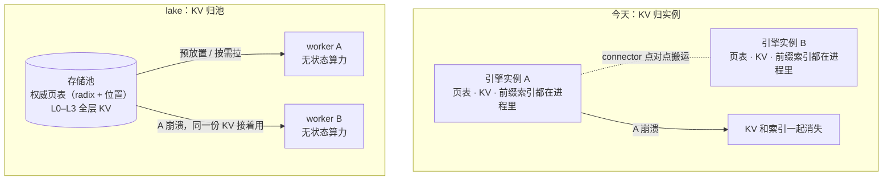

# 01 — KV 的虚拟内存：从 PagedAttention 到存算分离

如果你往 lake 集群里打一百个请求，带上同一段 system prompt，再去查它们前缀 KV 的“地址”，你会看到一百个一模一样的数字——同一个 block hash。

假如这些 KV 是每个请求各自算、各自存的，这个结果毫无意义：一百份相同的数据躺在一百个地方，烧一百份显存。但在 lake 里，这一百个请求命中的是**同一份 KV**。它此刻躺在哪块 HBM、哪台机器的 NVMe、还是对象存储里，没有任何一个请求知道，也不需要知道。

因为存储池对所有算力节点撒了一个谎：

**它让每个节点都坚信，KV 就在自己手边，显存要多少有多少。**

这个谎言不是新发明。它第一次登场是 1959 年，名字叫虚拟内存。lake 做的事情，是把这个讲了六十多年的故事，在 KV cache 上重新讲一遍——并且这一次，把它讲完。

本文按时间顺序把这条路线走一遍：虚拟内存当年解决了什么；PagedAttention 怎么把同一招搬进推理引擎，又停在了哪；业界各自走到了哪一站；最后，lake 为什么还要再往前走一步。设计细节不在此展开，分别指向对应架构文档；整体目标见 [`../00-plan.md`](../00-plan.md)。

## 六十年前的那个谎

早期的计算机里，程序直接读写物理内存。程序 A 占了 0–100KB，程序 B 就只能从 100KB 开始加载。单任务时代这没问题，多任务时代一到，三个死局立刻浮出来。

**第一个死局是碎片。** 程序不停地申请、释放，跑着跑着，物理内存就被挤成一块蜂窝煤：空闲总量还有 100MB，但被切成几万个几 KB 的小洞。这时来一个要 10MB 连续内存的程序，操作系统只能眼睁睁报“内存不足”。

**第二个死局是互相信任的毁灭。** 程序之间没有隔墙。A 的一个野指针踩进 B 的内存，B 当场崩溃；踩进内核，整机陪葬。那个时代写代码，就像在没有隔墙的房间里玩火。

**第三个死局最琐碎，也最折磨人：overlay。** 物理内存只有 1MB，程序有 2MB，怎么办？程序员自己动手，把程序切成几块，亲自写逻辑控制“现在加载第一块，用完了卸掉，再把第二块读进同一块内存”。大量的心血，消耗在这种搬砖上。

1959 年，曼彻斯特大学团队在 Atlas 机器上给出了答案：把“程序看到的地址”和“物理地址”彻底切开。逻辑优雅到了极点：

第一，**取消连续性**。物理内存切成定长页，程序的逻辑内存也切成页；程序以为自己拥有连续地址，操作系统通过页表把这些页随意散挂在物理内存的各个角落。碎片问题瞬间抹平——从此没有任何东西需要“连续”。

第二，**映射与隔离**。程序发出的每个地址都是虚拟地址，CPU 里的 MMU 在每次访存时截获它、查页表、翻译成物理地址；访问不属于自己的地址，MMU 直接弹中断，操作系统当场杀掉这个进程，其他程序毫发无损。

第三，**虚实不挂钩**。程序申请 1GB，操作系统不真的给 1GB，只在页表上画个饼。程序真正读写某一页时才发现物理内存里没有，触发缺页中断，操作系统再默默补上。物理内存不够了，就把冷页悄悄写进磁盘的 swap 分区。

当然，这个谎是有代价的：每次访存都要先查一次页表，一次访存变成好几次。工程上的回答是一套组合拳——硬件掏出 TLB（缓存近期翻译的快表，绝大多数翻译一个时钟周期完成），软件写好置换与回收策略（LRU 一族），硬把损耗压回个位数百分比。

这里有个分工值得记住：**MMU 硬件只干两件事，翻译和保护；真正值钱的是策略——什么时候换出、换哪页、什么时候回收——而策略从来都在软件里。**

行业最终接受了这个代价，因为所有人发现：虚拟内存的深层收益根本不是“省内存”，而是**解耦**。程序不再绑死在具体的物理位置上，进程于是可以被换出、被杀掉、被迁到另一颗核上，机器的利用率才敢拉满。Docker 能秒级启动、动态链接库能让几十个进程共享一份代码、云厂商敢把一台机器的内存超额卖出去——全部建立在这层幻象之上。

这个故事后来还有两个续集，都和 lake 要解决的问题直接相关。

**续集一是多核时代的缓存一致性。** 每个核有了私有缓存之后，共享内存就要回答“谁手里这份是真的”：MESI 协议用硬件状态机保证大家看到同一份数据。核再多下去，核间广播就不够用了，于是换成目录协议——一个中央目录记录“哪条缓存行被哪些核缓存着”，谁要写，先找目录。记住“目录”这个形态，后面会看到 lake 的页表权威长什么样。

**续集二是内存池化。** CXL 把内存从主板上解绑：内存不再焊死在某台机器里，而是机架级的池化资源，按需挂给任何一台计算节点。虚拟内存解耦了“程序与物理内存”，内存池化解耦的是“内存与机器”——同一层间接，又往下推了一代。

## KV cache 撞上了同一堵墙

六十多年后，大模型推理撞上了同一堵墙，只是这次被管理的对象换成了 KV cache。

KV cache 是推理的中间产物：每算一个 token，就要把它的 Key/Value 向量留下来，供后续所有 token 做 attention。它的难管之处和当年的内存一模一样——并发请求的 KV 随 decode 不断变长、长度千差万别，而 HBM 是最金贵的资源。早期的推理框架给每个请求按最大长度预留连续显存，三个死局一个不少地重演了：显存被预留和碎片榨干；十个请求带同一段 system prompt，就老老实实把同样的前缀算十遍、存十份；显存装不下，请求就只能排队等死。

vLLM 的 PagedAttention 就是 KV 世界的 Atlas 时刻——论文开宗明义，受操作系统虚拟内存与分页启发（见 [`../research/vllm/overview.md`](../research/vllm/overview.md)）：KV 按定长 block 切页（默认 16 token），每条 sequence 一张 block table，映射逻辑页到物理 block。

三招也原样搬了过来：

第一，**取消连续性**。一条请求的 KV 不必连续存放，block table 把散落的块串成逻辑上连续的序列，HBM 浪费压到个位数百分比。

第二，**映射与共享**。不同 sequence 的 block table 可以指向同一个物理 block——公共前缀、并行采样共享同一份 KV，显存占用随扇出线性下降；写时复制让 fork 采样只复制表项，谁真正改写了，才复制数据。

第三，**虚实不挂钩**。显存紧张时，冷 block 换出到 CPU，需要时再换回来（vLLM 的 `SharedOffloadRegion` / `swap_blocks_triton`，置换策略 lru/arc）——KV 有了自己的 swap。

## 为什么不用 GPU 的硬件 MMU

既然 PagedAttention 是“软件页表”，一个自然的疑问是：为什么不交给 GPU 的硬件 MMU 直接接管？GPU 又不是没有 MMU——统一虚拟寻址、demand paging（UVM）都是现成的。

先排除一个乍看合理的猜测：粒度。KV block 是不是太细，会把硬件 TLB 打爆？算一笔账就知道不成立。`block_size` 是 token 数，与 head 维度无关；主流模型每 token 的 KV 约 128–320KB，16 个 token 的 block 是 MB 级——比 GPU 硬件 MMU 的 2MB 大页还大。整个 KV arena 几十个大页就映射完，TLB 毫无压力。

而且这个问题真的有人正面试过。2024 年微软研究院的 vAttention（arXiv：2405.04437）就用 CUDA 的虚拟内存管理接口，给每条 sequence 一段连续的虚拟地址，物理页按需映射进去——block table 消失了，普通的 attention kernel 不用改就能跑。它还顺带量出了软件页表的真实代价：vLLM 在 CPU 侧准备 block table 的开销，在 batch 内序列长短悬殊时可以达到两位数百分比（后续版本已优化）。所以准确的说法不是“硬件路线走不通”，而是“硬件路线可行，但它解决的问题不对”：

1. **block table 是内容路由，不是地址翻译。** “第 12 条序列的第 300 个 token 的 KV 在哪个块”——这是按语义找数据；MMU 只会把虚拟地址翻译成物理地址，对“哪个块装着哪个 token”一无所知。这层映射硬件帮不上忙。
2. **复用语义只能在软件。** 前缀共享、写时复制、按内容去重、冷热驱逐，全都以 block table 为操作对象；硬件页表不暴露这些语义。vAttention 证明了连续虚拟地址可行，但共享与复用那层策略，它同样得在软件里做。
3. **缺页驱动的换页不可控。** UVM 的 page fault 是一次 host 往返，延迟和时机都不归你管，decode 热路径（ITL 以毫秒计）不能接受。所以引擎宁可自己写 offload——vLLM 有 block 粒度的换出层（LRU/ARC 策略加专门的 swap kernel，见 [`../research/vllm/compute.md`](../research/vllm/compute.md)），也不把换页交给 fault 驱动。

顺着“软硬件分工”往下想，还会得到另一个方案：既然 attention kernel 要显式读 block table，是不是该给 GPU 造一颗专用的“AI MMU”，让 kernel 面对一个虚拟连续的 KV 张量，由硬件负责打散与聚合？这个方案解决的是上面第一条里“不痛”的那半：attention 是访存 bound，每读一个 MB 级的 block 才查一次索引，kernel 里的翻译开销可以忽略，FlashAttention / FlashInfer / Triton 也早已把 paged KV 做成标准接口。真正昂贵的那条缝在单卡之外——下一节就说它。

## PagedAttention 停在了哪

那条昂贵的缝是：**KV 归产生它的引擎进程私有。**

PagedAttention 解耦了“逻辑 token 序列 ↔ 物理 block”，但只在单实例内。把视线拉到集群层面，虚拟内存出现之前的景象原样摆着：

- **状态即人质**。worker 崩溃，KV 随之销毁，上面对应的请求从头重算；反过来说，一个持有热点 KV 的实例不能随便下线，扩缩容被状态钉死。
- **索引和匹配，仍锚在引擎侧**。跨实例共享并非没人做——Mooncake、LMCache 这类系统已经能通过 connector 把 KV 在实例间传来传去，LMCache 甚至有一个中央协调器，记录“哪个实例的哪个位置有哪些 chunk”。但前缀这件事仍然归引擎：HiCache 的 radix 树长在每个引擎实例里，LMCache 的前缀匹配靠引擎从第 0 个 chunk 起顺序探测；中央元数据靠消息和心跳对账，是弱一致。位置、匹配、生命周期三本账，没有一个全局权威说了算。
- **搬砖回来了**。跨实例传 KV，要两个引擎的 connector 两两握手、自己发起、自己管理——每个引擎开发者都在干当年 overlay 程序员的活。

换言之：实例之内已经有了虚拟内存，集群层面还停在直连物理内存的时代。每个引擎实例自己当自己的操作系统——自己的页表、自己的 swap、自己的回收，实例之间靠点对点协议互相搬运。

## 业界停在哪一站

在 lake 之前，“KV 与引擎解耦”这条路上已经站着不少系统。一个一个看它们的设计，能看清每一站停在了哪。逐层对应与代码索引见 [`../research/3rdparty-reference.md`](../research/3rdparty-reference.md)。

- **vLLM：发明了分页，停在实例内。** 设计核心是每个 sequence 一张 block table，加一套读散落 block 的 paged attention kernel。跨实例留了 `KVConnectorBase_V1` 接口，例如 NIXL、Mooncake 的 connector 都从这里接入。但接入的是传输，不是所有权：前缀索引（APC）仍是引擎自维护的易失结构，实例死了，索引和 KV 一起死（见 [`../research/vllm/compute.md`](../research/vllm/compute.md)）。
- **SGLang HiCache：单机内把分层做全了，索引停在实例私有。** 它的 `HiRadixTree` 节点同时记录 L1（device）位置、L2（host）位置和链式哈希（当 L3 key）——已经是“带位置的页表项”的形状。例如它的 prefetch 有三个终止策略（best_effort / wait_complete / timeout，按 token 数给超时预算），write-back 也分三档（命中即回写 / 命中两次才回写 / 驱逐时才回写）。但这棵树长在每个引擎实例内；L3 命中靠实时向后端查询，没有全局权威（见 [`../research/sglang/hicache.md`](../research/sglang/hicache.md)）。
- **Mooncake：铺好了高速公路，没有建车管所。** 设计分两半：transfer-engine 负责 RDMA 零拷贝搬运，内存按 segment 注册，块按 `(segment_id, offset, len)` 寻址；store 是对象级 blob 池，按 `tenant+key` 字符串存取。例如它的 master 用一张哈希表记录全部对象元数据——没有内容寻址，没有前缀树。引擎要复用前缀，得自己在池子上面再长一份索引（见 [`../research/mooncake/transfer-engine.md`](../research/mooncake/transfer-engine.md)、[`../research/mooncake/kv-store.md`](../research/mooncake/kv-store.md)）。
- **LMCache：有中央协调器，但匹配与一致性停在引擎侧和弱一致。** 内容寻址（chunk 链式哈希）、多存储后端、实例间 P2P 直传都有；例如它的 cache_controller 维护一棵注册表，记录“哪个实例的哪个位置有哪些 chunk”，处理 lookup / pin / move。但前缀匹配不在控制器上——引擎侧从第 0 个 chunk 起顺序探测、断链即停；控制器与实例间靠消息加心跳对账，全量同步是 best-effort。有账本，但账本是弱一致的，记账的也不管匹配（见 [`../research/lmcache/sharing-and-backends.md`](../research/lmcache/sharing-and-backends.md)）。
- **Dynamo KVBM：离“KV 虚拟内存”最近，但 KV 仍归引擎。** 设计上分 logical / physical / engine 三层，offload 路径从 GPU 一路到远端对象存储；它的 `StorageTier` 按介质分（Device / HostPinned / Disk / External）——即“层”按介质划，不按“在本机还是远端”划，同一块 DRAM 放哪台机器都算同一层。例如 1.0 版本加了集群级 KV 事件，让 router 能看到全集群的缓存分布。但 KVBM 的定位是引擎缓存的 offload 层：KV 归 engine 持有，事件走 NATS，没有强一致位置视图（见 [`../research/dynamo/overview.md`](../research/dynamo/overview.md)）。
- **Ascend MemCache / UCM：同层的另两种形态。** 前者是昇腾的分布式 KV 对象池，MetaService 管元数据、LocalService 管本机介质；后者是可插拔缓存框架，KVStore 后端可换，挂在引擎插件层。两者都不是以前缀树为权威的设计（见 [`../research/memcache/overview.md`](../research/memcache/overview.md)、[`../research/ucm/overview.md`](../research/ucm/overview.md)）。

五站看下来，问题收敛成一个：谁来当那个全局的、懂前缀的、管生死的车管所？这正是 lake 要建的东西。

## lake 把谎言讲到集群级

lake 的核心想法只有一句话：**把“页表”从引擎私有，升级为独立的基础设施。**

立意是把所有有状态物——权重、KV、调度队列——从算力路径剥离，归一个长期存续、模型无关的存储池统一管理；算力节点不拥有任何内存，可随时销毁、随时拉起。三件事的进度不一样：KV 池是主线，原型已收口；权重分层缓存与请求队列（Router 的优先级队列）已有原型落地；逐阶段状态见 [`../00-plan.md`](../00-plan.md)，特性清单见 [`../features/features.md`](../features/features.md)。当年 Atlas 的三招，在集群尺度上重新落地。

**第一招，取消连续性——顺便取消“所有权”。** block 的身份不再是“哪个进程的第几号块”，而是从内容算出来的哈希：同一段前缀，谁算都是同一个身份。位置是另一份独立的数据：哪层介质、哪个节点、哪段偏移。HBM、DRAM、NVMe、对象存储编成 L0–L3 四层，层与层的区别只是介质，与在本机还是远端无关——连 HBM 都是池的物理载体（见 [`storage-layer.md`](storage-layer.md)）。这就是内存池化那个续集推到头的样子：CXL 解绑的是 DRAM 与机器，lake 把 HBM 也解绑了。于是 worker 连“租”内存的资格都没有：它只是池选中的计算场所，崩溃时烧掉的只是自己，烧不到 KV。

**第二招，映射与隔离——页表的权威在池，不在引擎。** 查“这段前缀的 KV 在哪”，查的是池维护的前缀树加位置视图，权威在控制面进程内存里（见 [`control-plane.md`](control-plane.md)）。这个形态就是前面说的目录协议：一份中央权威记录“哪个块被哪些节点持有”；Router 和每个节点上的 agent 手里各持一份只读镜像，相当于目录推到各节点的投影，绝大多数时候本地一查就有，零 RPC，守住 5ms 的选路预算（见 [`../features/slo.md`](../features/slo.md)）。隔离也比 MMU 更彻底：MMU 是“访问错了就杀你”，lake 里引擎根本拿不到地址——不组装 block table，不知道对端是谁，想踩都没处踩。

**第三招，虚实不挂钩——连带超发。** 要用的时候不在本地，就从池里现搬；池按冷热主动搬家，热的往上搬，冷的往下沉，公共前缀多一分保护。新产出的块先在 NVMe 落稳，才允许被别人看见——脏页没落盘之前不许发布。因为下面两层永远是后盾，HBM/DRAM 里的副本说扔就扔：池敢向整个集群呈现一个比所有 HBM 加起来大得多的 KV 工作集。这和云厂商超卖内存，是同一种会计手法。

整套对应关系列出来是这样：

| OS 虚拟内存 | lake |
|---|---|
| 虚拟地址 | block 的身份哈希（`KVBlockID`），与在哪无关 |
| 页表 | 池维护的“前缀 → 位置”权威视图（radix + 位置视图） |
| TLB | Router 和各节点手里的只读镜像，本地一查就有，零 RPC |
| 缺页中断 | 不在本地，就从池的下一层现搬 |
| swap 分区 | NVMe 层是恢复点，对象存储是最终后盾 |
| 脏页先写回，再复用页框 | 先落盘，再让别人看见（durable-first） |
| LRU 置换 | 按冷热驱逐，公共前缀多一分保护 |
| 页被 pin 住不可换出 | 正在算、正在传的块，谁也不许动 |
| kswapd 后台回收 | 后台回收与整理，限速、可暂停 |
| 内存超发 | 副本说扔就扔 → KV 工作集可以远超 HBM 总量 |

## 有五处，这个类比会断

把 lake 理解成“软件版 MMU”不算错，但会漏掉真正重要的东西。这个类比在五处会断：

1. **内容寻址 ≠ 虚拟寻址。** 虚拟地址是每进程私有的任意编号，两个进程共享一页要靠显式机制（共享内存，或 KSM 这种事后再扫描合并的补救）。lake 的“地址”是前缀链式哈希 `hash(parent_block_hash ‖ 本块 token ids)`——相同前缀天然算出相同身份，**全局去重和复用是寻址的副产品**，不需要任何额外机制。代价是哈希必须链式：KV 是前缀相关的（RoPE 位置编码、Mamba state 都是全前缀的函数），纯内容哈希会让“前缀不同、尾部相同”的序列误复用；把父块哈希编进本块身份，就不会撞。虚拟地址天然带进程上下文，从来没有这个问题（见 [`kv-cache-pool.md`](kv-cache-pool.md)「Block 寻址」）。
2. **翻译发生在调度时刻，不是每次访存。** MMU 在每条 load/store 上硬件翻译，对程序完全透明；lake 在请求/batch 边界由 Router 查镜像选好路、agent 组装好 block table 交给引擎，之后 attention 直接读 HBM，运行期零间接层（见 [`compute-layer.md`](compute-layer.md)）。相当于把翻译动作提到调度时刻一次做完——这就是为什么 5ms 模式选择预算是硬约束，它是这套系统的 TLB 命中承诺。
3. **没有硬件执行者，失败是显式的分布式问题。** 缺页是同步异常，指令级恢复；lake 的 miss 是软件异步 RDMA 搬运加 fence，还要处理镜像最终一致（误判 → 回查权威 → 回填）、在途传输源端冻结（ref 钉住，防半传覆写）这类 MMU 根本不存在的问题。它最近的亲戚是 TLB shootdown，而不是 page fault（见 [`consistency.md`](consistency.md)）。
4. **池懂页与页的关系，MMU 不懂。** MMU 眼里页与页毫无关联；lake 的 radix 记着每个 block 的前缀谱系，前缀亲和保护、模型下线级联删除、碎片整理把同序列 block 共置，全部建立在这份谱系上。这也是池必须自长 radix 的原因——一个不懂前缀的 blob 池，支撑不了前缀复用、DualPath、D-direct 中的任何一个（见 [`kv-cache-pool.md`](kv-cache-pool.md)「为何池必须自长 radix」）。
5. **连“物理内存”本身也是租来的。** 前面说的内存池化，CXL 解绑的是 DRAM 与单台机器；lake 推到头：HBM 也进池。worker 崩溃烧不到 KV，因为恢复点在 L2 NVMe，与位置无关；节点下线只是池把它的介质收回。这已经是 memory disaggregation 的极端版，超出单机虚拟内存讨论的范围（见 [`kv-cache-pool.md`](kv-cache-pool.md)「故障恢复」）。

## 回到间接层

计算机科学里有条老话：借由一层间接层，可以解决绝大多数问题。虚拟内存是它最著名的注脚——解耦程序与物理内存，进程于是可换出、可杀、可迁移。多核一致性补上了“私有副本与全局真相”的一课，内存池化补上了“内存与机器解绑”的一课。

lake 把同一层间接用在了推理系统的状态上：解耦 KV 与 GPU，算力节点于是可销毁、可拉起。隔了六十多年，管理对象是新的，定理还是那一条。

## 参考与回溯

- vLLM：[`../research/vllm/overview.md`](../research/vllm/overview.md)（PagedAttention 血缘）、[`../research/vllm/compute.md`](../research/vllm/compute.md)（block table / offload 实现）；源码锚点 `vllm/v1/worker/gpu/block_table.py`、`vllm/v1/kv_offload/cpu/`。
- vAttention（arXiv：2405.04437，非 submodule）：用 CUDA VMM 走硬件路线的对照实验——证明连续虚拟地址可行，同时量出软件页表的 CPU 侧代价。
- SGLang HiCache：[`../research/sglang/hicache.md`](../research/sglang/hicache.md)；源码锚点 `radix_cache.py::TreeNode`、`hiradix_cache.py::prefetch_from_storage`。
- Mooncake：[`../research/mooncake/transfer-engine.md`](../research/mooncake/transfer-engine.md)、[`../research/mooncake/kv-store.md`](../research/mooncake/kv-store.md)；源码锚点 `TransferEngine::registerLocalMemory` / `openSegment`、`master_service.h`。
- LMCache：[`../research/lmcache/sharing-and-backends.md`](../research/lmcache/sharing-and-backends.md)；源码锚点 `cache_controller/utils.py::RegistryTree`、`StorageBackendInterface::batched_contains`。
- Dynamo：[`../research/dynamo/overview.md`](../research/dynamo/overview.md)；源码锚点 `lib/kvbm-{logical,physical,engine}/`、`lib/kv-router/src/protocols.rs::StorageTier`。
- lake 侧落地：[`kv-cache-pool.md`](kv-cache-pool.md)（block 寻址 / radix / 传输 / 生命周期）、[`storage-layer.md`](storage-layer.md)（L0–L3 统一编址）、[`control-plane.md`](control-plane.md)（位置视图权威）、[`compute-layer.md`](compute-layer.md)（引擎零地址契约）、[`execution-modes.md`](execution-modes.md) / [`data-flow.md`](data-flow.md)（三模式与 KV 流转）、[`../features/slo.md`](../features/slo.md)（5ms 模式选择预算）。
