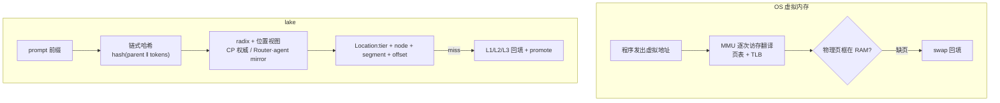

# 01 — KV 的虚拟内存:从 PagedAttention 到存算分离

本文是介绍性文档,回答"lake 为什么长这样"。从虚拟内存讲起,经 PagedAttention,引出 lake 的核心想法,最后对照业界现状。设计细节不在此展开,分别指向对应架构文档;总立地见 [`../00-plan.md`](../00-plan.md)。

## 虚拟内存解决了什么

早期计算机里,程序直接读写物理内存。进入多任务时代后,这种做法撞上三个死局:

- **碎片**:程序频繁申请释放,空闲内存被切成蜂窝。总量够,但没有连续的一段,新程序只能报"内存不足"。
- **无隔离**:程序之间没有隔墙,一个野指针可以踩死另一个程序;踩进内核,整机宕机。
- **overlay**:内存装不下程序时,程序员手动把代码切块,自己写逻辑控制哪一段何时待在内存里——大量时间花在搬砖上。

1959 年,曼彻斯特大学团队在 Atlas 机器上给出解法:把"程序看到的地址"和"物理地址"彻底切开。定长分页消灭碎片(逻辑连续、物理散落);MMU 在每次访存时把虚拟地址翻译成物理地址,越权访问当场杀掉进程;缺页中断 + swap 让内存可以超发——申请了不立刻给,不够了把冷页写进磁盘腾位。

代价是每次访存多查一次页表。工程上用两件东西把代价压回去:TLB(缓存近期翻译的硬件快表,绝大多数翻译一个时钟周期完成)和软件侧的置换/回收策略(LRU 一族)。注意这里的分工:**MMU 硬件只干翻译和保护,值钱的是策略,而策略从来在软件**。

这套机制的深层收益不是"省内存",而是**解耦**:程序不再绑死在具体物理位置上,进程于是可以被换出、被杀、被迁移,机器利用率才敢拉满。这是后面所有事情的动机。

## PagedAttention:同一招用在 KV cache 上

KV cache 面临的问题和当年的内存管理同构:并发请求的 KV 随 decode 动态增长、长度各异,HBM 被切成碎片;并行采样与公共前缀要求同一份 KV 被多条序列共享。

vLLM 的 PagedAttention 论文开宗明义,受操作系统虚拟内存与分页启发(见 [`../research/vllm/overview.md`](../research/vllm/overview.md)):KV 按定长 block 切页(vLLM 默认 16 token),每条 sequence 一张 block table,映射逻辑页→物理 block。收益与虚拟内存同构,且不止碎片:

- **共享**:不同 sequence 的 block table 指向同一物理 block → prefix caching、parallel sampling 的显存占用随扇出线性下降;写时复制(COW)让 fork 采样只复制表项。
- **换出**:显存不足时冷 block 换到 CPU(vLLM 的 `SharedOffloadRegion` / `swap_blocks_triton`,置换策略 lru/arc)——KV 的 swap。
- **碎片消除**:单条请求的 KV 不必连续,HBM 浪费压到个位数百分比。

**为什么是软件页表,而不是 GPU 硬件 MMU?** 一种常见误读是"KV block 太细,硬件 TLB 会打爆"。这不成立:`block_size` 是 token 数,与 head 维度正交;主流模型每 token 的 KV 约 128–320KB,16-token 的 block 是 MB 级——比 GPU 硬件 MMU 的 2MB 大页还大,整个 KV arena 几十个大页就映射完,TLB 毫无压力。GPU 也早就有硬件 demand paging(UVM)。工业界刻意不用它管 KV,真正的原因有三个:

1. **分配动态性**:driver 级映射/解除映射是微秒到毫秒级且带同步的操作,而 block 的分配释放是毫秒级高频动作;
2. **缺页延迟不可控**:UVM 的 page fault 是 host 往返,decode 热路径(ITL 预算)不能接受,所以引擎宁可自己写 offload 调度;
3. **策略必须懂语义**:KV 可重算(驱逐不需要保数据)、按内容共享、有冷热——硬件页表不暴露这些语义,策略只能活在软件里。

## PagedAttention 解到哪一层

PagedAttention 解耦了**逻辑 token 序列 ↔ 物理 block**,但只在单实例内。KV 仍然归产生它的引擎进程私有:

- worker 崩溃,KV 随之销毁,请求从头重算;
- 跨实例共享/迁移要引擎间 connector 两两握手(engine-to-engine 控制链);
- 扩缩容被状态钉死:持有热点 KV 的实例不能随便下线。

换言之:**实例之内已经有了虚拟内存,集群层面还停在直连物理内存的时代**。每个引擎实例自己当自己的 OS——自己的页表、自己的 swap、自己的回收,彼此之间靠点对点协议搬运。

另有一种误诊值得澄清:"attention kernel 显式读 block table,说明内存管理与计算缝合,需要 GPU 内置专用 AI MMU 才能彻底解耦"。kernel 那条缝不痛:attention 是访存 bound,每读一个 MB 级 block 才查一次索引,翻译开销可以忽略;FlashAttention / FlashInfer / Triton 也已把 paged KV 做成标准接口。真正昂贵的是**引擎 ↔ KV 所有权**这条缝,而它是任何单卡硬件 MMU 都解决不了的——硬件翻译改变不了 KV 归哪个进程所有。

## lake:把这套子系统做完,做到集群级

lake 的核心想法一句话:**把"页表"从引擎私有升级为独立基础设施**。所有有状态物(权重、KV、调度队列)从算力路径剥离,归一个长期存续、模型无关的存储池统一管理;算力节点不拥有任何内存,可随时销毁/拉起。特性清单见 [`../features/features.md`](../features/features.md)。

概念映射:

| OS 虚拟内存 | lake |
|---|---|
| 虚拟地址(与物理位置解耦的逻辑身份) | `KVBlockID = (model_id, revision, block_hash, …)`,身份不含位置(见 [`../../proto/schema.proto`](../../proto/schema.proto)) |
| 页表(VA→PA) | radix + 位置视图:`block_hash → Location{tier, node_id, segment_id, offset}`,权威在 Rust 控制面进程内存(见 [`control-plane.md`](control-plane.md)) |
| TLB | Router/agent 的只读 mirror,选路零 RPC(守 5ms 模式选择预算,见 [`../features/slo.md`](../features/slo.md));镜像不可信时回查权威树 |
| 缺页中断 | 读 miss 从 L1/L2/L3 回填(被动兜底);prefetch ≈ prepaging |
| swap 分区 | L2 NVMe 池(F4 恢复点);L3 对象存储 ≈ file-backed 页(`l3_present` + object key 现场拼) |
| 脏页先写回再复用页框 | durable-first:满块先落 L2 durable,才注册 radix 发布视图 |
| 置换算法(LRU/Clock) | LFU-Aging 热度分 + 前缀亲和加权 |
| 页被 pin 不可换出 | ref>0 冻结(请求引用 / 在途传输引用 / writeback ref) |
| kswapd / compactd(后台回收规整) | GC + 碎片整理共享后台带宽池(<10%,令牌桶可暂停) |
| 内存超发(申请了不立刻给) | L0/L1 驱逐不丢数据(L2/L3 有后盾)→ 池呈现比 HBM 总和大得多的 KV 工作集 |

相对"单机虚拟内存",lake 有三层推进:

1. **连 HBM 都归池**。OS 的页表只管 RAM 与磁盘;lake 统一编址 L0–L3(HBM / DRAM / NVMe / 对象存储,层=介质非位置,见 [`storage-layer.md`](storage-layer.md)),计算节点零私有内存,不存在引擎自维护的易失前缀索引(无 APC)。**本地命中**不是"引擎缓存命中",而是"池把 block 预放置在了本机 HBM"——放置决策的结果。
2. **池懂前缀**。radix 树(节点 = block_hash,路径 = token 序列)归存储池权威。这是池必须自长的能力:Mooncake 式的 blob 池(无内容寻址、无前缀匹配)支撑不了 lake 的三个核心能力——前缀复用、DualPath、D-direct(见 [`kv-cache-pool.md`](kv-cache-pool.md)「为何池必须自长 radix」)。
3. **执行模式是选路结果**。前缀 KV 已被池放置在某节点 HBM(本地命中)→ D-direct 零传输直跳;在池里但不在本地 → 传输后混部或 PD 分离。Router 按 `f(请求, 集群状态)` 逐请求选,读本地镜像,零 RPC。详见 [`execution-modes.md`](execution-modes.md)、[`data-flow.md`](data-flow.md)。

## 与 MMU / 虚拟内存不一样的地方

类比到此为止。lake 不是把 MMU 搬进软件,有五处本质不同:

1. **内容寻址 ≠ 虚拟寻址**。VA 是每进程私有的任意编号,两个进程共享一页要靠显式机制(共享内存、KSM 事后扫描)。lake 的"地址"是前缀链式哈希 `hash(parent_block_hash ‖ 本块 token ids)`:相同前缀天然算出相同身份,**全局去重与复用是寻址的副产品**,不需要任何额外机制。代价是哈希必须链式——KV 是前缀相关的(RoPE/ALiBi 位置编码、Mamba recurrent state 都是全前缀的函数),纯内容哈希会让"前缀不同、尾部相同"的序列误复用;链式把父块哈希编进本块身份。VA 天然含进程上下文,没有这个问题(见 [`kv-cache-pool.md`](kv-cache-pool.md)「Block 寻址」)。
2. **翻译时机:调度时刻批量做,不是逐次访存**。MMU 在每条 load/store 上硬件翻译,对程序透明;lake 在请求/batch 边界由 Router 查镜像选路、agent 组装好 block table 交给引擎,之后 attention 直接读 HBM,运行期零间接层(见 [`compute-layer.md`](compute-layer.md)「HBM 池化下的入图与 KV 管理」)。相当于把 MMU 的翻译动作提到调度时刻一次做完——这就是为什么"5ms 模式选择预算"是 SLO 硬约束:它是这套系统的 TLB 命中承诺。
3. **没有硬件执行者,失败是显式的分布式问题**。缺页是同步异常、指令级恢复;lake 的 miss 是软件异步 RDMA 搬运 + fence,还要处理镜像最终一致(误判 → 回查权威 → 回填)、在途传输源端冻结(ref 钉住,防半传覆写)这类 MMU 不存在的一致性问题。最近的亲戚是 TLB shootdown,而不是 page fault(见 [`consistency.md`](consistency.md))。
4. **池懂页间关系,MMU 不懂**。MMU 眼里页与页无关;lake 的 radix 记着 block 的前缀谱系,前缀亲和保护、模型下线级联删、defrag 把同序列 block 共置,全建立在这份谱系上。
5. **"物理内存"的所有权也被收走**。VM 里 RAM 好歹归 OS、进程只是租用;lake 把 HBM/DRAM/NVMe 全部划为池的物理载体,worker 崩溃烧不到 KV(恢复点在 L2,与位置无关,见 [`kv-cache-pool.md`](kv-cache-pool.md)「故障恢复」)。这层更接近 memory disaggregation / CXL 池化的极端版,而不是单机 VM。

## 业界现状对照

各家都在向"KV 与引擎解耦"走,停的位置不同。逐层对应与代码索引见 [`../research/3rdparty-reference.md`](../research/3rdparty-reference.md)。

- **vLLM(PagedAttention)**:单实例软件页表的开创者。KV 引擎私有,前缀索引(APC)是引擎自维护的易失结构;`KVConnectorBase_V1` 是存算分离的接入点,但接入不改变所有权。lake 复用其 block 粒度与 block table 模型,差别在:物理位置由池元数据决定,而非进程私有 free-list(见 [`../research/vllm/compute.md`](../research/vllm/compute.md))。
- **SGLang HiCache**:单机内最完整的一版——L1(device)/ L2(host)/ L3(后端)分层,`HiRadixTree` 的 `TreeNode` 同时记 L1/L2 位置与链式哈希(当 L3 key),即"带位置的页表项";`prefetch_from_storage` 三策略与 `write_through` / `write_back` 是 KV 的 prepaging / swap 策略。停在实例私有:L1/L2 归引擎,L3 命中靠实时查后端(弱一致)。lake 全层归池,位置视图由控制面进程内存强一致维护,etcd 只存降频 checkpoint(见 [`../research/sglang/hicache.md`](../research/sglang/hicache.md))。
- **Mooncake**:transfer-engine 提供 RDMA 零拷贝数据面(segment 寻址 `(segment_id, offset, len)`,lake `rust/transfer` 直接以此为原型);mooncake-store 是对象级 blob 池,无内容寻址、无 radix——做了"物理内存 + DMA",没做页表。lake 借数据面,控制面自长(见 [`../research/mooncake/transfer-engine.md`](../research/mooncake/transfer-engine.md)、[`../research/mooncake/kv-store.md`](../research/mooncake/kv-store.md))。
- **LMCache**:跨请求/跨实例复用 + 多存储后端 + 内容寻址的工程化;无全局强一致元数据,控制器只做弱一致协调(见 [`../research/lmcache/overview.md`](../research/lmcache/overview.md))。
- **Dynamo KVBM**:GPU→CPU→SSD→远端三层 offload,`StorageTier`(Device/HostPinned/Disk/External)介质分层与 lake"层=介质非位置"一致,是工业界最接近"KV 虚拟内存"的实现。但 KV 归 engine 持有,KVBM 是 offload 层(引擎私有缓存的延伸);事件走 NATS,无全局强一致位置视图。lake 里 HBM/KV 全归池,offload 是池的统一放置,而非引擎缓存的卸载(见 [`../research/dynamo/overview.md`](../research/dynamo/overview.md))。
- **Ascend MemCache / UCM**:分别是昇腾分布式 KV 对象池(MetaService/LocalService,非 radix 控制面)与可插拔缓存框架(引擎插件层),作同层对照(见 [`../research/memcache/overview.md`](../research/memcache/overview.md)、[`../research/ucm/overview.md`](../research/ucm/overview.md))。

lake 的位置:把这条演进路线推到头——存储池不是某个引擎的附属层,而是长期存续、模型无关的独立基础设施,连 HBM 都在池内。

## 回到间接层

"借由一层间接层,解决计算机科学中的绝大多数问题。"虚拟内存是这条原理最著名的注脚:解耦程序与物理内存,进程于是可换出、可杀、可迁移。lake 把同一层间接用在推理系统的状态上:解耦 KV 与 GPU,算力节点于是可销毁、可拉起。隔了六十多年,对象是新的,定理是同一条。

## 参考与回溯

- vLLM:[`../research/vllm/overview.md`](../research/vllm/overview.md)(PagedAttention 血缘)、[`../research/vllm/compute.md`](../research/vllm/compute.md)(block table / offload 实现);源码锚点 `vllm/v1/worker/gpu/block_table.py`、`vllm/v1/kv_offload/cpu/`。
- SGLang HiCache:[`../research/sglang/hicache.md`](../research/sglang/hicache.md);源码锚点 `radix_cache.py::TreeNode`、`hiradix_cache.py::prefetch_from_storage`。
- Mooncake:[`../research/mooncake/transfer-engine.md`](../research/mooncake/transfer-engine.md)、[`../research/mooncake/kv-store.md`](../research/mooncake/kv-store.md);源码锚点 `TransferEngine::registerLocalMemory` / `openSegment`、`master_service.h`。
- Dynamo:[`../research/dynamo/overview.md`](../research/dynamo/overview.md);源码锚点 `lib/kvbm-{logical,physical,engine}/`、`lib/kv-router/src/protocols.rs::StorageTier`。
- lake 侧落地:[`kv-cache-pool.md`](kv-cache-pool.md)(block 寻址 / radix / 传输 / 生命周期)、[`storage-layer.md`](storage-layer.md)(L0–L3 统一编址)、[`control-plane.md`](control-plane.md)(位置视图权威)、[`compute-layer.md`](compute-layer.md)(引擎零地址契约)、[`execution-modes.md`](execution-modes.md) / [`data-flow.md`](data-flow.md)(三模式与 KV 流转)、[`../features/slo.md`](../features/slo.md)(5ms 模式选择预算)。
