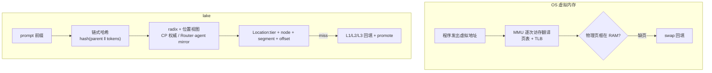

# 01 — KV 的虚拟内存:从 PagedAttention 到存算分离

如果你往 lake 集群里打一百个请求,带上同一段 system prompt,再去查它们前缀 KV 的"地址",你会看到一百个一模一样的数字——同一个 block hash。

假如这些 KV 是每个请求各自算、各自存的,这个结果毫无意义:一百份相同的数据躺在一百个地方,烧一百份显存。但在 lake 里,这一百个请求命中的是**同一份 KV**。它此刻躺在哪块 HBM、哪台机器的 NVMe、还是对象存储里,没有任何一个请求知道,也不需要知道。

因为存储池对所有算力节点撒了一个谎:

**它让每个节点都坚信,KV 就在自己手边,显存要多少有多少。**

这个谎言不是新发明。它第一次登场是 1959 年,名字叫虚拟内存。lake 做的事情,是把这个讲了六十多年的故事,在 KV cache 上重新讲一遍——并且这一次,把它讲完。

本文讲这个故事:虚拟内存当年解决了什么,PagedAttention 怎么把同一招搬进推理引擎,它停在了哪,以及 lake 为什么要再往前走一步。设计细节不在此展开,分别指向对应架构文档;总立地见 [`../00-plan.md`](../00-plan.md)。

## 六十年前的那个谎

早期的计算机里,程序直接读写物理内存。程序 A 占了 0–100KB,程序 B 就只能从 100KB 开始加载。单任务时代这没问题,多任务时代一到,三个死局立刻浮出来。

**第一个死局是碎片。** 程序不停地申请、释放,跑着跑着,物理内存就被挤成一块蜂窝煤:空闲总量还有 100MB,但被切成几万个几 KB 的小洞。这时来一个要 10MB 连续内存的程序,操作系统只能眼睁睁报"内存不足"。

**第二个死局是互相信任的毁灭。** 程序之间没有隔墙。A 的一个野指针踩进 B 的内存,B 当场崩溃;踩进内核,整机陪葬。那个时代写代码,就像在没有隔墙的房间里玩火。

**第三个死局最琐碎,也最折磨人:overlay。** 物理内存只有 1MB,程序有 2MB,怎么办?程序员自己动手,把程序切成几块,亲自写逻辑控制"现在加载第一块,用完了卸掉,再把第二块读进同一块内存"。大量的心血,消耗在这种搬砖上。

1959 年,曼彻斯特大学团队在 Atlas 机器上给出了答案:把"程序看到的地址"和"物理地址"彻底切开。逻辑优雅到了极点:

第一,**取消连续性**。物理内存切成定长页,程序的逻辑内存也切成页;程序以为自己拥有连续地址,操作系统通过页表把这些页随意散挂在物理内存的各个角落。碎片问题瞬间抹平——从此没有任何东西需要"连续"。

第二,**映射与隔离**。程序发出的每个地址都是虚拟地址,CPU 里的 MMU 在每次访存时截获它、查页表、翻译成物理地址;访问不属于自己的地址,MMU 直接弹中断,操作系统当场杀掉这个进程,其他程序毫发无损。

第三,**虚实不挂钩**。程序申请 1GB,操作系统不真的给 1GB,只在页表上画个饼。程序真正读写某一页时才发现物理内存里没有,触发缺页中断,操作系统再默默补上。物理内存不够了,就把冷页悄悄写进磁盘的 swap 分区。

当然,这个谎是有代价的:每次访存都要先查一次页表,一次访存变成好几次。工程上的回答是一套组合拳——硬件掏出 TLB(缓存近期翻译的快表,绝大多数翻译一个时钟周期完成),软件写好置换与回收策略(LRU 一族),硬把损耗压回个位数百分比。

这里有个分工值得记住:**MMU 硬件只干两件事,翻译和保护;真正值钱的是策略——什么时候换出、换哪页、什么时候回收——而策略从来都在软件里。**

行业最终接受了这个代价,因为所有人发现:虚拟内存的深层收益根本不是"省内存",而是**解耦**。程序不再绑死在具体的物理位置上,进程于是可以被换出、被杀掉、被迁到另一颗核上,机器的利用率才敢拉满。Docker 能秒级启动、动态链接库能让几十个进程共享一份代码、云厂商敢把一台机器的内存超额卖出去——全部建立在这层幻象之上。

## KV cache 撞上了同一堵墙

六十年后,大模型推理撞上了同一堵墙,只是这次被管理的对象换成了 KV cache。

KV cache 是推理的中间产物:每算一个 token,就要把它的 Key/Value 向量留下来,供后续所有 token 做 attention。它的难管之处和当年的内存一模一样——并发请求的 KV 随 decode 不断变长、长度千差万别,而 HBM 是最金贵的资源。早期的推理框架给每个请求按最大长度预留连续显存,三个死局一个不少地重演了:显存被预留和碎片榨干;十个请求带同一段 system prompt,就老老实实把同样的前缀算十遍、存十份;显存装不下,请求就只能排队等死。

vLLM 的 PagedAttention 就是 KV 世界的 Atlas 时刻——论文开宗明义,受操作系统虚拟内存与分页启发(见 [`../research/vllm/overview.md`](../research/vllm/overview.md)):KV 按定长 block 切页(默认 16 token),每条 sequence 一张 block table,映射逻辑页到物理 block。

三招也原样搬了过来。取消连续性:一条请求的 KV 散落各处,HBM 浪费压到个位数百分比。映射:不同 sequence 的 block table 指向同一个物理 block,公共前缀、并行采样共享同一份 KV,显存占用随扇出线性下降;写时复制让 fork 采样只复制表项。虚实不挂钩:显存紧张时,冷 block 换出到 CPU(vLLM 的 `SharedOffloadRegion` / `swap_blocks_triton`,置换策略 lru/arc)——KV 有了自己的 swap。

## 一个流传很广的误诊

既然 PagedAttention 是"软件页表",一个自然的疑问是:为什么不用 GPU 的硬件 MMU 直接接管?

流传最广的解释是"KV block 太细,会打爆 GPU 的 TLB"。这个说法经不起一笔账:`block_size` 是 token 数,与 head 维度完全无关;主流模型每 token 的 KV 约 128–320KB,16 个 token 的 block 是 MB 级——比 GPU 硬件 MMU 的 2MB 大页还大。整个 KV arena 几十个大页就映射完了,TLB 毫无压力。何况 GPU 早就有硬件 demand paging(UVM),要用早用了。

工业界刻意不用它,真正的原因有三个:

1. **分配动态性**。driver 级映射/解除映射是微秒到毫秒级、且带同步的操作;而 block 的分配释放是毫秒级的高频动作,走驱动等于给调度器上镣铐。
2. **缺页延迟不可控**。UVM 的 page fault 是一次 host 往返,decode 热路径(ITL 预算以毫秒计)根本不能接受。所以引擎宁可自己写 offload 调度,也不把换页交给硬件。
3. **策略必须懂语义**。KV 可重算——驱逐时不需要像内存页那样保证数据不丢;KV 按内容共享、有冷热之分。这些语义硬件页表根本不暴露,策略只能活在软件里。

与这个误诊同源的还有一个说法:"attention kernel 显式读 block table,说明内存管理和计算缝在一起,需要 GPU 内置专用的 AI MMU 才能彻底解耦。"kernel 那条缝其实不痛:attention 是访存 bound,每读一个 MB 级的 block 才查一次索引,翻译开销可以忽略,FlashAttention / FlashInfer / Triton 也早已把 paged KV 做成标准接口。真正昂贵的缝在别处——而它恰恰是任何单卡硬件 MMU 都解决不了的。

## PagedAttention 停在了哪

那条昂贵的缝是:**KV 归产生它的引擎进程私有。**

PagedAttention 解耦了"逻辑 token 序列 ↔ 物理 block",但只在单实例内。把视线拉到集群层面,你会发现虚拟内存出现之前的景象原样摆着:

- **状态即人质**。worker 崩溃,KV 随之销毁,上面对应的请求从头重算;反过来说,一个持有热点 KV 的实例不能随便下线,扩缩容被状态钉死。
- **共享出不了进程**。前缀复用是单实例的内部福利;另一个节点上的请求带着同样的前缀来,只能重新算一遍。
- **搬砖回来了**。跨实例传 KV,要两个引擎的 connector 两两握手、自己发起、自己管理——每个引擎开发者都在干当年 overlay 程序员的活。

换言之:实例之内已经有了虚拟内存,集群层面还停在直连物理内存的时代。每个引擎实例自己当自己的操作系统——自己的页表、自己的 swap、自己的回收,实例之间靠点对点协议互相搬运。

## lake 把谎言讲到集群级

lake 的核心想法只有一句话:**把"页表"从引擎私有,升级为独立的基础设施。**

所有有状态物——权重、KV、调度队列——从算力路径剥离,归一个长期存续、模型无关的存储池统一管理;算力节点不拥有任何内存,可随时销毁、随时拉起(特性清单见 [`../features/features.md`](../features/features.md))。当年 Atlas 的三招,在集群尺度上重新落地:

**取消连续性,并且取消"所有权"。** block 的身份是 `KVBlockID = (model_id, revision, block_hash, …)`,不含任何位置;位置是另一份数据:`Location{tier, node_id, segment_id, offset}`(见 [`../../proto/schema.proto`](../../proto/schema.proto))。HBM、DRAM、NVMe、对象存储统一编址为 L0–L3,层=介质而非位置——连 HBM 都是池的物理载体,计算节点零私有内存,不存在引擎自维护的易失前缀索引(见 [`storage-layer.md`](storage-layer.md))。这一步比操作系统更彻底:VM 里内存好歹归 OS、进程只是租用;lake 里 worker 连"租"都不租。

**映射与隔离,由池的权威来执行。** "页表"是 radix 树加位置视图——`block_hash → 位置`,权威在 Rust 控制面的进程内存里(见 [`control-plane.md`](control-plane.md));"TLB"是 Router 和 agent 手里的只读镜像,选路查本地、零 RPC,守住 5ms 模式选择的 SLO 预算(见 [`../features/slo.md`](../features/slo.md))。隔离也比 MMU 更进一步:MMU 是"你访问错了就杀你",lake 里引擎零地址、不组装 block table、不知道对端存在——它根本没有访问错的手段。

**虚实不挂钩,连带超发。** 读 miss 从 L1/L2/L3 回填;冷热按 LFU-Aging 加前缀亲和,在层间 promote/demote;满块先落 L2 durable 才注册 radix 发布视图——脏页没落盘之前,不许被看见。L0/L1 驱逐不丢数据(L2/L3 有后盾),于是池可以向整个集群呈现一个比所有 HBM 加起来大得多的 KV 工作集,这和云厂商超卖内存是同一种会计手法。

整套对应关系列出来是这样:

| OS 虚拟内存 | lake |
|---|---|
| 虚拟地址(与物理位置解耦的逻辑身份) | `KVBlockID`,身份不含位置 |
| 页表(VA→PA) | radix + 位置视图,权威在控制面进程内存 |
| TLB | Router/agent 只读 mirror,零 RPC;不可信时回查权威树 |
| 缺页中断 | 读 miss 从下层回填;prefetch ≈ prepaging |
| swap 分区 | L2 NVMe 池(F4 恢复点);L3 对象存储 ≈ file-backed 页 |
| 脏页先写回再复用页框 | durable-first:先落 L2,才注册 radix 发布视图 |
| 置换算法(LRU/Clock) | LFU-Aging 热度分 + 前缀亲和加权 |
| 页被 pin 不可换出 | ref>0 冻结(请求引用 / 在途传输引用 / writeback ref) |
| kswapd / compactd | GC + 碎片整理共享后台带宽池(<10%,可暂停) |
| 内存超发 | L0/L1 驱逐不丢数据 → KV 工作集可以远超 HBM 总量 |

## 有五处,这个类比会断

把 lake 理解成"软件版 MMU"不算错,但会漏掉真正重要的东西。这个类比在五处会断:

1. **内容寻址 ≠ 虚拟寻址。** 虚拟地址是每进程私有的任意编号,两个进程共享一页要靠显式机制(共享内存,或 KSM 这种事后再扫描合并的补救)。lake 的"地址"是前缀链式哈希 `hash(parent_block_hash ‖ 本块 token ids)`——相同前缀天然算出相同身份,**全局去重和复用是寻址的副产品**,不需要任何额外机制。代价是哈希必须链式:KV 是前缀相关的(RoPE 位置编码、Mamba state 都是全前缀的函数),纯内容哈希会让"前缀不同、尾部相同"的序列误复用;把父块哈希编进本块身份,就不会撞。虚拟地址天然带进程上下文,从来没有这个问题(见 [`kv-cache-pool.md`](kv-cache-pool.md)「Block 寻址」)。
2. **翻译发生在调度时刻,不是每次访存。** MMU 在每条 load/store 上硬件翻译,对程序完全透明;lake 在请求/batch 边界由 Router 查镜像选好路、agent 组装好 block table 交给引擎,之后 attention 直接读 HBM,运行期零间接层(见 [`compute-layer.md`](compute-layer.md))。相当于把翻译动作提到调度时刻一次做完——这就是为什么 5ms 模式选择预算是硬约束,它是这套系统的 TLB 命中承诺。
3. **没有硬件执行者,失败是显式的分布式问题。** 缺页是同步异常,指令级恢复;lake 的 miss 是软件异步 RDMA 搬运加 fence,还要处理镜像最终一致(误判 → 回查权威 → 回填)、在途传输源端冻结(ref 钉住,防半传覆写)这类 MMU 根本不存在的问题。它最近的亲戚是 TLB shootdown,而不是 page fault(见 [`consistency.md`](consistency.md))。
4. **池懂页与页的关系,MMU 不懂。** MMU 眼里页与页毫无关联;lake 的 radix 记着每个 block 的前缀谱系,前缀亲和保护、模型下线级联删除、碎片整理把同序列 block 共置,全部建立在这份谱系上。这也是池必须自长 radix 的原因——一个不懂前缀的 blob 池,支撑不了前缀复用、DualPath、D-direct 中的任何一个(见 [`kv-cache-pool.md`](kv-cache-pool.md)「为何池必须自长 radix」)。
5. **连"物理内存"本身也是租来的。** 统一编址的终点是 memory disaggregation 的极端版:worker 崩溃烧不到 KV,因为恢复点在 L2 NVMe,与位置无关;节点下线只是池把它的介质收回。这层图景更接近 CXL 内存池化,而不是单机虚拟内存(见 [`kv-cache-pool.md`](kv-cache-pool.md)「故障恢复」)。

## 业界停在哪一站

"KV 与引擎解耦"这件事,业界都在走,区别是停在哪一站。逐层对应与代码索引见 [`../research/3rdparty-reference.md`](../research/3rdparty-reference.md)。

- **vLLM** 发明了 KV 的分页,停在实例内:KV 引擎私有,前缀索引(APC)是引擎自维护的易失结构;`KVConnectorBase_V1` 留出了存算分离的接入口,但接入不改变所有权(见 [`../research/vllm/compute.md`](../research/vllm/compute.md))。
- **SGLang HiCache** 把单机内的一整套做全了:L1(device)/ L2(host)/ L3(后端)分层,`HiRadixTree` 的 `TreeNode` 同时记 L1/L2 位置和链式哈希——已经是"带位置的页表项"的形状;prefetch 三策略和 write-back 三策略就是 KV 的 prepaging 与 swap。但它停在实例私有:L1/L2 归引擎,L3 命中靠实时查后端,弱一致(见 [`../research/sglang/hicache.md`](../research/sglang/hicache.md))。
- **Mooncake** 铺好了高速公路:transfer-engine 的 RDMA 零拷贝、segment 寻址 `(segment_id, offset, len)`,lake 的数据面直接以它为原型。但它的 store 是 dumb blob 池,无内容寻址、无 radix——有路,没有车管所。lake 借数据面,控制面自长(见 [`../research/mooncake/transfer-engine.md`](../research/mooncake/transfer-engine.md)、[`../research/mooncake/kv-store.md`](../research/mooncake/kv-store.md))。
- **LMCache** 把跨请求、跨实例复用和内容寻址工程化了,但元数据是弱一致协调,没有全局强一致的位置权威(见 [`../research/lmcache/overview.md`](../research/lmcache/overview.md))。
- **Dynamo KVBM** 是工业界离"KV 虚拟内存"最近的一站:GPU→CPU→SSD→远端三层 offload,`StorageTier` 按介质分层,与 lake 的"层=介质非位置"一致。但 KV 归 engine 持有,KVBM 是 offload 层——引擎私有缓存的延伸,而不是池;事件走 NATS,无强一致位置视图(见 [`../research/dynamo/overview.md`](../research/dynamo/overview.md))。
- **Ascend MemCache / UCM** 分别是昇腾的分布式 KV 对象池和可插拔缓存框架,作同层对照(见 [`../research/memcache/overview.md`](../research/memcache/overview.md)、[`../research/ucm/overview.md`](../research/ucm/overview.md))。

lake 的位置,是把这条路线推到头:存储池不是某个引擎的附属层,而是长期存续、模型无关的独立基础设施——连 HBM 都在池内。

## 回到间接层

计算机科学里有条老话:借由一层间接层,可以解决绝大多数问题。虚拟内存是它最著名的注脚——解耦程序与物理内存,进程于是可换出、可杀、可迁移。

lake 把同一层间接用在了推理系统的状态上:解耦 KV 与 GPU,算力节点于是可销毁、可拉起。隔了六十多年,管理对象是新的,定理还是那一条。

## 参考与回溯

- vLLM:[`../research/vllm/overview.md`](../research/vllm/overview.md)(PagedAttention 血缘)、[`../research/vllm/compute.md`](../research/vllm/compute.md)(block table / offload 实现);源码锚点 `vllm/v1/worker/gpu/block_table.py`、`vllm/v1/kv_offload/cpu/`。
- SGLang HiCache:[`../research/sglang/hicache.md`](../research/sglang/hicache.md);源码锚点 `radix_cache.py::TreeNode`、`hiradix_cache.py::prefetch_from_storage`。
- Mooncake:[`../research/mooncake/transfer-engine.md`](../research/mooncake/transfer-engine.md)、[`../research/mooncake/kv-store.md`](../research/mooncake/kv-store.md);源码锚点 `TransferEngine::registerLocalMemory` / `openSegment`、`master_service.h`。
- Dynamo:[`../research/dynamo/overview.md`](../research/dynamo/overview.md);源码锚点 `lib/kvbm-{logical,physical,engine}/`、`lib/kv-router/src/protocols.rs::StorageTier`。
- lake 侧落地:[`kv-cache-pool.md`](kv-cache-pool.md)(block 寻址 / radix / 传输 / 生命周期)、[`storage-layer.md`](storage-layer.md)(L0–L3 统一编址)、[`control-plane.md`](control-plane.md)(位置视图权威)、[`compute-layer.md`](compute-layer.md)(引擎零地址契约)、[`execution-modes.md`](execution-modes.md) / [`data-flow.md`](data-flow.md)(三模式与 KV 流转)、[`../features/slo.md`](../features/slo.md)(5ms 模式选择预算)。
