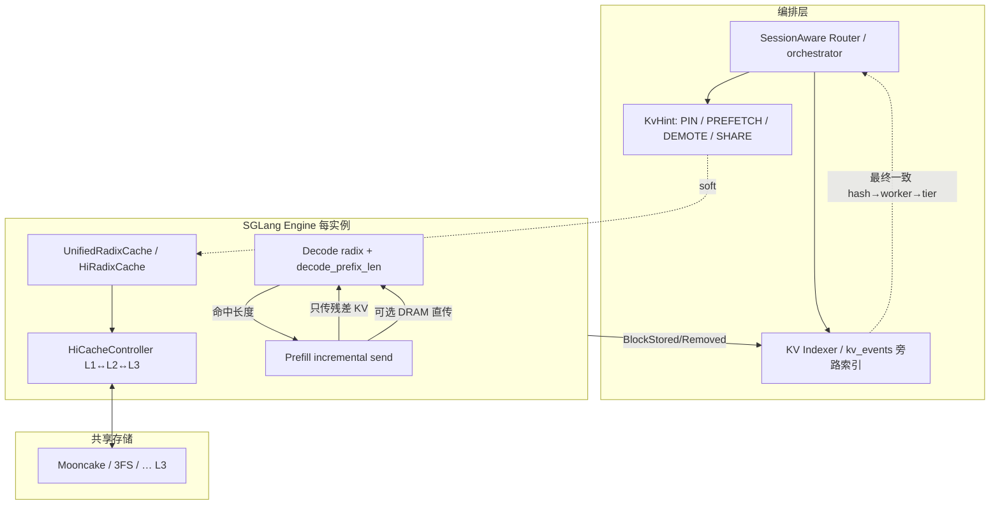

# SGLang #21846 — Agentic 分布式 KVCache 总设计

> **上游**：[sgl-project/sglang#21846](https://github.com/sgl-project/sglang/issues/21846) `[Roadmap]: SGLang Distributed KVCache System For Agentic Workload`（labels: `high priority` · `hicache` · `roadmap` · `PD Disaggregation`）。  
> **调研快照**：2026-07-24 · submodule `3rdparty/sglang` @ `37f94cb7a0` · 议题/PR 状态以 GitHub 为准。  
> **机制基线**：[overview.md](overview.md) · [hicache.md](hicache.md) · [storage-backends.md](storage-backends.md)。  
> **痛点索引**：[pain-points.md](pain-points.md)（本文是 #21846 **设计专文**；pain-points 继续做全局痛点地图）。  
> **PD 控制面**：[../pd-disaggregation.md](../pd-disaggregation.md)。

## 1. 一句话

Agent / 多轮 / 工具调用把 KV **体积、复用拓扑、生命周期可预测性**同时拉爆；SGLang 的应对不是「把 L1/L2 改成全局共享池」，而是在 **HiCache 三层 + PD 分离** 上叠四条线：

1. **增量 PD 传输**（Decode 先命中 → Prefill 只发残差）；  
2. **Decode 侧 radix / 主机直传**（少搬、大 batch）；  
3. **Hybrid/Unified 树**（Linear / DSA / SWA / Mamba 可进 HiCache）；  
4. **编排层 hint**（Router 发 PREFETCH / DEMOTE / PIN，引擎软执行）。

Q3 目标写明：PD 增量 + HiCache/HiSparse + PP + Eagle 端到端，在 DeepSeek DSA（V3.2/GLM5）与 Linear（Qwen3.5）族上规模验证。

## 2. 问题与设计哲学

### 2.1 动机（issue 原文）

- Agentic 负载下 KV **存储与传输量**暴涨，现有 PD + HiCache 撞瓶颈。  
- HiCache 对 **hybrid 模型**与其它特性的兼容仍薄。  
- 需要能扛大规模 agent 场景的**分布式 KV 系统**。

### 2.2 哲学（从 #27574 / #24656 / 已落地代码归纳）

| 原则 | 含义 |
|------|------|
| **编排知意图，引擎管内存** | Router 知道 session / subagent / tool gap；引擎只接受 soft hint，可 clip/defer/reject |
| **L1/L2 仍实例私有** | 跨机靠 L3 共享 + P↔D 直传 + 路由贴命中，**不做**全局 HBM/DRAM 池（与 lake 方案 Z 分叉） |
| **前缀复用贯穿 PD** | Decode 侧树命中直接变成 wire 上的 `decode_prefix_len`，Prefill 跳过已缓存段 |
| **Hybrid 统一树** | FULL / SWA / Mamba 进 `UnifiedRadixCache` + component，避免多套 radix 分叉 |
| **组合正确性是主债** | PP×HiCache、MTP×HiCache、异构 TP、HiSparse 生产化并行推进 |

## 3. 总架构（端到端）



数据面三条主路径：

| 路径 | 何时用 | 结果 |
|------|--------|------|
| **A. 本地 HiCache** | 同实例多轮 / 同机命中 | L1 或 L2→L1，零或极少跨机 |
| **B. 增量 PD** | Decode 已有前缀，Prefill 补尾 | 传输量 ≈ 未命中后缀 |
| **C. 经 L3 / Host 直传** | 跨实例共享、长上下文、HiSparse | P→D DRAM 或 L3→L2→L1 |

## 4. Roadmap 地图（Q2 / Q3）与落地状态

状态列：相对 submodule `37f94cb7a0` + 2026-07-24 GitHub 核对；`done` = 主干行为已在代码/已勾；`partial` = 有实现但缺口；`open` = 未闭环。

### 4.1 Q2 — Hybrid HiCache + PD×HiCache + 兼容性

| 子项 | 锚点 | 状态 | 设计要点 |
|------|------|------|----------|
| Hybrid Cache Controller / Linear | [PR #20457](https://github.com/sgl-project/sglang/pull/20457) | **done** | Mamba state offload + `HybridCacheController` |
| Mooncake × hybrid | [PR #21259](https://github.com/sgl-project/sglang/pull/21259) | **done** | DSA & Mamba 进 Mooncake 后端 |
| 3FS × hybrid | [PR #23241](https://github.com/sgl-project/sglang/pull/23241) | **done** | 同左 |
| Unified Hybrid Radix | [#20415](https://github.com/sgl-project/sglang/issues/20415) | **partial→主路径** | `UnifiedRadixCache` + FULL/SWA/Mamba components；KeLing MLA+Mamba [#22957](https://github.com/sgl-project/sglang/pull/22957) 仍 open |
| DeepSeek V4 / MiMO-V2 HiCache | [#24691](https://github.com/sgl-project/sglang/pull/24691) / [#27378](https://github.com/sgl-project/sglang/pull/27378) | **done** | UnifiedTree + Shadow Radix 等 |
| TP 间 host MLA 去重 | [#26691](https://github.com/sgl-project/sglang/pull/26691) | **open** | 同机 rank0 单份 + NCCL 广播 |
| Decode 侧 RadixTree | [#19746](https://github.com/sgl-project/sglang/pull/19746) 等 | **done**（非 hybrid） | `--disaggregation-decode-enable-radix-cache` |
| Decode HybridRadix (SWA/Mamba) | [#27770](https://github.com/sgl-project/sglang/pull/27770) | **open** | SWA：复用 full 前缀 + 传新窗口；`kv_cache_builder` 今仍拒 hybrid+decode radix |
| Storage prefetch API（Decode 入队即查 L3） | #21846 勾选 | **done** | `decode_hicache_mixin` + `prefetch_from_storage` |
| L2 RadixTree 提命中 | #21846 | **open** | 叙事上 = 强化 host 层节点 / 大 decode batch 拼装，非第二套类名 |
| Storage group 语义 | Mooncake + #21846 | **partial** | `mooncake_store._make_group_id`；多 key 同页统一可见/驱逐 |
| 异构 TP × PD+HiCache | #21846 | **open** | staging / hetero 路径限制（如 NIXL non-VRAM） |
| **Incremental KV Transfer** | #21846 勾选 | **done** | 见 §5 |
| **PD Host TransferMode** | [#21591](https://github.com/sgl-project/sglang/pull/21591) | **done** | Prefill→Decode **DRAM**，绕 GPU 中转（HiSparse 路径） |
| 大 decode batch：L2/L3 前缀 + P 增量再上 GPU | #21846 | **partial** | Decode HiCache mixin + offload manager |
| Agent/Rollout KV | [#24656](https://github.com/sgl-project/sglang/issues/24656) · [#27574](https://github.com/sgl-project/sglang/issues/27574) | **open** | 见 §7 |
| PP × HiCache | [#22607](https://github.com/sgl-project/sglang/issues/22607) | **open** | Rank0 事件编号同步各 PP rank 树 |
| MTP × HiCache | [#21125](https://github.com/sgl-project/sglang/pull/21125) · [#30393](https://github.com/sgl-project/sglang/pull/30393) | **partial** | 组合 hang 仍是痛点区 |
| EP/DP/CP × HiCache | #21846 勾选 + [#29421](https://github.com/sgl-project/sglang/pull/29421) | **done / partial** | CP layer-wise split 等 |

### 4.2 Q3 — Agentic 调度 / UnifiedRadix 增强 / PD / HiSparse

| 子项 | 锚点 | 状态 | 设计要点 |
|------|------|------|----------|
| Session-aware RadixTree / HiCache | [#29173](https://github.com/sgl-project/sglang/pull/29173) | **open** | 驱逐考虑「活跃 session 是否仍引用前缀」 |
| KV orchestrator + PREFETCH/DEMOTE/PIN | [#25760](https://github.com/sgl-project/sglang/issues/25760) + #27574 | **open** | Router↔引擎 hint；接全局调度 |
| Direct L3 cache mode | #21846 | **open** | 放大全局共享内存池占比（buffer-mode 相关 [#20535](https://github.com/sgl-project/sglang/pull/20535)） |
| CPU-only KV simulator | [#21891](https://github.com/sgl-project/sglang/issues/21891) | **open** | 无 GPU 回放 agent 负载 |
| Sequence Split（均摊显存） | [#30501](https://github.com/sgl-project/sglang/pull/30501) | **open** | CP 下 at-rest KV 分片而非每 rank 全量复制 |
| TreeCore 解耦 → Rust | [#29901](https://github.com/sgl-project/sglang/issues/29901) | **open** | `RadixTreeCoreInterface` + NodeId；Python 留策略/IO |
| Mamba offload 生产化 | #21846 | **partial** | Qwen/Kimi 产线缺口 |
| KVCache-Canary | #21846 | **open** | KV 正确性调试 |
| Decode L2 RadixTree（增 transfer batch） | #21846 | **open** | 与 Q2「L2 Radix」同簇 |
| Prefill-as-a-Service PoC | #21846 | **open** | 探索项 |
| HiSparse 生产就绪 | [#28874](https://github.com/sgl-project/sglang/issues/28874) | **open** | 长上下文稀疏：热集在 GPU、全量在 pinned host |

## 5. 核心机制详解

### 5.1 Incremental KV Transfer（已落地）

**意图**：Decode 若已通过 radix/HiCache 持有前缀，Prefill **不必再传整段 KV**。

**时序**：

```
Decode  prealloc
  → match_prefix / HiCache 命中长度 L
  → send_metadata(..., decode_prefix_len=L)
Prefill bootstrap
  → pop_decode_prefix_len()
  → req.start_send_idx = L
  → 只发送 input[L:) 对应的 KV 页
全命中
  → dst_kv_indices 可为空，但仍传 aux/state（非 dummy abort）
```

**代码锚点**：

| 步骤 | 文件:符号 |
|------|-----------|
| Decode 算前缀 | `disaggregation/decode.py`（prealloc / `_match_prefix_and_lock`） |
| 元数据下发 | `disaggregation/*/conn.py`::`TransferInfo.decode_prefix_len`（NIXL/Mooncake/Mori） |
| Prefill 跳过 | `disaggregation/prefill.py`::`finalize_bootstrap` → `start_send_idx` |
| 发送切片 | `schedule_batch` / `send_kv_chunk` 尊重 `start_send_idx` |

**对 lake**：形态贴近「Pool 命中省重算、再决定是否传输」；lake 的 **D-direct** 更进一步要求**本地 HBM 命中**且零传输，权威在池而非 Decode 私有树。

### 5.2 Decode-side Radix + Storage Prefetch

- 开关：`disaggregation_decode_enable_radix_cache`（默认关）。  
- 与 **hybrid SWA/SSM 不兼容**（`kv_cache_builder.py` 直接 `ValueError`）→ #27770 补缺口。  
- Decode + HiCache：`enable_decode_hicache`；入队即可 `query_storage` / `prefetch_from_storage`（Storage→Host→Device）。  
- 多轮写回：`DecodeKVCacheOffloadManager.offload_incremental` + `OffloadedState`。

### 5.3 PD Host TransferMode（#21591）

- Prefill 把 KV **RDMA 进 Decode DRAM**（`kv_data_mem_kinds = DRAM`），不占 Decode HBM 中转。  
- 主落地在 **HiSparse** 路径：`hisparse_coordinator.admit_request_direct`。  
- 收益：长上下文下 Decode 侧可撑更大 batch；与「大 decode batch 拼 L2/L3+增量」同一方向。

### 5.4 UnifiedRadixCache / TreeCore（#20415 → #29901）

**现状**：`UnifiedRadixCache` 融合树机制 + FULL/SWA/Mamba component + HiCache IO/调度。  

**目标拆分**（#29901）：

```
Scheduler ──BasePrefixCache──▶ UnifiedRadixCache（策略 + IO + 拥有 components）
                                    │ NodeId API
                                    ▼
                              RadixTreeCore（可 Rust 化：match/insert/evict/LRU）
                                    │
                              TreeComponents（FULL / SWA / Mamba）
```

约束：TreeCore **永不**碰 cache；cache 只经 NodeId；walk 副作用以 typed Action 回传后由 cache 按序应用。

### 5.5 Sequence Split（#30501，Q3）

Prefill CP 今日常把整段 KV **在每个 CP rank 复制一份** → 组级唯一容量 ≈ 1×。Sequence Split 要把 at-rest KV **分片**，均摊显存压力（尤其 MLA）。与 lake「按层/分片池化」同问题域，实现仍绑引擎 CP 拓扑。

## 6. Agentic 控制面（未闭环，但是设计核心）

### 6.1 两条 RFC 的关系

| RFC | 焦点 | 粒度 |
|-----|------|------|
| [#24656](https://github.com/sgl-project/sglang/issues/24656) Agent-Aware Phase 1 | 请求里带 `agent_hints`（workflow/step/tool/TTL…），可选 `agent_aware` 驱逐 | **元数据进树** |
| [#27574](https://github.com/sgl-project/sglang/issues/27574) Programmatic KV | Router 发 **provider-neutral hint**；引擎 soft 执行；L3 作共享 retention | **编排→引擎意图面** |
| [#29173](https://github.com/sgl-project/sglang/pull/29173) | Session-reference-aware 驱逐 | **活跃 session 引用** |
| [#25760](https://github.com/sgl-project/sglang/issues/25760) SessionAware Router | bucket + sticky→cache_aware→load；远期接 agent hint | **全局选路** |

### 6.2 Hint 分类（#27574）

| Hint | 意图 | 典型映射 |
|------|------|----------|
| **SHARE** | 跨 worker / 共享层复用前缀 | 经 L3 或跨 worker 拉前缀；其它 hint 的存在性前提 |
| **PREFETCH** | 即将使用，提前升温 | L3→L2→（可选）L1 |
| **DEMOTE** | 长 tool gap / 暂停，降层勿丢 | L1→L2→发布 L3，本地可驱逐 |
| **PIN**（POC） | 高价值前缀短期不可丢 | Mooncake L3 lease / TTL（有界） |

原则：**零 hint 时行为与今日完全一致**；hint 可观测、可拒绝、不可无界占满 HBM。

### 6.3 与 Session 工作的分工

- Session 打标 / `SessionRadixCache`：生命周期「这棵前缀属于哪个 session」。  
- Token-relative Pin：可**不**依赖 session id，直接钉精确前缀页组。  
- StreamingSession（`session_params.session_id`）与顶层 `session_id`（#29436）刻意拆开，避免语义劫持。

## 7. 与周边 roadmap 的咬合

| 议题 | 角色 |
|------|------|
| [#21703](https://github.com/sgl-project/sglang/issues/21703) PD 总路线 | layerwise、runtime role、session-aware LB 等总账 |
| [#31458](https://github.com/sgl-project/sglang/issues/31458) KV Indexer | 树外 `hash→worker→tier`，最终一致；供 router 查询 |
| [#28874](https://github.com/sgl-project/sglang/issues/28874) HiSparse | 长上下文稀疏 decode；与 decode radix **互斥**（server_args 校验） |
| [#21891](https://github.com/sgl-project/sglang/issues/21891) Simulator | 无 GPU 评估 agent KV 策略 |
| Mooncake Group / KV events | L3 分组可见性 + 供 Indexer 的事件流 |

## 8. 代码索引（#21846 相关热路径）

| 概念 | 文件:符号 |
|------|-----------|
| Unified 树 | `mem_cache/unified_radix_cache.py`::`UnifiedRadixCache` |
| 树选型工厂 | `mem_cache/registry.py`::`default_radix_cache_factory` |
| HiCache 经典入口 | `mem_cache/hiradix_cache.py`::`HiRadixCache` |
| 传输阶段枚举 | `unified_cache_components/tree_component.py`::`CacheTransferPhase` |
| Prefetch / 终止 | `hiradix_cache.py`::`prefetch_from_storage` / `can_terminate_prefetch` |
| Controller | `managers/cache_controller.py`::`HiCacheController` |
| Decode 增量前缀 | `disaggregation/decode.py` + `TransferInfo.decode_prefix_len` |
| Prefill 跳过发送 | `disaggregation/prefill.py`::`finalize_bootstrap` |
| Decode HiCache | `disaggregation/decode_hicache_mixin.py` |
| Host 直传 / HiSparse | `managers/hisparse_coordinator.py`::`admit_request_direct` |
| Hybrid 拒 decode radix | `mem_cache/kv_cache_builder.py`（SWA/SSM ValueError） |
| Mooncake group | `mem_cache/storage/mooncake_store/mooncake_store.py`::`_make_group_id` |
| Session radix mixin | `mem_cache/session_radix_cache.py`::`SessionRadixCacheMixin` |
| KV 事件 | `disaggregation/kv_events.py`::`BlockStored` / `BlockRemoved` |

## 9. 对 lake 的读数（关键对照）

| #21846 设计点 | lake 对应 | 照搬？ |
|---------------|-----------|--------|
| 增量 PD（`decode_prefix_len`） | Pool 命中后残差传输 / 时序二 | **借鉴协议形态**；权威改池视图 |
| Host 直传、大 batch 拼 L2/L3 | Transfer Bus + 分层加载 | 借鉴；介质归池 |
| Router soft hint PIN/PREFETCH/DEMOTE | Gateway 可有意图；**放置权威在池（方案 Z）** | 原则同「编排不抢内存」；lake 更硬：池主动放置，调度单向消费 |
| Session / agent 元数据影响驱逐 | 前缀亲和 + `ref>0` 冻结 + LFU-Aging | 借鉴「引用中的前缀勿误杀」 |
| L1/L2 实例私有 + L3 共享 | **L0–L3 均归池** | **不照搬**——这是分叉点 |
| KV Indexer 最终一致 | 控制面强一致位置视图 | **不照搬弱一致旁路** |
| TreeCore→Rust | 存储/控制 radix 在 Rust/Go | 方向同；职责边界不同 |
| 无 D-direct / 三模式 Router | F2 PD/混部/D-direct | lake 增量 |
| HiSparse 长上下文 | Could；非 P0–P4 必做 | 可后期对照 |

**一句话差异**：SGLang #21846 是在「**引擎私有分层缓存 + 外挂 L3 + 编排 soft hint**」上把 agent/PD 做强；lake 是「**池权威统一编址 + 计算可弃 + 按位置视图选模式**」。前者的增量传输、host 直传、hint 分类、session 感知驱逐，都是 lake 设计时的**直接对照样板**；全局共享 HBM/强一致目录不要跟他们的 Indexer 路线混成一条。

## 10. 跟踪清单（建议 watch）

| 优先级 | 链接 | 看什么 |
|--------|------|--------|
| P0 | [#21846](https://github.com/sgl-project/sglang/issues/21846) | 总勾选变化 |
| P0 | [#27574](https://github.com/sgl-project/sglang/issues/27574) / [#24656](https://github.com/sgl-project/sglang/issues/24656) | hint API 与 agent_hints |
| P0 | [#29173](https://github.com/sgl-project/sglang/pull/29173) | session-aware 驱逐 |
| P0 | [#27770](https://github.com/sgl-project/sglang/pull/27770) | Decode HybridRadix |
| P1 | [#29901](https://github.com/sgl-project/sglang/issues/29901) | TreeCore / Rust |
| P1 | [#25760](https://github.com/sgl-project/sglang/issues/25760) | SessionAware Router × agent |
| P1 | [#30501](https://github.com/sgl-project/sglang/pull/30501) | Sequence Split |
| P1 | [#28874](https://github.com/sgl-project/sglang/issues/28874) | HiSparse 生产化 |
| P1 | [#22607](https://github.com/sgl-project/sglang/issues/22607) | PP×HiCache |
| P2 | [#21891](https://github.com/sgl-project/sglang/issues/21891) | Simulator |
| P2 | [#31458](https://github.com/sgl-project/sglang/issues/31458) | KV Indexer |

---

*本文随上游 roadmap 演进应再核对勾选与 PR 状态；机制细节以 submodule 符号为准。*
