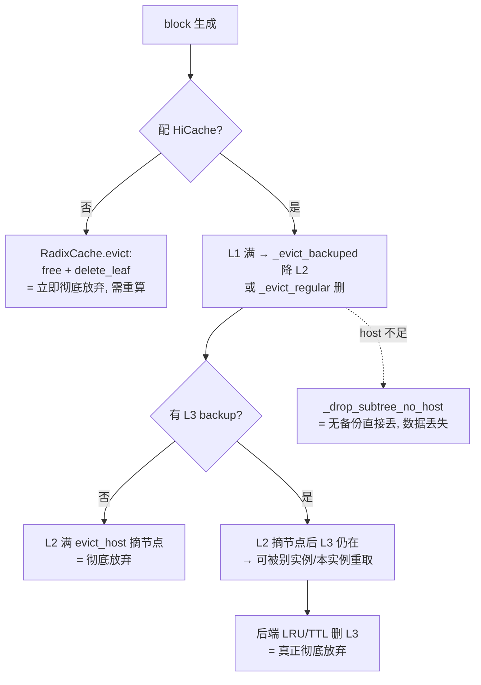

# SGLang — KV block 生命周期:何时释放、何时彻底放弃

> 源码:`3rdparty/sglang`(submodule `37f94cb7a0`)。本文回答一个具体问题:**一个 KV block 在什么层级被完全释放、什么情况下被彻底放弃**,从**当前实现**与**未来计划**两方面梳理。
> HiCache 机制总览见 [overview.md](overview.md) / [hicache.md](hicache.md);痛点见 [pain-points.md](pain-points.md)。
>
> **调研快照**:2026-07-17。

## 一句话

「释放一个 block」不是单一动作,而是**逐层剥离**:物理内存只在 allocator `free()` 回收(L1/L2),L3 是**独立生命周期**。当前实现下,**配了 L3 时引擎侧永不主动彻底放弃**——只降层、摘树节点,真正删除下放给 L3 后端的独立 LRU/TTL,引擎甚至看不到这次删除。未来计划(#29709/#27898/#27574)正是把「放弃」**事件化 + 编排层可编程 + 可插拔策略**。

---

## 一、一个 block 的三副身份

一个 radix `TreeNode` 同时挂三层位置(源码 `radix_cache.py::TreeNode` / `hiradix_cache.py`):

| 字段 | 层 | 含义 |
|------|----|------|
| `node.value` | L1 GPU | device KV 槽位索引(指向 `token_to_kv_pool`) |
| `node.host_value` | L2 host | host pinned 槽位索引;`None`=未 backup |
| `node.hash_value` | L3 key | 每页 SHA256 链式哈希——**只是 key,不是位置** |

物理内存真正回收只在 allocator:`token_to_kv_pool_allocator.free()`(L1)、`mem_pool_host.free()`(L2)。**L3 不由树节点直接管**。

「释放」因此分四个层级,下面逐层看**何时触发**。

---

## 二、当前实现:各层「何时释放」

### 层级 0 — 物理槽位回收(唯一真正还内存处)+ 延迟释放组

`multi_ended_allocator.py::free`(L910)关键细节——**free group 延迟释放**:

```python
if not self.is_not_in_free_group:
    self.free_group.append(free_index)   # 攒起来,暂不还
    return
```

`free_group_begin/end`(L1653-1658)之间的 free 会被**缓存**,避免 CUDA graph / overlap 期间槽位被 step 内复用。

> **对照 lake**:等价于 lake「in-flight 跨层冻结」(ref>0 的 block step 期间物理映射冻结)。SGLang 用 free group 做同一件事,lake 用引用计数,更显式。

### 层级 1 — 请求结束即时 free(不是驱逐)

#### 发生在哪个调度阶段?

**Scheduler 的 `process_batch_result`(CPU 收尾),不在 `ModelRunner.forward`。**

```
run_batch / forward（GPU）
  → sample（可 delay_sample）
  → process_batch_result（CPU）          ← 请求结束释放在这里
       update_finish_state → req.finished()
       → release_kv_cache → cache_finished_req
```

| 步骤 | 符号 | 做什么 |
|------|------|--------|
| 判定结束 | `Req.update_finish_state` / `req.finished()` | stop / length / abort 等写 `finished_reason` |
| 收尾入口 | `batch_result_processor._handle_finish_state_updated_req` | MM 释放、draft `note_request_finished`、可选 hisparse / offload |
| KV 释放 | `mem_cache/common.py::release_kv_cache` | → `tree_cache.cache_finished_req`；顺带收回 over-allocated 槽 |
| Overlap 下 | `event_loop_overlap` 处理**上批** result | 本步 forward 与上批释放 CPU 重叠；物理 free 可进 free_group（见层级 0） |

例外路径：abort 排队未跑 → abort 处理里直接 `release_kv_cache`；decode offload → D2H 完成后再 release。主循环 / FutureMap 见 [model-runner.md](model-runner.md)「Overlap schedule」。

> **对照 vLLM**：KV 释放也在 Scheduler，但是 **`update_from_output`（吃完 ModelRunnerOutput 之后）**；Worker 另收 `finished_req_ids` 只清 runner 态。见 [../vllm/block-lifecycle.md](../vllm/block-lifecycle.md)「请求结束的调度阶段」。

#### `cache_finished_req` 当场 free 三类

`radix_cache.py::cache_finished_req`:请求收尾**当场 free 三类**——

1. 与树中已有前缀重复的部分 `kv_indices[cache_protected_len:prefix_len]`;
2. 未对齐的尾块 `kv_indices[key_len:]`(page 对不齐的残尾,直接丢);
3. 新生成并成功 `insert` 进树的部分**不 free**——转成树节点,`lock_ref` 由请求持有 → `dec_lock_ref` 后变**可驱逐候选**。

**关键:`lock_ref → 0 ≠ 释放**。`dec_lock_ref`只是把节点从 `protected_size_` 挪到 `evictable_size_`,内存还在、仍可命中复用。

> **对照 lake**:与 lake「ref 归 0 = 可驱逐候选,非删内存;归 0 不摘位置视图」完全一致。

### 层级 2 — 驱逐(容量压力触发)

**纯 RadixCache(无 HiCache)** `radix_cache.py::evict`(L564):按优先级堆弹叶子 → `allocator.free(x.value)` + `_delete_leaf`。**一步到位:还内存 + 删节点 = 彻底放弃**,下次要用只能重算。

**HiRadixCache** `hiradix_cache.py::evict`(L1115)按写策略分 `_evict_write_through` / `_evict_write_back`,驱逐 L1 叶子时分叉:

| 叶子状态 | 函数 | 结果 |
|----------|------|------|
| `backuped`(已有 host_value) | `_evict_backuped`(L1204):`value=None`,节点留树 | **降层 L1→L2**,非放弃 |
| 未 backup | `_evict_regular`(L1210):`free(value)`+`_delete_leaf` | device 上**彻底删**(若没写过 L3,则真丢,要重算) |
| write_back 模式 + host 不足 | `_drop_subtree_no_host`(L1220) | **host+device 一起丢**,日志 warning「dropped without backup」= **数据丢失** |

### 层级 3 — host 驱逐(L2 压力触发)

`hiradix_cache.py::evict_host`(L1259)只处理**已从 device 驱逐(`node.evicted`)且 `host_ref_counter==0`** 的节点:

```python
self.cache_controller.evict_host(x.host_value)   # 还 host 内存(mem_pool_host.free)
x.parent.children.pop(key)                         # 从树摘除节点
self._record_remove_event(x, medium=CPU)           # 通知 router 掉 host 条目
```

到这一步节点**从 radix 树彻底消失**。

### 层级 4 — L3:当前不主动删

最关键、最反直觉的一点:

- `evict_host` 摘节点时**不调用 L3 backend 的 `remove()`**。`node.hash_value` 指向的 L3 数据**继续留在后端**。
- #29709 官方 RFC 责任矩阵原话:"Worker evicts host node whose data remains in Mooncake → **Engine remove(CPU) only; L3 copy persists**"。
- 所以 L3 block 的彻底放弃**不由 radix 树决定**,而由**后端自己的容量/LRU/TTL**:
  - file 后端:`storage/file/lru_file_evictor.py::LRUFileEvictor`(`reserve→evict→os.remove(tensor_path)`,按字节上限 + free-space 水位);**无上限配置时 inert(永不删)→ 无界增长**(bug [#26886](https://github.com/sgl-project/sglang/issues/26886));
  - mooncake / hf3fs / eic:各自 `delete`/eviction 策略。

---

## 三、「彻底放弃一个 block」= 什么条件



- **无 L3**:block 彻底放弃 = `evict_host` 从树摘除(或无 HiCache 时 `evict` 删叶)。
- **有 L3**:引擎侧**永远不主动彻底放弃**——只降层、摘树节点;真正删除下放给 L3 后端独立 LRU/TTL,引擎**看不到这次删除**(#29709 要补)。
- **非正常(有损)放弃**:`_drop_subtree_no_host`(host 压力无备份直接丢)、abort 半传([#30233](https://github.com/sgl-project/sglang/issues/30233))。

---

## 四、未来计划方向(issue / RFC)

围绕 block 生命周期的在途改造,正好补现状三个洞:

| 方向 | Issue/RFC | 补什么洞 |
|------|-----------|----------|
| **L3 删除可观测** | [#29709](https://github.com/sgl-project/sglang/issues/29709) KV Events for L3 | 现状 L3 evict 引擎无感。Phase 1 backup ack 发 `BlockStored(EXTERNAL)`;Phase 3 后端 TTL/eviction 反发 `BlockRemoved(EXTERNAL)`,router 才能清陈旧条目。**把"彻底放弃"变成事件** |
| **调度器感知 + 可插拔驱逐** | [#27898](https://github.com/sgl-project/sglang/issues/27898) MORI-UMBP | 现状后端是 passive byte store、驱逐硬编码 LRU。目标:master 维护全 tier 位置 + 访问历史 + **depth-aware eviction**,offload/load/eviction/replication 做成**可插拔策略接口** |
| **编排层显式控制释放** | [#27574](https://github.com/sgl-project/sglang/issues/27574) Programmatic KV | 现状释放全靠被动 LRU。目标:router 主动下 **Pin/Prefetch/Demote/Evict** hint——subagent 退出即显式 evict main-agent KV,不等被动驱逐 |
| **session 级抢占释放** | [#29099](https://github.com/sgl-project/sglang/issues/29099) | 现状 `StreamingSession` 把 KV 钉死、空闲会话饿死新请求。目标:内存压力下 **soft-evict 空闲 session KV**(可插拔启发式),下轮重算 |
| **驱逐扫描提速** | [#24072](https://github.com/sgl-project/sglang/issues/24072) | UnifiedRadix LRU 从 O(M×K) restart 扫描改 O(1) 游标续扫 |
| **SWA tombstone(部分放弃)** | UnifiedRadix([#26577](https://github.com/sgl-project/sglang/issues/26577)) | 混合模型里 SWA 分量**独立于 FULL** 被驱逐(tombstone/hole),FULL KV 保留、prefix 仍可命中——即"部分放弃"一个 block |

方向共性:从「被动 LRU、引擎不感知 L3」→「事件化 + 编排层可编程 + 可插拔策略」。即**"谁决定放弃一个 block"从引擎本地 LRU 上移到 router/master**。

---

## 五、对 lake 的启示

1. **「彻底放弃」必须是一等事件**:SGLang 现状 L3 删除引擎无感(靠 #29709 补);lake 位置视图强一致 + 驱逐覆写才摘视图,天然避开。
2. **区分「降层 / 摘树 / 删物理」三态**:SGLang `_evict_backuped`(降层)vs `evict_host`(摘树)vs 后端 LRU(删物理)是三件事;lake「ref 归 0→可驱逐候选→驱逐覆写才摘视图→L2/L3 回填」要保持分层,不合并。
3. **`_drop_subtree_no_host` 是反面教材**:host 压力无备份直接丢 = 有损;lake「L2=F4 恢复点、L3=SSOT,L3 缺失才算不存在」要保证**放弃前必有持久副本**。
4. **free_group = lake in-flight 冻结**:SGLang 用延迟释放组防 step 内复用;lake 用「ref>0 step 期间物理映射冻结」,同一诉求更显式。

---

## 代码索引

> 符号名稳定锚定,行号会漂移——找不到时 `grep -n "符号名" 3rdparty/sglang/<文件路径>`。

| 机制 | 文件:符号 |
|------|-----------|
| 物理槽位 free + 延迟释放组 | `python/sglang/srt/mem_cache/multi_ended_allocator.py`::`free`(L910)/ `free_group_begin`(L1653)/ `free_group_end`(L1657) |
| 请求结束调度阶段 | `managers/scheduler_components/batch_result_processor.py`::`_handle_finish_state_updated_req` / `process_batch_result_*` |
| 请求结束 KV 入口 | `mem_cache/common.py`::`release_kv_cache` |
| 请求结束即时 free | `mem_cache/radix_cache.py`::`cache_finished_req` / `cache_unfinished_req` |
| ref 计数(可驱逐↔保护) | `radix_cache.py`::`inc_lock_ref`(L593)/ `dec_lock_ref`(L608) |
| 纯 radix 驱逐(=彻底放弃) | `radix_cache.py`::`evict`(L564) |
| 分层驱逐入口 | `python/sglang/srt/mem_cache/hiradix_cache.py`::`evict`(L1115)/ `_evict_write_through`(L1139)/ `_evict_write_back`(L1157) |
| 降层 L1→L2 | `hiradix_cache.py`::`_evict_backuped`(L1204)/ `_detach_backuped`(L1191) |
| device 彻底删 | `hiradix_cache.py`::`_evict_regular`(L1210) |
| 无备份直接丢(有损) | `hiradix_cache.py`::`_drop_subtree_no_host`(L1220) |
| host 驱逐摘树 | `hiradix_cache.py`::`evict_host`(L1259) |
| controller 还内存 | `python/sglang/srt/managers/cache_controller.py`::`evict_device`(L837)/ `evict_host`(L841) |
| L3 后端接口(remove 存在但驱逐不调) | `python/sglang/srt/mem_cache/hicache_storage.py`::`HiCacheStorage.remove`(L332) |
| L3 file 后端独立 LRU | `python/sglang/srt/mem_cache/storage/file/lru_file_evictor.py`::`LRUFileEvictor` |
| write-back 到 L2/L3 | `hiradix_cache.py`::`write_backup`(L833)/ `write_backup_storage`(L909) |
