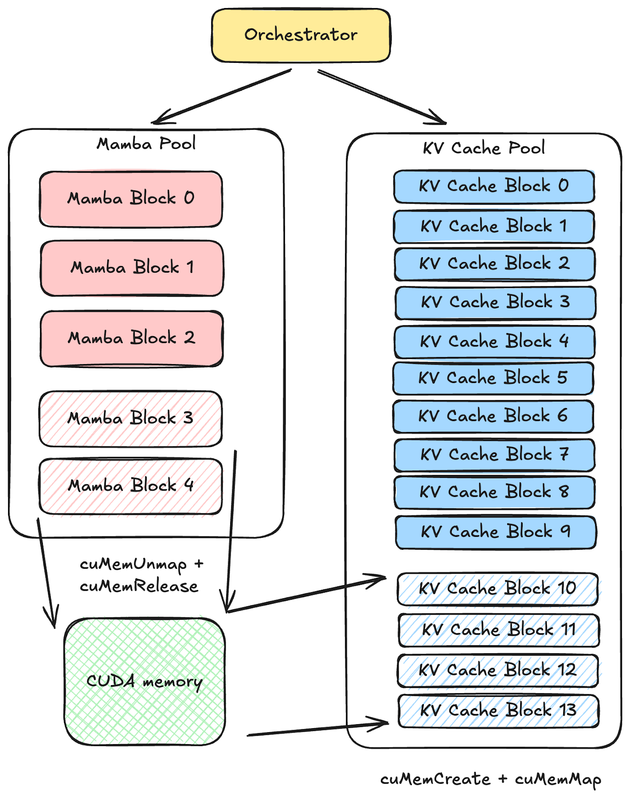

# SGLang Elastic Memory Pool — 同介质多池动态再分配

> 调研快照 2026-07-17，submodule `37f94cb7a0`。源码 `3rdparty/sglang/python/sglang/srt/mem_cache/`。
> 本文与 [hicache.md](hicache.md)（跨介质分层 L1/L2/L3）互补：hicache 解决「KV 在不同**介质**间搬」，本文解决「同一**介质**（GPU HBM）内多个**形态不同**的池如何共享一块物理 buffer 并动态调比例」。

## 来源

PyTorch blog：[Hybrid Models Meet SGLang: More Than Full Attention](https://pytorch.org/blog/hybrid-models-meet-sglang-more-than-full-attention)

该文讲 SGLang 如何服务**混合模型**（full attention 层与 linear/SSM 层交替，如 Qwen3-Next、Mamba 架构）。SSM 状态是**定长、in-place 更新**的，与 KV cache 的 token 级分配语义冲突，破坏了标准的前缀缓存 / 投机解码 / PD 分离。文中的五项设计之一是 **Elastic Memory Pool**：

图示：同一块 GPU HBM 被**两个子池**共享——Mamba pool（request 级，定长状态）与 KV cache pool（token 级）。物理地址空间超额预留（oversubscription），物理页按需 map/unmap；当某池耗尽容量，从利用率最低的对端池收缩腾位。注意：blog 的「elastic」是**同介质内多池再分配**，不是跨介质分层——后者是 [hicache.md](hicache.md) 的范畴。

## 机制

源码分两层：底层 CUDA VMM 提供按需物理页，上层 unified pool 在两端相向生长的两个 allocator 间再分配字节区间。

### 1. 底层：CUDA VMM 按需 commit 物理页

`kv_vmm_backing.py::KvVmmArena`（L100）——「一台 GPU 的 CUDA 虚拟内存预留，暴露为 `torch.cuda.MemPool`」。

- 构造时 `cuMemAddressReserve` 预留一大段虚拟地址（`reserved`，默认超额），**先不分配物理内存**（L131-139）。
- `commit_range(offset, want_bytes)`（L199）：按需把 `[base+offset, …)` 段用 `cuMemCreate` + `cuMemMap` 映射物理页，`cuMemSetAccess` 授读写（L119-128）。这是 blog 图里「物理页按需 map」的落点。
- 当前版本 `commit_range` 是 **monotonic（只增）**：`if want <= prev: return`（L112）。`cuMemUnmap`/`cuMemRelease` 仅出现在 `commit_range` 失败回滚（L129-135），**没有主动归还物理页给系统的路径**。即「VA oversubscription + 按需 commit」在；「主动 unmap 缩物理占用」在当前 submodule 版本未实现。

> 与 lake 的对照：lake L0（GPU HBM）当前是静态预分配。若 L0 要同时承载多模型/多 KV 形态，VMM oversubscription + 按需 commit 能避免静态切分僵化——但这属 P6/P7 弹性调度范畴，P5 不涉及。

### 2. 上层：UnifiedKVPool 两端相向生长 + 压缩式 free

`unified_memory_pool.py::UnifiedKVPool`（L177）——「一个物理 `uint8` 字节 buffer，由 2 个子池共享」。

- 恰好 2 个子池（L16-19 `assert len==2`），一个 `grow_direction="up"`、一个 `"down"`，从 buffer 两端**相向生长**（L22-26）。
- envelope-major 布局：一个 slot 的全层数据连续存放，free 后腾出对端池可长入的整段字节区间（文件头注释 L16-21）。
- 每子池一个 `MultiEndedAllocator`（`multi_ended_allocator.py:99`），持 `virtual_to_physical` / `physical_to_virtual` 页粒度表（L49-56）。上层只存 **virtual slot ID**；compaction 只改 v2p/p2v 表，**不改上层引用**（无 reference rewriting，注释 L18-21）。
- eager-compacting `free`：释放后压实，保持每池字节区间无空洞；空闲区间立即对对端池可见、可被长入。这就是 blog 图里「某池满 → 找最低利用率对端池 shrink」的真实实现——shrink 发生在**字节区间层**（两池间的再分配），不是 VMM 物理页层。

> 当前版本未实现 N>2 子池（L17-19 assert）。

### 3. Hybrid 双池的语义来源

`memory_pool.py::MambaPool`（L311，request 级定长 SSM 状态）、`HybridReqToTokenPool`（L876）、`HybridLinearKVPool`（L2508，full attention 的 token 级 KV + 线性层状态分离）。`hi_mamba_radix_cache.py::HiMambaRadixCache` 要求 `HybridLinearKVPool`（L114-120）。elastic pool 的价值正在于：full-attention KV（随 token 增长）与 SSM 状态（随 request 定长）的最佳比例随负载漂移，静态切分会浪费——两端相向生长让两者动态争用同一 buffer。

## 代码索引

| 概念 | 符号 | 位置 |
|------|------|------|
| CUDA VMM arena | `KvVmmArena` | `kv_vmm_backing.py:100`（`commit_range` L199、`cuMemAddressReserve` L36） |
| 共享字节 buffer + 两子池 | `UnifiedKVPool` | `unified_memory_pool.py:177` |
| 端向 allocator + v2p/p2v | `MultiEndedAllocator` | `multi_ended_allocator.py:99` |
| 子池规格（grow_direction） | `SubPoolSpec` | `unified_memory_pool.py:75` |
| Mamba 定长状态池 | `MambaPool` | `memory_pool.py:311` |
| Hybrid 请求→token 映射 | `HybridReqToTokenPool` | `memory_pool.py:876` |
| Hybrid KV（full + linear 分离） | `HybridLinearKVPool` | `memory_pool.py:2508` |
| Hybrid radix（Mamba + KV 双 LRU） | `HiMambaRadixCache` | `hi_mamba_radix_cache.py` |

## 与 lake 的关系

| 维度 | SGLang Elastic Pool | lake |
|------|---------------------|------|
| 解决的问题 | 同**介质**（GPU HBM）内多池**比例**动态分配 | 跨**介质**（HBM/DRAM/NVMe/对象）分层放置 |
| 共享对象 | 一块 GPU 物理字节 buffer | L0-L3 全层，存储池统一管理 |
| 再分配粒度 | 字节区间（v2p 表重映射，无 ref rewrite） | block 级（radix + locations，统一编址） |
| shrink 语义 | 字节区间层 compacting free（当前 VMM 物理页层无主动 unmap） | 主动 demotion（L0→L1→L2）+ 被动驱逐 |
| 触发 | 某子池 alloc 耗尽 → 压缩自身腾位给对端 | 冷热判定（引用>0 冻结 + LFU-Aging + 前缀亲和）+ 配额 |

**借鉴点**：若 lake L0 未来需在一块 HBM 上共置多模型/多 KV 形态，`UnifiedKVPool` 的「两端相向生长 + compacting free + v2p 重映射不改上层引用」是比静态预切分更优的同介质再分配范式——上层只看 virtual slot，物理压实对上层透明。这与 lake「计算节点不拥有内存、位置归存储池权威」的方向一致：物理放置细节下推，上层只持有虚拟/逻辑视图。

**关键差异**：SGLang 的 elastic 是**实例私有**（与 HiCache 的 L1/L2 私有一脉相承，见 [overview.md 劣势 1](overview.md)）；lake 的 L0 归存储池统一管理，「本地命中」是放置决策的结果而非实例私有缓存。lake 不需要 SGLang 这种实例内多池争用——多模型/多形态的隔离在存储池层用 `(model_id, revision)` 命名空间解决（见 [`../architecture/kv-cache-pool.md`](../../architecture/kv-cache-pool.md)），而非靠实例内 buffer 再分配。
