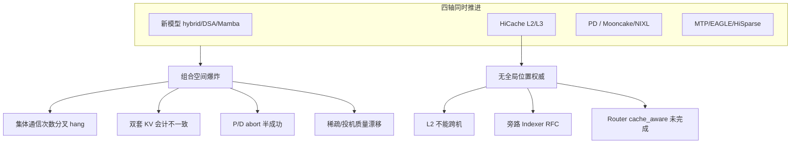

# SGLang — 上游痛点与 lake 对照

> 源码:`3rdparty/sglang`(submodule)。本文整理 **上游 GitHub issue / roadmap** 暴露的尚未解决痛点,并区分「可修工程债 / 架构债 / 物理或职责边界上难消掉的点」,供 lake 设计取舍。  
> HiCache 机制本身见 [overview.md](overview.md) / [hicache.md](hicache.md);block 何时释放/彻底放弃见 [block-lifecycle.md](block-lifecycle.md);PD 控制机制见 [../pd-disaggregation.md](../pd-disaggregation.md);thinking 能力缺口见 [thinking-control.md](thinking-control.md)。
>
> **调研快照**:2026-07-17 · submodule `37f94cb7a0`(`origin/main`) · 议题以当时 open 状态为准,编号可漂移,以 GitHub 为准。

## 一句话

SGLang 在 **新模型(hybrid/DSA/Mamba) × HiCache × PD × 投机/稀疏** 四轴同时推进;组合正确性与「全局 KV 位置权威」跟不上。多数线上 hang/乱码来自**多份真相 + 热路径集体通信 + 实例私有 L1/L2**。这些痛点划出了 lake 的**问题域**:哪些能在 lake 的设计构想里对上号、哪些即便换架构也解不干净(RoPE 位置耦合、编排层语义、thinking 硬预算)。下文第 4 节列 lake **能做什么**——均为待验证的设计意图,非既成能力。

## 议题版图

**总量**:2026-07-17 快照约 **711 条 open issue**。取最近更新的 250 条采样:标题前缀 `[Bug]` 131 / `[Feature]` 28 / `[Roadmap]` 15 / `[RFC]` 12——**bug 占过半**。

主题分布(采样 250,关键词可多重计):

| 主题 | 采样计数 | 性质 |
|------|---------|------|
| 模型接入 / 精度回归 | ~85 | **日常洪流**:追 DeepSeek-V4/GLM-5.2/Qwen3.5 day-0、FP4/FP8 数值回归 |
| kernel / 性能 | ~40 | 洪流:flashinfer/triton/cuda graph |
| 量化 FP8/FP4 | ~39 | 洪流 |
| 硬件 ROCm/AMD/NPU/XPU/Blackwell | ~37 | 洪流:B300/GB300/gfx 崩溃 |
| 投机 MTP/EAGLE | ~25 | **战略线**:与 HiCache/PD 叠出最多 hang |
| OOM/内存/泄漏/驱逐/hang | ~18 | 战略线:内存会计分裂 |
| PD / 传输 | ~17 | 战略线 |
| HiCache / 分层 | ~15 | 战略线:分层 + 同步 |
| Hybrid/Mamba/SWA/Radix | ~14 | 战略线:树重构未收尾 |
| Router / session / agent | ~6 | 战略线:编排语义缺口 |
| HiSparse / 稀疏 | ~6 | 战略线 |

**关键读数**:KV/分层/PD/router 这条**战略线在 711 条里是绝对少数**(采样中合计约 20%),SGLang 人力主要被模型/硬件矩阵吃掉 → 分布式 KV 系统进展偏慢;而 `[Bug]` 集中在**组合叠加**(HiCache×EAGLE、MTP×Mooncake、PD×异构 TP),印证组合正确性是长期债。

主战场 roadmap:[#21846](https://github.com/sgl-project/sglang/issues/21846) *Distributed KVCache System For Agentic Workload*(high priority)。战略主线的六大簇见第 1 节。

---

## 1. 尚未解决的痛点(有 issue / roadmap)

### 1.1 Agentic 分布式 KV 总栈未闭环

[#21846](https://github.com/sgl-project/sglang/issues/21846) 动机:agent 负载下 PD + HiCache 的 storage/transfer 撞墙,hybrid 兼容不足。仍开放的代表项:

- Decode 侧 HybridRadix(SWA/Mamba)、**L2 RadixTree**、storage **group** 语义、PD+HiCache **异构 TP**
- 大 decode batch:L2/L3 前缀 + P→D 增量拼装再上 GPU
- Agent/Rollout KV → [#24656](https://github.com/sgl-project/sglang/issues/24656) / [#27574](https://github.com/sgl-project/sglang/issues/27574)
- **PP × HiCache**、**MTP × HiCache**

PD 总路线 [#21703](https://github.com/sgl-project/sglang/issues/21703) 另缺:layerwise transfer、Prefill PP+MTP、runtime role 切换、session-aware LB 等。

### 1.2 元数据弱一致 / 无全局位置权威

架构根因见 [overview.md](overview.md)「劣势」:L3 实时 `batch_exists`、每实例独立 HiRadixTree、跨实例靠 `kv_events` 旁路。

用户侧已直接撞墙:

| Issue | 现象 |
|-------|------|
| [#31505](https://github.com/sgl-project/sglang/issues/31505) | 期望多机 DRAM(L2)拼成虚拟 offload 池——**HiCache 明确不做**(L2 实例私有,跨机只能经 L3) |
| [#31458](https://github.com/sgl-project/sglang/issues/31458) | RFC:**KV Indexer**(独立 Rust 服务)吃 `BlockStored`/`BlockRemoved`,维护 `hash→worker→tier`;旁路、最终一致,KV 字节仍归 worker |

[#25760](https://github.com/sgl-project/sglang/issues/25760) SessionAware Router:`cache_aware`(吃 KVEvent 建近似前缀树)、sticky/load、PD backpressure、agent hint 透传多数未做。

### 1.3 并行度 × HiCache:树发散与集体死锁

| Issue | 根因摘要 |
|-------|----------|
| [#22607](https://github.com/sgl-project/sglang/issues/22607) | PP 各 rank 自有 radix;L3 prefetch **异步** + 墙钟 LRU → host 树发散 → shape crash。缓解靠多层 gloo all_reduce / PP0 广播;L3 fix 未完全闭环 |
| [#30760](https://github.com/sgl-project/sglang/issues/30760) | **纯 TP**(无 PP):`can_terminate_prefetch` 每候选 req 无条件 `all_reduce`,而 `batch_is_full` 按 rank 本地退出 → **调用次数不一致永久 hang** |
| [#30476](https://github.com/sgl-project/sglang/issues/30476) | PD+PP+HiCache 与 abort 相关的 diverge |

代码锚点:`hiradix_cache.py::can_terminate_prefetch` / `check_prefetch_progress`(见 [hicache.md](hicache.md) prefetch 节)。  
模式:**调度控制流 per-rank 分叉 + 热路径集体通信** → 不必有 PP 也会死。

### 1.4 Orchestrator ↔ 引擎的 KV 语义断层

| Issue | 缺口 |
|-------|------|
| [#27574](https://github.com/sgl-project/sglang/issues/27574) | Router 知道 tool gap / subagent 生命周期;引擎只有 hash+refcount。缺 Pin/Prefetch/Demote/Share 等软 hint |
| [#24656](https://github.com/sgl-project/sglang/issues/24656) | Phase 1 仅 `agent_hints` 元数据与驱逐原型;不解决跨进程协调、HiCache 继承、生产打分 |
| [#29099](https://github.com/sgl-project/sglang/issues/29099) | `StreamingSession` 把 KV 钉在 slot,空闲会话可饿死新请求;session 级抢占与「跨 session 前缀共享」互斥 |

评论共识:subagent 跑数分钟时 main-agent KV 被慢慢驱逐,需要**显式 evict + 回来时 prefetch**——引擎猜不到。

### 1.5 特性组合稳定性(组合空间爆炸)

| Issue | 组合 |
|-------|------|
| [#26092](https://github.com/sgl-project/sglang/issues/26092) | Prefill HiCache + Decode HiSparse → hang / KVTransfer 超时 |
| [#30532](https://github.com/sgl-project/sglang/issues/30532) | HiCache + EAGLE:池 `evictable≈全量` 却驱不动 → watchdog |
| [#30321](https://github.com/sgl-project/sglang/issues/30321) | MTP + HiCache + Mooncake 偶发乱码 |
| [#31252](https://github.com/sgl-project/sglang/issues/31252) | PD 下 draft KV HiCache backup crash |
| [#31295](https://github.com/sgl-project/sglang/issues/31295) | PD 异构 TP(P TP1→D TP4) NIXL 失败 |
| [#30919](https://github.com/sgl-project/sglang/issues/30919) | flashinfer 版本 × PD × mamba `extra_buffer` × GB300 → 概率性 GPU wedge |

投机路径常有**第二套 draft KV**;HiCache 会计/驱逐未与之闭环。

### 1.6 PD 失败语义不完整

[#30233](https://github.com/sgl-project/sglang/issues/30233):prefill 因超长 abort 后仍传 **1 token KV**,decode 按满长 prompt 开跑 → **静默垃圾输出**(FINISH_ABORT 还可被 Success 覆盖)。

根因:P/D 双端状态机未共享 abort 权威——半成功传输。对照 lake:失败 → F4 重路由,不设 mode-to-mode 降级链;传输契约应全有或全无。

### 1.7 HiSparse:长上下文能力 vs 质量

[#28874](https://github.com/sgl-project/sglang/issues/28874) roadmap:MTP 兼容、Decode L2 Radix、跨 TP 共享 CPU 内存等未勾完。  
[#31482](https://github.com/sgl-project/sglang/issues/31482):PD + decode HiSparse,设备内历史已全在 GPU 就与 baseline logits 不同;长推理 GPQA 变差,SWE agent 工具调用畸形循环(`finish_reason=tool_calls` 但 `tool_calls=[]`)。  
短任务(GSM8K)可绿、长推理/agent 红——评测矩阵若只看短生成会漏。

### 1.8 UnifiedRadix / CPU 热路径 / 位置无关复用

| Issue | 内容 |
|-------|------|
| [#20415](https://github.com/sgl-project/sglang/issues/20415) | Unified Hybrid Radix 重构:旧树清理、Mamba/SWA 优化、LRU 等未收尾 |
| [#28420](https://github.com/sgl-project/sglang/issues/28420) | RFC:UnifiedRadix 逻辑骨干迁 Rust——长上下文下 GPU 只算增量,整树重走+`torch.cat` 吃步时 |
| [#30928](https://github.com/sgl-project/sglang/issues/30928) | Position-Independent Cache:radix 要求同内容同绝对 offset;agent/RAG 同文档不同位置必 miss。RoPE 写进 K。方案(Irminsul/MiniPIC/COMB)重且正确性风险高 |
| [#24072](https://github.com/sgl-project/sglang/issues/24072) | UnifiedRadix LRU 扫描 O(M×K) |

### 1.9 Thinking 长度硬控制(能力空白,非 bug 堆)

见 [thinking-control.md](thinking-control.md):仅 template 开关 + `reasoning_effort` hint + 事后 parser;**无 thinking budget / logits 抬升 `</think>`**。`max_new_tokens` 会截在 think 中间。上游未作为一等控制目标立项。

### 1.10 架构劣势(机制层,不依赖具体 issue)

完整列表见 [overview.md](overview.md)「劣势」。与上表重叠的摘要:

1. L1/L2 实例私有 → 跨机必经 L3(#31505)。  
2. L3 元数据弱一致 + 单实例 radix。  
3. 链式哈希前缀耦合(非位置无关)。  
4. Prefetch/terminate 路径多次 `all_reduce`(#30760)。  
5. 无内建 decode→prefill 主动前缀生长(依赖旁路事件)。

---

## 2. 可能无法真正消掉 / 只能缓解

| 痛点 | 为何难 | 能做什么 |
|------|--------|----------|
| L1/L2 跨实例热共享 | HiCache 设计即实例私有 | 加强 L3/prefetch;或换 lake 式池化 HBM/DRAM——**改架构** |
| L3 强一致 + 低延迟 | 每实例树 + 异步 prefetch;强一致要集体同步 | MIN-all_reduce / 事件编号;**无法同时零同步税 + 零发散** |
| 位置无关 KV 复用(PIC) | RoPE/位置编码使同内容不同 offset 的 KV 不同;链式 hash 必须含 parent(lake [#2](https://github.com/chengda-wu/lake/issues/2) 同理) | MLA delta-rotation / 延迟 RoPE / 训专用模块——非通用免费午餐 |
| 引擎内「看懂」agent 图 | 工具时隙、subagent 在编排层(#27574 原则) | 只能做 soft hint;**智能放 router** |
| PD×HiCache×PP×MTP×Sparse×Hybrid 全绿 | 组合正确性近似指数 | 矩阵测试 + 砍组合;不能承诺任意叠 |
| Thinking 硬预算且不伤质量 | 结束思考是生成行为 | logits 软引导或产品接受硬切——无完美解 |
| 启动固定 P/D 角色 | `--disaggregation-mode` 启动定角色(见 [pd-disaggregation.md](../pd-disaggregation.md)) | runtime role 在 roadmap;逐请求 PD/混部/D-direct **不是** SGLang 目标形态 |

---

## 3. 横切模式

1. **同步原语放进 per-request 热路径**(prefetch terminate 的 all_reduce)→ 任何本地 early-exit 都是死锁种子。  
2. **多份真相**:SessionSlot / ReqToTokenPool / Radix / HiCache host / L3 / draft pool(#29099 已点名)。  
3. **事件最终一致**(KVEvent)撑不起强路由 → Indexer RFC,仍弱于池权威。  
4. **正确性分层**:短生成绿、长推理/agent 红。

---

## 4. lake 能做什么(设计构想,未验证)

> 下表不谈"lake 比 SGLang 好",只回答:**上游这个痛点,lake 现有设计文档打算怎么接?前提是什么、还没定什么。** 所有条目都停留在文档层,尚无实现与实测。

| SGLang 痛点 | lake 设计里能对应做的事 | 前提 / 尚未验证 |
|-------------|------------------------|-----------------|
| L1/L2 实例私有,不能跨机(#31505) | 把 DRAM/HBM 也纳入存储池作物理载体,让"跨机命中"成为放置结果而非实例缓存 | 池化 HBM 的入图约束、放置延迟能否守 SLO,全待 P4/P7 验证 |
| 弱一致位置 / 旁路 Indexer(#31458) | 由控制面维护位置视图、Router 持本地镜像(见 lake [#4](https://github.com/chengda-wu/lake/issues/4)) | 强一致视图的刷新延迟、镜像陈旧兜底尚未实测;是否真比旁路事件流划算未知 |
| prefetch 每 req all_reduce → hang(#30760) | 选路走本地镜像读、纯函数决策,不在 per-req 路径放集体通信 | 仅是设计约束,实际调度器还没写 |
| PD abort 半传垃圾(#30233) | 传输契约设为全有或全无,失败统一走 F4 重路由 | 契约与 F4 目前只在文档;实现细节未定 |
| agent 生命周期不可见(#27574 / #29099) | 划清边界:准入/过载归 gateway、执行系统只上报信号;可预留 agent hint 透传位 | hint 字段、evict/prefetch 语义都没设计 |
| 位置无关复用 PIC(#30928) | 维持前缀链式 hash(必含 parent),**不承诺** PIC;若做只作独立窄切片 | 与上游同样受 RoPE 位置耦合限制 |
| 启动固定 P/D 角色 | 设计上按请求在 PD 分离 / 混部 / D-direct 间选路(见 [../../architecture/execution-modes.md](../../architecture/execution-modes.md)) | 模式选择 <5ms 预算、切换开销均未验证 |
| Thinking 无硬预算 | 可作为一项候选特性(logits 软引导或硬切),P0 未列 | 尚未立项,机制未定 |
| Radix CPU 吃步时(#28420) | 把 radix/位置视图放到 Rust 存储控制面,计算引擎热路径尽量轻 | 跨语言边界、每步 block table 组装延迟待测 |
| HiSparse 长上下文质量漂移(#31482) | 若将来引入稀疏路径,按场景(长推理/agent)单独做质量验收 | lake 目前无稀疏设计 |

**可借鉴的实现(与优劣无关)**,细节见 [../3rdparty-reference.md](../3rdparty-reference.md):HiRadix 节点记位置、prefetch 三策略与 timeout 预算公式、`page_first` 布局、生产侧计算-传输重叠。这些是可直接参考的现成做法,lake 是否照搬仍待定。

---

## 5. 建议持续跟踪的上游议题

| 优先级 | Issue | 看什么 |
|--------|-------|--------|
| P0 | [#31458](https://github.com/sgl-project/sglang/issues/31458) Indexer | 元数据 API 形态;对照 lake 位置视图设计 |
| P0 | [#21846](https://github.com/sgl-project/sglang/issues/21846) / [#27574](https://github.com/sgl-project/sglang/issues/27574) | agent hint / Pin-Prefetch |
| P0 | [#30760](https://github.com/sgl-project/sglang/issues/30760) / [#22607](https://github.com/sgl-project/sglang/issues/22607) | 集体同步反模式 |
| P1 | [#25760](https://github.com/sgl-project/sglang/issues/25760) | Router cache_aware / bucket |
| P1 | [#29099](https://github.com/sgl-project/sglang/issues/29099) | Session 钉死 vs 共享 |
| P1 | [#28420](https://github.com/sgl-project/sglang/issues/28420) | Rust radix 拆分 |
| P2 | [#31482](https://github.com/sgl-project/sglang/issues/31482) / [#28874](https://github.com/sgl-project/sglang/issues/28874) | 稀疏长上下文质量 |
| P2 | [#30928](https://github.com/sgl-project/sglang/issues/30928) | PIC:确认 lake 边界(默认不做) |

---

## 代码与文档索引

| 主题 | 锚定 |
|------|------|
| prefetch 终止 / all_reduce | `python/sglang/srt/mem_cache/hiradix_cache.py`::`can_terminate_prefetch` / `check_prefetch_progress` |
| L3 命中查询 | `python/sglang/srt/managers/cache_controller.py`::`_storage_hit_query` |
| KV 事件旁路 | `python/sglang/srt/disaggregation/kv_events.py`(`BlockStored`/`BlockRemoved`) |
| PD 队列状态机 | `python/sglang/srt/disaggregation/prefill.py` / `decode.py` |
| HiCache 设计 | `docs/advanced_features/hicache_design.md`(上游树内) |
| lake 分层对照 | [overview.md](overview.md) · [../3rdparty-reference.md](../3rdparty-reference.md) |
