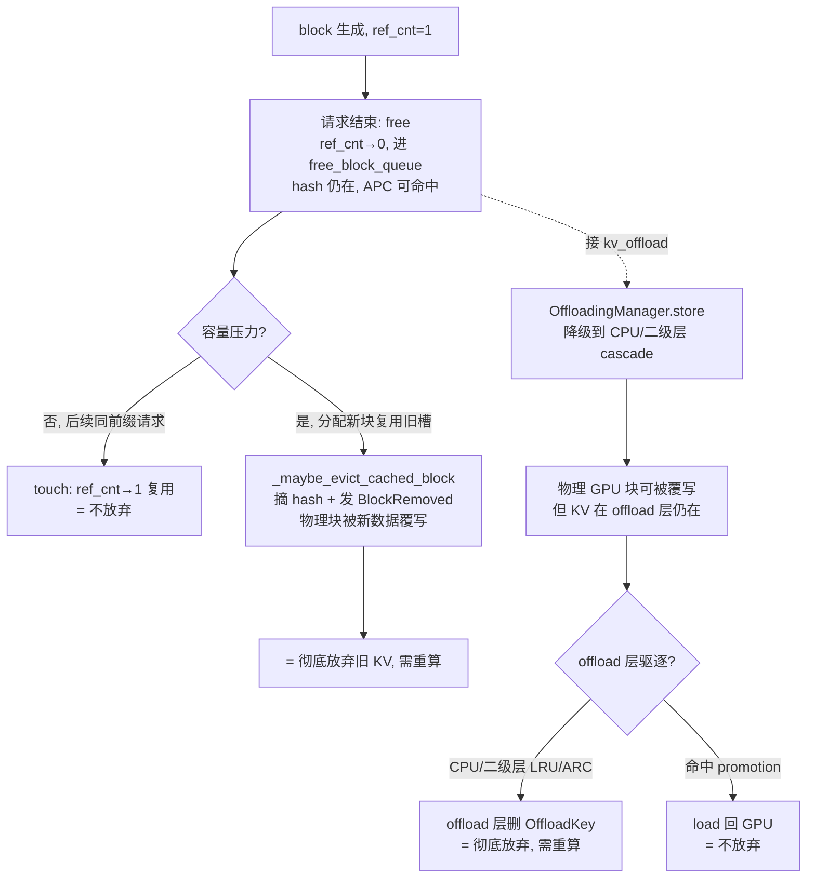

# vLLM — KV block 生命周期:ref_cnt、释放、驱逐与 offload

> 源码:`3rdparty/vllm`(submodule,HEAD `ab132ee98`)。本文回答一个具体问题:**一个 KV block 在 vLLM V1 里如何被持有、释放、驱逐、彻底放弃**,以及接上 `kv_offload` 多层后的降级/promotion 路径,从**当前实现**与**未来 RFC** 两方面梳理。
> 计算层抽象与 connector 接口见 [compute.md](compute.md);上游痛点见 [pain-points.md](pain-points.md);总览见 [overview.md](overview.md)。
>
> **调研快照**:2026-07-17。

## 一句话

vLLM 的 block 生命周期由**一个 `ref_cnt` 驱动**:归 0 ≠ 释放,只进**可驱逐候选队列**(`free_block_queue`);真正"彻底放弃"分两步——`_maybe_evict_cached_block` **摘 hash 表条目**(发 `BlockRemoved` 事件)和 `free_blocks` **还物理槽位**。APC 的 hash 表与物理 block 池是**两套独立账本**,驱逐只摘 hash、不断物理(块进 free 队列等下次复用)。接上 `kv_offload` 后多了**降级到 CPU/二级层**(cascade)与 **promotion 回 GPU**——但仍是**单实例内**账本,无跨实例权威。这与 SGLang「降层/摘树/删物理」三态同构,但 vLLM **无 radix 树**,hash 是平铺键。

---

## 一、一个 block 的两副账本

vLLM V1 的 block 不像 SGLang 挂在 radix 树节点上,而是**两个独立结构**各记一件事:

| 结构 | 文件:符号 | 记什么 |
|------|-----------|--------|
| `KVCacheBlock`(`ref_cnt`、`block_hash`) | `vllm/v1/core/kv_cache_utils.py::KVCacheBlock` (L118;`ref_cnt` L124) | 物理槽位的引用计数 + 是否被 APC 哈希表收录 |
| `cached_block_hash_to_block`(`hash→block`) | `vllm/v1/core/block_pool.py::BlockPool` (L144;字段 L185) | APC:内容哈希→物理 block(前缀命中查这个) |
| `FreeKVCacheBlockQueue` | `kv_cache_utils.py::FreeKVCacheBlockQueue` (L179) | 可驱逐候选队列(ref_cnt=0 的块) |

**关键:hash 表收录 ≠ 物理占用,ref_cnt=0 ≠ 释放**。一个块可以:
- 物理还在、`ref_cnt=0`、在 free 队列(可驱逐候选,仍可 APC 命中复用);
- 物理还在、`ref_cnt=0`、hash 已被摘(APC 命中不了,但槽位等下次复用);
- 物理被新数据覆写(才真正"放弃"旧 KV)。

> **对照 SGLang**:SGLang 把位置挂在 `TreeNode`(`value`/`host_value`/`hash_value` 三副),vLLM 无树——hash 是平铺键(`hash_block_tokens` L577 → `BlockHashWithGroupId`),前缀匹配靠 `get_computed_blocks` 逐块查 hash 表、断链即停。物理与 APC 分账这点两者一致;vLLM 更扁平。

---

## 二、当前实现:各层「何时释放」

### 层级 0 — ref_cnt:持有的唯一凭证

`ref_cnt` 是 block 的引用计数,**没有封装方法**,直接在 `BlockPool` 内 `block.ref_cnt += 1` / `-= 1`:

- **touch**(命中复用):`BlockPool.touch` (L597)——前缀命中时 `ref_cnt += 1`,若原为 0 则从 free 队列移出(不再可驱逐)。
- **分配**:`get_new_blocks` (L542)——新块 `ref_cnt=0 → +=1`,若复用了带 hash 的旧块先 `_maybe_evict_cached_block` (L574) 摘 hash。
- **释放**:`free_blocks` (L614)——`ref_cnt -= 1`。

**`ref_cnt → 0 ≠ 释放、≠ 摘 hash`**。`free_blocks` 把归 0 的块按"有无 hash"分两队列塞回 `free_block_queue`(无 hash 的先驱逐,见 L622–635):**块仍在、hash 仍在、可被 APC 命中复用**。

> **对照 lake**:与 lake「ref 归 0 = 可驱逐候选,非删内存;归 0 不摘位置视图」完全一致。与 SGLang `dec_lock_ref`(L608)把节点从 `protected_` 挪到 `evictable_` 同构。

### 层级 1 — 请求结束:free(进候选队列,不删)

请求收尾走 `Scheduler._free_request` (L2075) → `_free_request_blocks` (L2106) → `KVCacheManager.free(request)` (kv_cache_manager.py L462):

- `free` 把请求持有的 blocks `ref_cnt -= 1`,归 0 的进 `free_block_queue` 候选。
- **hash 表条目不动**——这些块仍可被后续同前缀请求 APC 命中(`touch` 把 ref_cnt 加回去)。
- 尾块对不齐的残尾(非整 block)不进 APC,直接进无 hash 队列优先驱逐。

**异步路径**(`defer_block_free=True`):`_free_request` 不立即 free,而是 `pop_blocks_for_free` (kv_cache_manager.py L491) 攒到 `deferred_frees`,由 `_drain_deferred_frees` 批量 `free_blocks`。**这条路径有 bug**:`pop_blocks_for_free` 把多 group 的块 flatten 成一个 list 再整体 reverse,丢了 per-group 驱逐顺序(#48489,见 [pain-points.md](pain-points.md) 1.5)。

> **对照 lake**:lake「请求结束 ref 归 0→可驱逐候选→驱逐覆写才摘位置视图」与 vLLM 同构;vLLM 的 deferred-free 是性能优化但引入顺序 bug,lake 用引用计数更显式。

### 层级 2 — 驱逐:摘 hash 表(发 BlockRemoved),物理块进候选队列

**APC 驱逐**(容量压力触发)分两种语义:

| 入口 | 文件:符号 | 做什么 |
|------|-----------|--------|
| 分配时复用旧块 | `block_pool.py::_maybe_evict_cached_block` (L574) | 摘 hash(`_remove_cached_block_hashes` L484)+ 发 `BlockRemoved` 事件(`_emit_block_removed_events` L505);**物理块归新数据** |
| 主动逐出 hash 表 | `block_pool.py::evict_blocks` (L637) | **只摘 hash 表条目**(`ref_cnt>0` 的块物理不释放,只从 APC 摘除);块仍在 free 队列 |
| 自然淘汰 | `free_blocks` (L614) 进队列后,`get_new_blocks` 复用 | 候选队列尾部的块被新请求覆写 = 真正放弃旧 KV |

**关键区分**:`evict_blocks` 是"从 APC 摘除但物理保留"(块还能被 free 队列复用,只是不再 APC 命中);`_maybe_evict_cached_block` 是"复用旧块时摘 hash + 物理覆写"。**真正放弃旧 KV 发生在新数据覆写那一刻**——在此之前块要么在候选队列(可复用)、要么 hash 还在(APC 可命中)。

> **对照 SGLang**:SGLang 纯 `RadixCache.evict` 一步到位(free+delete_leaf=彻底放弃);vLLM 把"摘 hash"与"覆写物理"解耦成两步,中间态更多。lake「驱逐覆写才摘位置视图」对应 vLLM 的"覆写才真放弃"。

### 层级 3 — KV Events:放弃的可观测性

vLLM 把 block 生命周期**事件化**(`vllm/distributed/kv_events.py`),供外部控制面构建 KV 索引:

| 事件 | 文件:符号 | 何时发 |
|------|-----------|--------|
| `BlockStored` | `kv_events.py::BlockStored` (L48) | `cache_full_blocks` (L226) L340、`cache_partial_block` (L358) L440 inline append;携 `block_hashes`+`medium`+`group_idx` |
| `BlockRemoved` | `kv_events.py::BlockRemoved` (L92) | `_emit_block_removed_events` (L505),摘 hash 时发 |
| `AllBlocksCleared` | `kv_events.py::AllBlocksCleared` (L107) | `reset_prefix_cache` (L688) |

`KVEventBatch` (L111) 带 `data_parallel_rank`;`KVEventAggregator` (L115) 跨 TP worker 聚合去重(只返回所有 worker 都 emit 的事件)。事件经 zmq 发布,外部(Dynamo/llm-d)消费建集群索引。

**当前缺口**:`medium` 字段只标记**单实例内**介质(`"GPU"`),无跨实例坐标;`session_id`/`continuation_id` 尚未落地(#48501 RFC,见 [pain-points.md](pain-points.md) 1.2)。`publisher_epoch` 类 crash-recovery nonce **不存在**(对比 SGLang #29709 计划补)。

> **对照 lake**:vLLM KV Events schema 是控制面构建集群位置视图的现成事件源形态;但 vLLM 事件只描述单实例内生命周期,无集群坐标——lake 的位置视图由存储池权威元数据驱动(非引擎事件),强一致。

### 层级 4 — 接 kv_offload:降级到 CPU/二级层

接上 `vllm/v1/kv_offload/` 后(经 `OffloadingConnector` 插件外壳),block 多了**层间降级/promotion** 路径(全跑在 Scheduler 进程):

| 操作 | 文件:符号 | 语义 |
|------|-----------|------|
| 内容寻址键 | `kv_offload/base.py::OffloadKey` (L30;`make_offload_key` L35) | `block_hash + group_idx`,平铺键(非树) |
| 查询三态 | `base.py::OffloadingManager.lookup` (L170) → `LookupResult` (L56) | `MISS`/`HIT`/`HIT_PENDING`/`RETRY`(`HIT_PENDING`=异步传输未就绪) |
| offload 策略 | `base.py::OffloadPolicy` (L65) | `BLOCK_LEVEL`(仅新算块)/`REQUEST_LEVEL`(含前缀命中块) |
| CPU 主层驱逐 | `kv_offload/cpu/manager.py::CPUOffloadingManager` (L36;`lookup` L116) | `self._policy.evict(...)` (L201),策略 `LRUCachePolicy`/`ARCCachePolicy`(`cpu/policies/{lru,arc}.py`) |
| 二级层级联 store | `kv_offload/tiering/base.py::SecondaryTierManager` (L51) | GPU→CPU(主层)→secondary(cascade);`JobMetadata` (L33,`is_promotion`/`req_context`) |
| promotion load | 同上 | secondary→CPU(主层)→GPU;`submit_load`/`get_finished_jobs` 异步 |
| 二级层实现 | `tiering/fs/manager.py::FileSystemTierManager` (L62)、`tiering/obj/manager.py::ObjectStoreSecondaryTierManager` (L85) | NVMe / 对象存储 |

**关键**:CPU 主层直接访问 GPU(GPU↔offload 网关);二级层(NVMe/Obj)**不能直接访问 GPU**,必须经 CPU 主层级联。`lookup` 的 `HIT_PENDING` 对应"块在二级层、promotion 传输中"——请求可等待或回退重算。

**但**:这套 offload 仍 **per-instance**——跑在该引擎的 Scheduler 进程内,tier 是引擎私有,无跨实例共享/权威。`OffloadKey` 是平铺内容键,无 radix、无跨节点位置视图。

> **对照 SGLang HiCache**:SGLang `HiRadixCache` 把三层位置挂 `TreeNode`(`value`/`host_value`/`hash_value`),驱逐分 `_evict_backuped`(降层)/`_evict_regular`(删)/`_drop_subtree_no_host`(有损丢);vLLM `kv_offload` 用 `OffloadKey` 平铺键 + `OffloadingManager` 三态查询 + cascade/promotion 异步作业,无树但层级职责更清晰(主层网关 + 二级级联)。两者都 per-instance。lake 把这层归存储池集群权威。

---

## 三、「彻底放弃一个 block」= 什么条件

- **无 offload**:彻底放弃 = 新数据覆写物理块(此前 hash 已摘、`BlockRemoved` 已发)。
- **有 offload**:GPU 块被覆写不算放弃——KV 降级到 CPU/二级层仍在;**offload 层 LRU/ARC 删 `OffloadKey` 才真放弃**。
- **非正常放弃**:`evict_blocks` 主动摘 hash(块物理还在,只是 APC 不再命中——介于"放弃 APC 身份"与"放弃物理"之间)。

> **对照 SGLang**:SGLang 配 L3 时引擎侧永不主动彻底放弃(L3 后端独立 LRU/TTL);vLLM `kv_offload` 的二级层同理——`OffloadKey` 的删除由二级层 manager 自己的 LRU 决定,引擎侧只 `store`/`lookup`。lake「L2=F4 恢复点、L3=SSOT,L3 缺失才算不存在」与两者同构,但 lake 是集群级池。

---

## 四、未来计划方向(issue / RFC)

围绕 block 生命周期的在途改造:

| 方向 | Issue/RFC | 补什么洞 |
|------|-----------|----------|
| **跨 session 坐标** | [#48501](https://github.com/vllm-project/vllm/issues/48501) session-centric | 现状事件只带 hash+medium,无 session/lineage。提议 `session_id`+`continuation_id` 两个不透明坐标,引擎退化为"无策略机制",控制面 indexer 成"集群内存图"。**把"放弃"决策上移到控制面** |
| **layerwise offload API** | [#48203](https://github.com/vllm-project/vllm/issues/48203) | prefill 共享 2–4 device buffer 逐层 onload/offload、decode 只 onload top-k;提 `d2h_block`/`h2d_token` API。代码侧未落地 |
| **offload 块大小松绑** | [#48635](https://github.com/vllm-project/vllm/issues/48635) | 放宽 offloading block size assert |
| **layer-major 布局** | [#45997](https://github.com/vllm-project/vllm/issues/45997) | 现状 MLA 禁用 cross-layer(#37090),导致 L 次独立拷贝 + L 次 RDMA 注册。提议常量跨层 stride 的 layer-major 布局,`cudaMemcpy2D` 一次拷贝 + 单次内存注册 |
| **跨 connector QoS** | [#46016](https://github.com/vllm-project/vllm/issues/46016) | 把请求优先级透传到 connector 层,KV 传输按优先级调度 |
| **语义复用 commit 策略** | [#44223](https://github.com/vllm-project/vllm/issues/44223) | 现状外部加载的 KV 一律按 exact commit,会污染后续 exact 命中。提 `ExternalKVCachePolicy`(EXACT_COMMIT/REQUEST_ONLY) |
| **Mooncake 总栈** | [#45036](https://github.com/vllm-project/vllm/issues/45036) | 把 Mooncake connector 从前缀缓存升级为 disagg KV 层:HBM/DRAM 统一编址、SSD 分层、KV Events、recompute-on-failure、layer-wise transfer |

方向共性:从「单实例 hash 表 + per-instance offload」→「事件化 + 跨 session 坐标 + 控制面可编程 + 跨层布局标准化」。即**"谁决定放弃/移动一个 block"从引擎本地 LRU 上移到外部控制面**——与 SGLang #29709/#27574 同向。

---

## 五、对 lake 的启示

1. **ref_cnt 三态是通用模式**:vLLM `ref_cnt=0→候选队列(可命中)→摘 hash→覆写物理` 与 SGLang `lock_ref→0→evictable→evict→free`、lake「ref 归 0→可驱逐候选→驱逐覆写才摘视图」三者同构。lake 保持分层(不合并"摘视图"与"删物理")。
2. **APC hash 表与物理池分账**:vLLM `evict_blocks` 只摘 hash、物理保留的设计,说明"放弃 APC 身份"≠"放弃物理"——lake 位置视图的摘除也要与物理回收解耦(驱逐覆写才摘视图)。
3. **KV Events 是控制面索引的现成事件源**:vLLM `BlockStored`/`BlockRemoved` schema(携 `ExternalBlockHash`+`medium`+`group_idx`)可直接参考;但 vLLM 无集群坐标(#48501 在补),lake 位置视图由存储池权威元数据驱动、强一致,不依赖引擎事件。
4. **`OffloadingManager`/`LookupResult` 三态查询**:vLLM `MISS`/`HIT`/`HIT_PENDING`/`RETRY` 直接映射 lake「Pool miss / Pool 命中待传 / 本地命中」;`HIT_PENDING`(异步 promotion 未就绪)正是 lake「Pool 命中需传输」的对应。
5. **cascade/promotion 异步作业模型**:vLLM 二级层 `SecondaryTierManager` 的 GPU→CPU→secondary cascade、`JobMetadata.is_promotion` 与 lake「L2→L1 promotion / L1→L2 demotion」同构,可参考其作业抽象。
6. **deferred-free 丢顺序是反面教材**:#48489 flatten 多 group 块再整体 reverse 丢 per-group 驱逐顺序——lake 多层驱逐要保留 per-tier/per-group 顺序,不 flatten。
7. **layer-major 布局值得跟踪**:#45997 的"常量跨层 stride + 单次 RDMA 注册"若落地,直接影响 lake worker↔存储池的 KV 传输布局设计。

---

## 代码索引

> 符号名稳定锚定,行号会漂移——找不到时 `grep -n "符号名" 3rdparty/vllm/<文件路径>`。

| 机制 | 文件:符号 |
|------|-----------|
| block 对象 + ref_cnt | `vllm/v1/core/kv_cache_utils.py`::`KVCacheBlock` (L118;`ref_cnt` L124) |
| 可驱逐候选队列 | `kv_cache_utils.py`::`FreeKVCacheBlockQueue` (L179) |
| block 哈希(内容寻址) | `kv_cache_utils.py`::`hash_block_tokens` (L577) / `BlockHashWithGroupId` (L49) / `ExternalBlockHash` (L54) |
| 跨实例外部哈希 | `kv_cache_utils.py`::`maybe_convert_block_hash` (L79) |
| block 分配器 + hash→block | `vllm/v1/core/block_pool.py`::`BlockPool` (L144;`cached_block_hash_to_block` L185) |
| 新块分配(复用旧块先摘 hash) | `block_pool.py`::`get_new_blocks` (L542) / `_maybe_evict_cached_block` (L574) |
| 命中复用(ref_cnt+1) | `block_pool.py`::`touch` (L597) |
| 释放(ref_cnt-1,进候选队列) | `block_pool.py`::`free_blocks` (L614) |
| 主动摘 hash(物理保留) | `block_pool.py`::`evict_blocks` (L637) |
| 摘 hash 原语 | `block_pool.py`::`_remove_cached_block_hashes` (L484) / `_insert_block_hash` (L520) |
| cache full/partial block | `block_pool.py`::`cache_full_blocks` (L226) / `cache_partial_block` (L358) |
| KV manager 释放入口 | `vllm/v1/core/kv_cache_manager.py`::`get_computed_blocks` (L202) / `allocate_slots` (L244) / `free` (L462) / `pop_blocks_for_free` (L491) / `evict_blocks` (L504) |
| 调度器请求释放 | `vllm/v1/core/sched/scheduler.py`::`_free_request` (L2075) / `_free_blocks` (L2094) / `_free_request_blocks` (L2106) |
| KV Events 事件 | `vllm/distributed/kv_events.py`::`BlockStored` (L48) / `BlockRemoved` (L92) / `AllBlocksCleared` (L107) / `KVEventBatch` (L111) / `KVEventAggregator` (L115) |
| BlockRemoved 发射点 | `block_pool.py`::`_emit_block_removed_events` (L505) |
| BlockStored 发射点 | `block_pool.py` L340 / L440(inline append) |
| AllBlocksCleared 发射点 | `block_pool.py`::`reset_prefix_cache` (L688) / `take_events` (L713) |
| offload 内容寻址键 | `vllm/v1/kv_offload/base.py`::`OffloadKey` (L30) / `make_offload_key` (L35) |
| offload 查询三态 | `base.py`::`OffloadingManager` (L168) / `lookup` (L170) / `LookupResult` (L56) |
| offload 策略/上下文 | `base.py`::`OffloadPolicy` (L65) / `ReqContext` (L51) / `RequestOffloadingContext` (L75) / `LoadStoreSpec` (L79) |
| CPU 主层 | `vllm/v1/kv_offload/cpu/manager.py`::`CPUOffloadingManager` (L36;`lookup` L116、`evict` L201) |
| CPU 驱逐策略 | `vllm/v1/kv_offload/cpu/policies/`::`lru.LRUCachePolicy` (L12) / `arc.ARCCachePolicy` (L12) |
| 二级层 ABC + 异步作业 | `vllm/v1/kv_offload/tiering/base.py`::`SecondaryTierManager` (L51) / `JobMetadata` (L33) / `JobResult` (L44) / `JobId` (L29) |
| tiering 管理器 | `vllm/v1/kv_offload/tiering/manager.py`::`TieringOffloadingManager` (L122) / `CPUPrimaryTierOffloadingManager` (L73) |
| tiering spec | `vllm/v1/kv_offload/tiering/spec.py`::`TieringOffloadingSpec` (L59) |
| 二级层实现 | `tiering/fs/manager.py`::`FileSystemTierManager` (L62) / `tiering/obj/manager.py`::`ObjectStoreSecondaryTierManager` (L85) |
| offload connector 外壳 | `vllm/distributed/kv_transfer/kv_connector/v1/offloading_connector.py`::`OffloadingConnector` (L46) / `simple_cpu_offload_connector.py`::`SimpleCPUOffloadConnector` (L45) |
| offload scheduler(含 `_blocks_being_loaded`) | `vllm/distributed/kv_transfer/kv_connector/v1/offloading/scheduler.py`::`_blocks_being_loaded` (L357) / `get_num_new_matched_tokens` (L647) |
| 跨层 KV 布局 | `vllm/v1/worker/kv_connector_model_runner_mixin.py`::`use_uniform_kv_cache` (L115) / `allocate_uniform_kv_caches` (L161) / `prefer_cross_layer_blocks` (L148) |
| connector 跨层偏好(基类) | `vllm/distributed/kv_transfer/kv_connector/v1/base.py`::`prefer_cross_layer_blocks` (L177) |
