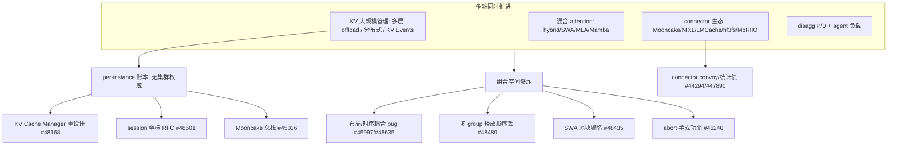

# vLLM — 上游痛点与 lake 对照

> 源码:`3rdparty/vllm`(submodule,HEAD `ab132ee98`)。本文整理 **上游 GitHub issue / roadmap / RFC** 暴露的尚未解决痛点,并区分「可修工程债 / 架构债 / 物理或职责边界上难消掉的点」,供 lake 设计取舍。
> 计算层抽象见 [compute.md](compute.md);block 生命周期见 [block-lifecycle.md](block-lifecycle.md);总览与 KV 大规模管理演进见 [overview.md](overview.md)。
>
> **调研快照**:2026-07-17 · submodule `ab132ee98`(≈ v0.23.x) · 议题以当时 open 状态为准,编号可漂移,以 GitHub 为准。

## 一句话

vLLM 在 **KV 大规模管理(多层 offload / 分布式 / disagg P/D)× 混合 attention(hybrid/SWA/MLA)× connector 生态(Mooncake/NIXL/LMCache/hf3fs/MoRIIO)× agent 负载** 多轴同时推进;Q3 2026 roadmap(#48168)正式把"分布式多层 KV offload 生产化 + KV Cache Manager 重设计 + Scheduler 重构"列为核心目标。多数线上 hang/crash/性能塌陷来自**per-instance KV 账本 + connector 与核心的布局/时序耦合 + 组合正确性**。这些痛点划出了 lake 的**问题域**:哪些能在 lake 的设计构想里对上号、哪些即便换架构也解不干净(RoPE 位置耦合、MLA 跨层布局、agent 语义归属)。下文第 4 节列 lake **能做什么**——均为待验证的设计意图,非既成能力。

## 议题版图

vLLM 是工业级引擎,issue 体量远大于 SGLang 的分布式 KV 议题占比。**KV/分层/disagg/connector 这条战略线**在 Q3 2026 被正式扶正为 roadmap 核心目标(此前主要是 connector 外挂 + 单实例优化),但仍落后于模型/硬件/量化矩阵的日常洪流。

主战场:

- **Q3 2026 roadmap** [#48168](https://github.com/vllm-project/vllm/issues/48168):生产级分布式 + 多层 KV offload、Mooncake P2P KV Events、agent 前缀缓存(session hint + 选择性 offload/驱逐/预取)、**KV Cache Manager 重新设计**、**Scheduler 重构**、量化 KV 生产化、PD disagg recipe。  
  → **KV/Session 专文**（含 #48501 全文结构）见 [kv-session-roadmap.md](kv-session-roadmap.md)。
- **Mooncake Store Connector 总栈** [#45036](https://github.com/vllm-project/vllm/issues/45036):把 Mooncake connector 从前缀缓存升级为 disagg KV 层(HBM/DRAM 统一编址、SSD 分层、KV Events、recompute-on-failure、layer-wise transfer)——这是 vLLM 生态在做的"分布式 KV 总栈"(对应 SGLang [#21846](https://github.com/sgl-project/sglang/issues/21846))。

战略主线六大簇见第 1 节。

---

## 1. 尚未解决的痛点(有 issue / roadmap / RFC)

### 1.1 分布式 / 多层 KV offload 仍在生产化途中

vLLM 已落地 `vllm/v1/kv_offload/`(CPU/FS/Obj 多层,见 [block-lifecycle.md](block-lifecycle.md) 层级 4)与 KV Events,但仍是 **per-instance**,roadmap 明确要推向"生产级分布式 + 多层":

- **KV Cache Manager 重新设计 + Scheduler 重构**(SIG Core,#48168):KV 内存管理抽象的根本重做——承认当前 `KVCacheManager`/`BlockPool`/`Scheduler` 单实例账本撑不住大规模。
- **Mooncake P2P KV Events + 分层 offload 的 KV Events 支持**(#48168):对等分布式 KV cache + 事件协调。
- **Mooncake 总栈** [#45036](https://github.com/vllm-project/vllm/issues/45036):SSD offload(已 done)、HBM/DRAM 统一编址(memory semantics)、KV Events 传播给编排层做 cache-aware 路由、recompute-on-get-failure、layer-wise transfer。
- **gRPC server API for downstream disagg KV** [#47768](https://github.com/vllm-project/vllm/issues/47768):给下游 disagg KV 传输集成的 gRPC 接口。

> **对照 lake**:vLLM 正向 lake 的方向走(多层 + 事件 + 编排层可见),但仍 per-instance、无集群权威池。lake 把 L0–L3 归存储池集群权威,是 vLLM 还没走到的那一步。

### 1.2 跨 session / 跨实例 KV 协调仍是 RFC

| Issue | 缺口 |
|-------|------|
| [#48501](https://github.com/vllm-project/vllm/issues/48501) session-centric | 现状事件只带 hash+medium,无 session/lineage。提议 `session_id`+`continuation_id` 两个不透明坐标,**引擎退化为"无策略机制"**,控制面 indexer 成"集群内存图";指令(retention/offload/move/discard/prefetch)按坐标寻址。代码侧未落地 |
| [#44223](https://github.com/vllm-project/vllm/issues/44223) 语义复用 | exact prefix caching 对"相似但不完全相同"的 prompt 无能为力。提议 `ExternalKVCachePolicy`(EXACT_COMMIT/REQUEST_ONLY)防止近似复用污染 exact 命中。Phase 0–4 滚动 |
| [#46016](https://github.com/vllm-project/vllm/issues/46016) 跨 connector QoS | KV 传输不感知请求优先级;提议把优先级透传到 connector 层 |

[#48501](https://github.com/vllm-project/vllm/issues/48501) 的方向几乎就是 lake 的架构(引擎=执行、控制面=集群权威),是 vLLM 在向 lake 靠拢的最强信号。

> **对照 lake**:lake 设计即为集群级位置视图 + 控制面权威;vLLM 的 `session_id`/`continuation_id` 坐标方案可作为 lake 控制面↔引擎 hint 接口的参考形态。

### 1.3 connector ↔ 核心的布局/时序耦合

connector 生态(Mooncake/NIXL/LMCache/hf3fs/MoRIIO)与 vLLM 核心的 KV 布局协商是高频痛点源:

| Issue / RFC | 根因 |
|-------------|------|
| [#45997](https://github.com/vllm-project/vllm/issues/45997) layer-major 布局 | #37090 因 MLA 需连续 per-layer view 而**禁用 cross-layer KV**,导致 DeepSeek-V3/V3.2/GLM/Kimi 这些 disagg 主力模型每块 L 次独立拷贝 + L 次 RDMA 注册。提议常量跨层 stride 的 layer-major 布局,`cudaMemcpy2D` 一次拷贝 + 单次内存注册 |
| [#48635](https://github.com/vllm-project/vllm/issues/48635) offload 块大小 assert | offloading block size 约束过严 |
| [#45330](https://github.com/vllm-project/vllm/issues/45330)(已闭)NIXL hetero TP | `tp > num_kv_heads`(GQA replication)时断言失败 |
| [#47722](https://github.com/vllm-project/vllm/issues/47722) LoRA 隔离 | runtime `add_lora()` 后一个用户的在途请求被另一用户 adapter 静默服务——前缀缓存正确性受影响 |

代码锚点:`prefer_cross_layer_blocks`(`base.py` L177)、`use_uniform_kv_cache`/`allocate_uniform_kv_caches`(`kv_connector_model_runner_mixin.py` L115/L161)、`get_kv_cache_stride_order`(`mla_attention.py` L1226)。

模式:**MLA/混合 attention 的 per-layer 连续性要求** 与 **connector 想 cross-layer 批量传输** 天然冲突,vLLM 用禁用 cross-layer 回避,代价是传输开销 ×L。

> **对照 lake**:lake 存储池按"不透明字节块"存(不解释布局),但 worker↔池传输仍需 layout spec。vLLM #45997 的 layer-major 布局若落地是直接可借鉴的传输布局;lake 要在 P2/P4 定 worker↔存储池的 KV 布局,需跟踪此 RFC。

### 1.4 OffloadingConnector 性能/正确性 bug(已落地代码的债)

`OffloadingConnector`(`v1/offloading_connector.py` L46)是把 `kv_offload` 子系统暴露为 connector 的外壳,已暴露多个实质 bug:

| Issue | 现象 | 根因(代码锚点) |
|-------|------|-----------------|
| [#44294](https://github.com/vllm-project/vllm/issues/44294) | 50 并发共享前缀时 **TTFT 12× 膨胀**(0.90s→11.46s) | `_blocks_being_loaded`(`offloading/scheduler.py` L357)去重逻辑把"不发重复 load"错写成"延迟整个请求":命中 in-flight key 时 `return None` 阻塞请求,形成 O(n) convoy。修法 `return None`→`return 0` |
| [#47890](https://github.com/vllm-project/vllm/issues/47890) | DSpark draft-model KV-cache group 的 sparse 存储导致 `external_prefix_cache_hits_total` 永远为 0 | draft group 稀疏存储,外部前缀命中统计漏 |
| [#45268](https://github.com/vllm-project/vllm/issues/45268) | `--kv-offloading-backend native + --enable-sleep-mode` 首次 sleep/wake 后 `EngineDeadError` | offload 与 sleep 模式组合崩溃 |

[#44294](https://github.com/vllm-project/vllm/issues/44294) 尤其值得注意:一个"防止重复加载"的去重逻辑,因**把"不发重复 job"与"阻塞请求"混为一谈**,把并发优势变成串行 convoy——这是 per-instance offload 路径的典型工程债。

> **对照 lake**:lake「Pool 命中待传」要避免 vLLM #44294 的 convoy——多个请求共享同一 in-flight 传输时,应让后续请求**继续推进(回退重算或等传输)**而非阻塞,传输去重与请求推进解耦。

### 1.5 混合 attention / 多 group 的组合正确性

hybrid KV cache config(full + SWA + Mamba 多 group)是 bug 重灾区:

| Issue | 现象 | 根因 |
|-------|------|------|
| [#48435](https://github.com/vllm-project/vllm/issues/48435) | hybrid-SWA 多 session 轮询,~25% 池占用时**前缀命中塌陷到 0**(所有请求,二元失败) | SWA all-or-nothing 交语义 + SWA 尾块稀疏 hash + out-of-window 块 eager free 进共享 free 队列 + tail-first 驱逐——四因共振,尾块被轮询回收导致整请求命中归零 |
| [#48489](https://github.com/vllm-project/vllm/issues/48489) | `defer_block_free` 异步路径丢 per-group 驱逐顺序 | `pop_blocks_for_free`(kv_cache_manager.py L491)flatten 多 group 块再整体 reverse,破坏 per-group tail-first 顺序——纯驱逐质量回归 |
| [#47722](https://github.com/vllm-project/vllm/issues/47722) | MoE EP+DP KV cache init shape mismatch | #47722 |

[#48435](https://github.com/vllm-project/vllm/issues/48435) 是"组合正确性"的典型:四个各自合理的设计(all-or-nothing 交语义、稀疏 hash、eager free、tail-first 驱逐)叠加产生**二元塌陷**,且只在特定占用率(~25%)触发,评测矩阵若只跑单 session 会漏。修法是 SWA-aware 驱逐优先级或显式 pin(#23083)。

> **对照 lake**:lake 若引入混合 attention / SWA,需警惕 vLLM #48435 的"尾块被共享 free 队列回收"——驱逐策略要 group-aware;#48489 的教训是多层/多 group 释放不 flatten,lake 已在 [block-lifecycle.md](block-lifecycle.md) 启示 6 记入。

### 1.6 disagg P/D 失败语义不完整

| Issue | 现象 |
|-------|------|
| [#46240](https://github.com/vllm-project/vllm/issues/46240) | abort 请求的 `finished_recving`+`finished_sending` 落同一 step → `_update_from_kv_xfer_finished` 的 `assert req_id in self.requests` 崩 EngineCore;DP 部署下级联 `sync_dp_state` gloo 断连,整池死 |
| [#47136](https://github.com/vllm-project/vllm/issues/47136) | disagg P/D decode 节点 `cached_tokens` 恒等于 `prompt_tokens`——decode 端从未真正收到缓存 token,重算整个 prompt |
| [#45749](https://github.com/vllm-project/vllm/issues/45749) | ROCm P/D MoRI/MoRIIO READ-mode hang + 部分完成 |

[#46240](https://github.com/vllm-project/vllm/issues/46240) 根因:P/D 双端状态机未共享 abort 权威,半成功传输的完成通知在请求已 free 后到达,断言崩溃。修法是 `assert`→`if not in: continue` 容忍陈旧完成通知。

> **对照 lake**:lake「失败 → F4 重路由,不设 mode-to-mode 降级链;传输契约全有或全无」正避此坑——abort 后的陈旧传输完成通知必须被容忍(幂等丢弃),而非断言。vLLM #46240 是"abort 半成功"的反面教材(对照 SGLang [#30233](https://github.com/sgl-project/sglang/issues/30233) abort 半传垃圾)。

### 1.7 agent / session 编排语义断层

| Issue | 缺口 |
|-------|------|
| [#48501](https://github.com/vllm-project/vllm/issues/48501) | 引擎只有 hash+refcount,无 session/lineage;router 想 evict 已退出 subagent 的 KV、prefetch 即将回来的 KV,引擎猜不到 |
| [#45036](https://github.com/vllm-project/vllm/issues/45036) | KV Events 传播给编排层做 cache-aware 路由(进行中) |
| #48168 roadmap | agent hint(Session-ID/Correlation-ID)+ 选择性 offload/驱逐/预取指令 |

评论共识(SGLang [#27574](https://github.com/sgl-project/sglang/issues/27574) 同向):subagent 跑数分钟时 main-agent KV 被慢慢驱逐,需**显式 evict + 回来时 prefetch**——智能放编排层,引擎只执行。

> **对照 lake**:lake 划清边界——准入/过载归 gateway、执行系统只上报信号;agent hint 透传位可预留。与 vLLM #48501 的"引擎=机制/控制面=智能"同向。

### 1.8 架构劣势(机制层,不依赖具体 issue)

完整列表见 [overview.md](overview.md)「劣势」与「KV 大规模管理演进」。摘要:

1. KV/调度/元数据仍 **per-instance**(`kv_offload` 跑在引擎 Scheduler 进程内,tier 私有);无集群权威池(#48168 在重设计)。
2. 多层 offload 是**单实例内级联**(GPU↔CPU↔NVMe/Obj 同机),非跨节点池。
3. **无 radix**——APC hash 顺序匹配 + `OffloadKey` 平铺键,断链即停。
4. **无集群位置视图/本地命中**——KV Events `medium` 仅单实例介质标记;`session_id`/`continuation_id` 是 RFC(#48501)。
5. HBM **引擎自分配**(offload/connector 只借传输)——方案 Z"池管 HBM 放置"无对应。
6. MLA/混合 attention 的 per-layer 连续性要求与 connector cross-layer 传输冲突(#45997)。

---

## 2. 可能无法真正消掉 / 只能缓解

| 痛点 | 为何难 | 能做什么 |
|------|--------|----------|
| per-instance KV → 集群权威 | `KVCacheManager`/`BlockPool`/`Scheduler` 设计即单实例;KV Cache Manager 重设计(#48168)进行中但方向未定 | 换 lake 式存储池集群权威——**改架构**;vLLM 自己走 #48501 旁路 indexer(最终一致)而非强一致池 |
| MLA 跨层布局 | MLA kernel 需连续 per-layer view,与 cross-layer 批量传输天然冲突(#45997) | layer-major 常量 stride 布局可缓解,但 MLA 本身的物理约束在 |
| 位置无关 KV 复用(PIC) | RoPE/位置编码使同内容不同 offset 的 KV 不同;链式 hash 必含 parent | MLA delta-rotation / 延迟 RoPE——非通用免费午餐(lake [#2](https://github.com/chengda-wu/lake/issues/2) 同理) |
| 引擎内「看懂」agent 图 | 工具时隙、subagent 生命周期在编排层(#48501 原则) | 只能做 soft hint;智能放控制面 |
| hybrid×offload×disagg×connector 全绿 | 组合正确性近似指数(#48435/#48489) | 矩阵测试 + 砍组合;不能承诺任意叠 |
| abort 半成功传输 | P/D 双端状态机不共享 abort 权威(#46240) | 容忍陈旧完成通知(幂等丢弃);无法零成本同时零残留 |
| cross-layer 传输开销 ×L | MLA 禁用 cross-layer(#37090)回退 | #45997 layer-major 若落地可解,但仍在 RFC |

---

## 3. 横切模式

1. **per-instance KV 账本**是根因:`KVCacheManager`/`BlockPool`/`Scheduler` 单实例,跨实例靠 connector 外挂 + KV Events 旁路;集群权威要等 #48168 重设计 / #48501 坐标 / #45036 Mooncake 总栈——三者都未到位。
2. **MLA/混合 attention 的 per-layer 连续性**与 **connector cross-layer 传输**冲突,逼出 #37090 禁用 → #45997 补布局。
3. **组合正确性塌陷**常在特定占用率/并发二元触发(#48435 @25%、#44294 @50 并发),评测矩阵易漏。
4. **abort 半成功**是 P/D 通病(vLLM #46240 / SGLang #30233):双端状态机不共享 abort 权威。

---

## 4. lake 能做什么(设计构想,未验证)

> 下表不谈"lake 比 vLLM 好",只回答:**上游这个痛点,lake 现有设计文档打算怎么接?前提是什么、还没定什么。** 所有条目都停留在文档层,尚无实现与实测。

| vLLM 痛点 | lake 设计里能对应做的事 | 前提 / 尚未验证 |
|-----------|------------------------|-----------------|
| per-instance KV,无集群权威(#48168/#45036) | L0–L3 归存储池集群权威,跨节点统一编址;DRAM/HBM 是池物理载体,跨机命中是放置结果 | 池化 HBM 入图约束、放置延迟能否守 SLO,全待 P4/P7 验证 |
| 弱一致位置 / 旁路事件(#48501) | 控制面维护强一致位置视图、Router 持本地镜像(见 lake [#4](https://github.com/chengda-wu/lake/issues/4)) | 强一致视图刷新延迟、镜像陈旧兜底未实测;是否真比 vLLM 旁路事件流划算未知 |
| MLA 跨层布局冲突(#45997) | 存储池按不透明字节块存(不解释布局),worker↔池传输 layout spec 待定 | 可借鉴 #45997 layer-major 布局;lake 自身布局未设计 |
| offload convoy(#44294) | 「Pool 命中待传」时多请求共享 in-flight 传输但不阻塞请求(回退重算或等传输) | 传输去重与请求推进的解耦策略未设计 |
| 多 group 释放丢顺序(#48489) | 多层/多 group 驱逐保留 per-tier/per-group 顺序,不 flatten | 仅设计约束,调度器未写 |
| SWA 尾块塌陷(#48435) | 若引入混合/SWA,驱逐策略 group-aware + 尾块保护 | lake 目前无 SWA/混合 attention 设计 |
| abort 半成功崩(#46240) | 传输契约全有或全无,失败统一走 F4 重路由;陈旧完成通知幂等丢弃 | 契约与 F4 目前只在文档;实现细节未定 |
| agent 生命周期不可见(#48501) | 划清边界:准入/过载归 gateway、执行系统只上报信号;预留 agent hint 透传位 | hint 字段、evict/prefetch 语义都没设计 |
| 语义复用污染(#44223) | 维持前缀链式 hash(必含 parent),不承诺语义/PIC 复用 | 与上游同样受 RoPE 位置耦合限制 |
| 启动固定 P/D 角色 | 设计上按请求在 PD 分离/混部/D-direct 间选路(见 [../../architecture/execution-modes.md](../../architecture/execution-modes.md)) | 模式选择 <5ms 预算、切换开销均未验证 |
| HBM 引擎自分配 | 方案 Z"池管 HBM 放置",vLLM 无对应 | 池化 HBM 入图约束全待验证 |

**可借鉴的实现(与优劣无关)**,细节见 [compute.md](compute.md) / [block-lifecycle.md](block-lifecycle.md):`OffloadingManager`/`LookupResult` 三态查询、KV Events schema(`BlockStored` 的 `medium`/`group_idx`)、`OffloadKey` 内容寻址编码、secondary tier cascade/promotion 异步作业模型、`#45997` layer-major 布局、`#48501` session 坐标方案。这些是可直接参考的现成做法,lake 是否照搬仍待定。

---

## 5. 建议持续跟踪的上游议题

| 优先级 | Issue | 看什么 |
|--------|-------|--------|
| P0 | [#48168](https://github.com/vllm-project/vllm/issues/48168) Q3 roadmap | KV Cache Manager 重设计 + Scheduler 重构方向;分布式多层 offload 生产化进度 |
| P0 | [#48501](https://github.com/vllm-project/vllm/issues/48501) session-centric | `session_id`/`continuation_id` 坐标 API;对照 lake 位置视图与控制面↔引擎 hint |
| P0 | [#45036](https://github.com/vllm-project/vllm/issues/45036) Mooncake 总栈 | HBM/DRAM 统一编址、KV Events、recompute-on-failure;对照 lake 存储池分层 |
| P0 | [#45997](https://github.com/vllm-project/vllm/issues/45997) layer-major 布局 | 跨层 stride + 单次 RDMA 注册;直接关系 lake worker↔池传输布局 |
| P1 | [#44294](https://github.com/vllm-project/vllm/issues/44294) offload convoy | `_blocks_being_loaded` convoy 反模式;对照 lake「Pool 命中待传」去重 |
| P1 | [#46240](https://github.com/vllm-project/vllm/issues/46240) abort 崩 | abort 半成功处理;对照 lake F4 契约 |
| P1 | [#48435](https://github.com/vllm-project/vllm/issues/48435) / [#48489](https://github.com/vllm-project/vllm/issues/48489) | 混合/SWA + 多 group 组合正确性;lake 若引入混合 attention 的前车之鉴 |
| P1 | [#44223](https://github.com/vllm-project/vllm/issues/44223) 语义复用 | `ExternalKVCachePolicy` commit 策略;确认 lake 边界(默认不做 PIC) |
| P2 | [#48203](https://github.com/vllm-project/vllm/issues/48203) layerwise offload | `d2h_block`/`h2d_token` API;sparse attention offload |
| P2 | [#46016](https://github.com/vllm-project/vllm/issues/46016) / [#47768](https://github.com/vllm-project/vllm/issues/47768) | 跨 connector QoS / gRPC disagg 接口 |

---

## 代码与文档索引

| 主题 | 锚定 |
|------|------|
| block 释放/驱逐/ref_cnt | 见 [block-lifecycle.md](block-lifecycle.md) 代码索引 |
| KV Events | `vllm/distributed/kv_events.py`::`BlockStored`/`BlockRemoved`/`AllBlocksCleared` |
| KV offload 子系统 | `vllm/v1/kv_offload/`(`base.py`::`OffloadingManager`/`LookupResult`/`OffloadKey`) |
| OffloadingConnector | `vllm/distributed/kv_transfer/kv_connector/v1/offloading/scheduler.py`::`_blocks_being_loaded` / `get_num_new_matched_tokens` |
| 跨层布局 | `vllm/v1/worker/kv_connector_model_runner_mixin.py`::`use_uniform_kv_cache`/`prefer_cross_layer_blocks` |
| disagg P/D 状态机 | `vllm/v1/core/sched/scheduler.py`::`_update_from_kv_xfer_finished` |
| lake 分层对照 | [overview.md](overview.md) · [../3rdparty-reference.md](../3rdparty-reference.md) |
